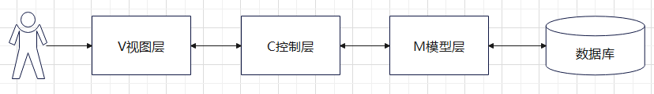
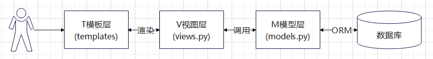
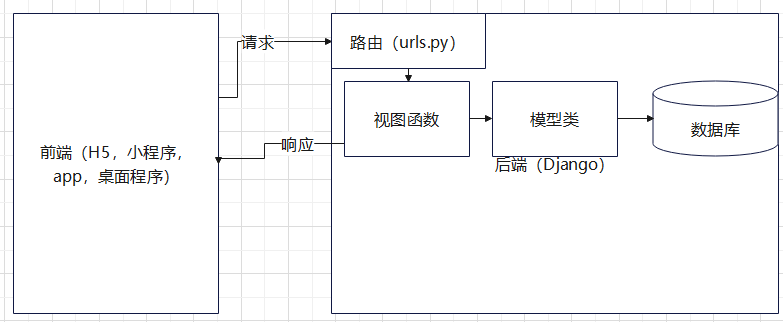
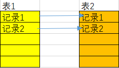
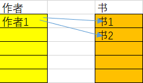
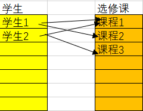
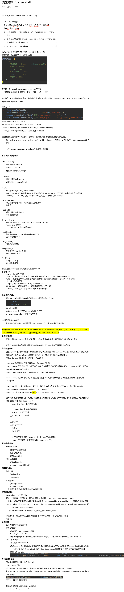
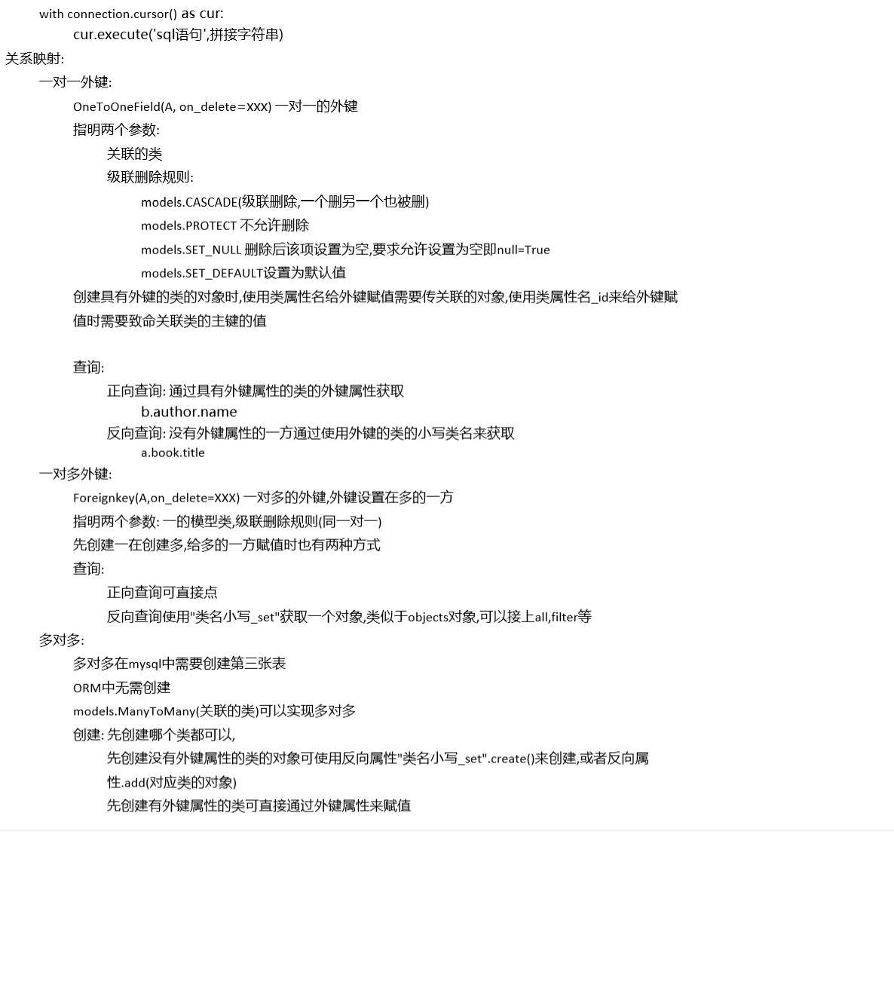

# 任务目标

​	完成一个前后端分离的物联网系统设备管理模块的后端部分

​	本次目标： 完成项目起步,第一个应用和模型类的创建,并了解外键相关知识

# 概念

## 	前后端分离

​		将前端代码和后端代码分开，后端只负责接收请求并处理，返回响应，前端只负责发送请求，渲染页面，接收响应

​		前后端一般使用**json**的数据格式来通信

​		后端暴露**接口**给前端使用，前端只需要关注如何使用接口而不需要关心对方的细节实现，并且可以同步开发

​		实现前后端的解耦合（彼此影响）

## 	设计模式

​		django中使用的是变种的MVC：MTV

​		MVC:

​		

​		MTV: 

​		前端只能是模板，html中含有python代码，耦合严重

​	

​		前后端分离:

​		前端可任意更换，后端只需要暴露接口

​		

# 项目起步

## 创建数据库

```sql
	sudo -u postgres psql 进入数据库
	
	create database iotplus; --iotplus是数据库名可自己更换
	CREATE DATABASE --出现此行代表成功，sql语句后面要加分号

	\l --列出所有数据库
	\c iotplus --进入数据库
	You are now connected to database "iotplus" as user "postgres". --出现此行代表成功
	\d --列出数据库中所有的表
	\q --退出数据库
```

## 	创建django项目并进行初始配置

```python
	$ django-admin startproject iotplus
	
    #修改setting.py文件的内容
	======settings.py======
	# 这里只列出了需要更改的部分，不是完整的文件
    ALLOWED_HOSTS = ['*'] # 这里是允许的host名，也就是http://localhost:8080/中的localhost部分，设置成*是任何都能访问，也可以写具体的ip和域名，若想在主机中访问项目需要写成局域网ip，为了省事可以直接写*
	LANGUAGE_CODE = 'zh-hans'
	TIME_ZONE = 'Asia/Shanghai'
    DATABASES = {
        'default': {
            'ENGINE': 'django.db.backends.postgresql',
            'NAME': 'iotplus',
            'HOST': '127.0.0.1',
            'PORT': '5432',
            'USER': 'postgres',
            'PASSWORD': '123456'
    	}
    }
    ======setting.py======
    # 初次migrate,将系统自带应用的数据库创建好 模型类--------makemigrations------->中间文件-----migrate------->数据库
    $ python manage.py migrate
    $ sudo -u postgres psql
    =# \c iotplus
    =# \d
    展示数据表
    =# \d 表名字
    展示某个数据表的详细信息
    =# \q
    $ python manage.py createsuperuser # 创建一个超级用户,方便使用admin管理
    $ python manage.py runserver 0:8080 # 启动项目
```

## 创建第一个应用和模型类

```python
	# 创建应用,
    $ python manage.py startapp devtemplate
    # 注册应用
    ======settings.py======
    INSTALLED_APPS = [
        'django.contrib.admin',
        'django.contrib.auth',
        'django.contrib.contenttypes',
        'django.contrib.sessions',
        'django.contrib.messages',
        'django.contrib.staticfiles',
        'devtemplate', # 这一行是新增的
	]
    ======settings.py======
```

创建 设备模板 模型类

| 字段名               | 命名                 | 数据类型     | 备注                 |
| -------------------- | -------------------- | ------------ | -------------------- |
| 设备模板ID           | id                   | Uuid         | 一种特殊的字符串     |
| 模板设备名称         | title                | 字符串(Char) |                      |
| 设备型号             | device_type          | 字符串       |                      |
| 是否允许动态接入设备 | is_custom_registered | 布尔值       | 是否允许设备发起注册 |
| 模板设备描述         | description          | 文本(Text)   |                      |
| 设备采用的协议       | protocol_type        | 字符串       | MQTT/HTTP等          |
| 模板设备图片         | img                  | 图片         | 数据库里存放路径     |
| 创建者               | owner                | 外键         | 指向user表           |
| 创建时间             | created              | 时间         | auto_now_add         |
| 更新时间             | updated              | 时间         | auto_now             |

```python
from django.db import models
from django.utils.translation import ugettext_lazy as _
import uuid

class DevTemplate(models.Model):
    MQTT = 'MQTT'
    HTTP = 'HTTP'
    CoAP = 'CoAP'
    PROTOCOL_CHOICES = (
        (MQTT, 'MQTT'),
        (HTTP, 'HTTP'),
        (CoAP, 'CoAP'),
    )

    # 唯一标识，uuid是一串几乎不可能重复的唯一编码，uuid4()函数不需要参数，每次都会计算出一个不同的值，这个字段是不允许更改的
    id = models.UUIDField(primary_key=True, default=uuid.uuid4, editable=False)
    # 名字，blank=True代表可以在admin管理后台不填,max_length是必须指定的
    title = models.CharField(max_length=80,blank=True)
    # 设备描述，_用于国际化，不同语言的浏览器看到的结果不一样
    description = models.TextField(_(u'Description'),blank=True)
    # 设备图片，定义了上传的位置，数据库中存放的为路径字符串
    img = models.ImageField(upload_to='image',default='upload/none.jpg',blank=True)
    # 设备型号
    device_type = models.CharField(max_length=40,blank=True)
    # 是否允许动态接入设备
    is_custom_registered = models.BooleanField(default=False)
    # 协议类型，从固定的列表中选择
    protocol_type = models.CharField(max_length=200,choices=PROTOCOL_CHOICES,default=HTTP)
    # 更新与创建时间
    updated = models.DateTimeField(_(u'Updated date'),auto_now=True)
    created = models.DateTimeField(_(u'Created date'),auto_now_add=True)
    # 外键
    owner = models.ForeignKey('auth.user', on_delete=models.CASCADE)

    def __str__(self):
        return self.title
```


```python
$ python manage.py makemigrations
# 可能会报错
SystemCheckError: System check identified some issues:

ERRORS:
devtemplate.DevTemplate.img: (fields.E210) Cannot use ImageField because Pillow is not installed.
        HINT: Get Pillow at https://pypi.org/project/Pillow/ or run command "python -m pip install Pillow".
                
$ pip install pillow
$ python manage.py makemigrations
$ python manage.py migrate

# 将模型类注册到admin管理页面
======devtemplate/admin.py======
from django.contrib import admin
from .models import *

admin.site.register(DevTemplate)
======devtemplate/admin.py======

$ python manage.py runserver 0:8080
# 进入管理界面查看
# 主要关注点:
# 1.填blank=True的可以不写
# 2.Protocal type的显示和值
# 3.owner的外键是django自带的认证系统

# 进入数据库查看
# 1.表结构
# 2.img字段
# 3.外键字段
```

# 外键

## 一对一外键

例子: 一个人只能有一个户口,一个老公只能有一个老婆



在任何一方设置外键都可

定义方式

​	字段名(一般为对方表名的小写) = models.OneToOneField(关联的类名,on_delete=类型)

创建时先创建没有设置外键的一方

在给外键属性赋值时有两种方式:

​	外键名 = 关联表的对象

​	外键名_id = 关联表对象的id

> 正向查询: 通过具有外键属性的类的外键属性获取
>
> ​	wife0.man
>
> 反向查询: 没有外键属性的一方通过使用外键的类的小写类名来获取
>
> ​	man.wife

常用on_delete:

​	models.CASCADE: 级联删除,删除被引用方,引用他的会跟着删除,反着来则不会

​	models.PROTECT :不允许删除

​	models.SET_NULL : 删除后该字段设置为空,要求允许设置为空即null=True

​	models.SET_DEFAULT: 设置为默认值,要求设置默认值

```python
>>> from example1.models import *
>>> Man.objects.create(name='man1')
<Man: man1>
>>> Man.objects.create(name='man2')
<Man: man2>
>>> Man.objects.create(name='man3')
<Man: man3>
>>> man = Man.objects.get(name='man3')
>>> Wife.objects.create(name='wife1',man_id=1) # 通过id赋值
<Wife: wife1>
>>> Wife.objects.create(name='wife2',man_id=2)
<Wife: wife2>
>>> Wife.objects.create(name='wife3',man=man) # 通过对象赋值
<Wife: wife3>
>>> Man.objects.all() # 展示刚刚添加的
<QuerySet [<Man: man1>, <Man: man2>, <Man: man3>]>
>>> Wife.objects.all()
<QuerySet [<Wife: wife1>, <Wife: wife2>, <Wife: wife3>]>
>>> Man.objects.all()[0].delete() # 删除Man,Wife被连带删除
(2, {'example1.Wife': 1, 'example1.Man': 1})
>>> Wife.objects.all()
<QuerySet [<Wife: wife2>, <Wife: wife3>]>
>>> Wife.objects.all()[0].delete() # 删除Wife,Man不受影响
(1, {'example1.Wife': 1})
>>> Man.objects.all()
<QuerySet [<Man: man2>, <Man: man3>]>
>>> wife = Wife.objects.all()[0] # 正向和反向查询
>>> wife.man
<Man: man3>
>>> wife.man.wife
<Wife: wife3>
```


## 一对多外键

例子: 作者和书,班级和学生



在”多“的一方设置外键

定义方式

​	字段名(一般为对方表名的小写) = models.ForeignKey(类名,on_delete=类型)

创建对象时要先创建"一",再创建"多"

给"多"的一方的外键赋值也是两种方式

> 正向查询: 多的一方.外键名可以调用
>
> 反向查询: 一的一方.对方表名小写_set来获得一个对象,这个对象等同于objects（可以执行create方法）

```python
>>> from example1.models import *
>>> Author.objects.create(name='author') # 创建作者
<Author: author>
>>> Book.objects.create(title='book1',author_id=1) # 通过id赋值
<Book: book1>
>>> Author.objects.all()[0].book_set.create(title='book2') # 通过book_set.create()对象创建
<Book: book2>
>>> Author.objects.all()[0].book_set.all() # 通过book_set查询
<QuerySet [<Book: book1>, <Book: book2>]>
>>> Book.objects.all() # 查看所有的book
<QuerySet [<Book: book1>, <Book: book2>]>
>>> Book.objects.all()[0].author # 通过外键获得对象
<Author: author>
>>> Author.objects.all()[0].delete() # 删除对象
(3, {'example1.Book': 2, 'example1.Author': 1})
```


## 多对多外键

例子: 学生与选修课



在哪一方设置外键都可

定义方式

​	字段名(一般为相关类的类名小写也可以写成类名小写_set) = models.ManyToManyField(类名)

​	无需on_delete选项

传统的实现多对多关系需要创建第三个表,在Django中无需手动创建,一切都由ORM替我们完成

创建对象时先创建哪一方都可

> 正向查询：有外键的一方.外键名
>
> 反向查询：无外键的一方.对方类名小写_set
>
> 他们的返回的都是一个类似objects的对象，可以调用all，create等方法

## 测试用模型类

```python
 from django.db import models

# 一对一
class Man(models.Model):
    name = models.CharField(max_length=100)

class Wife(models.Model):
    name = models.CharField(max_length=100)
    man = models.OneToOneField(Man,on_delete=models.CASCADE)

# 一对多，外健设置在多的一方
class Author(models.Model):
    name = models.CharField(max_length=100)

class Book(models.Model):
    title = models.CharField(max_length=100)
    author = models.ForeignKey(Author,on_delete=models.CASCADE)

# 多对多，不需要on_delete
class Course(models.Model):
    course_name = models.CharField(max_length=100)

class Student(models.Model):
    name = models.CharField(max_length=100)
    course = models.ManyToManyField(Course)
```



