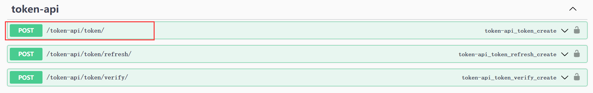
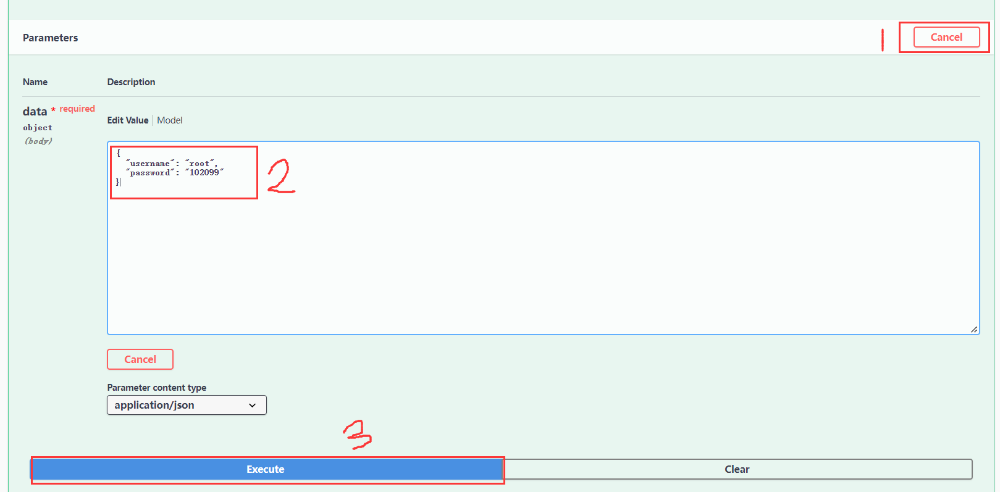
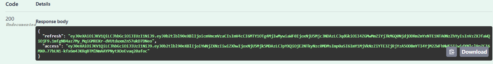
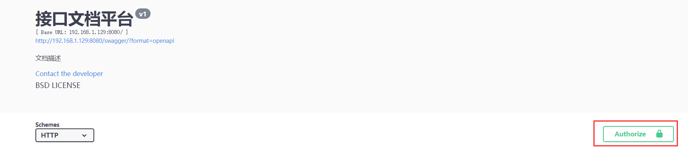
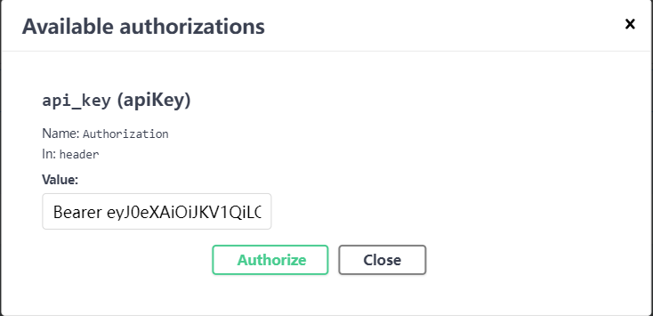
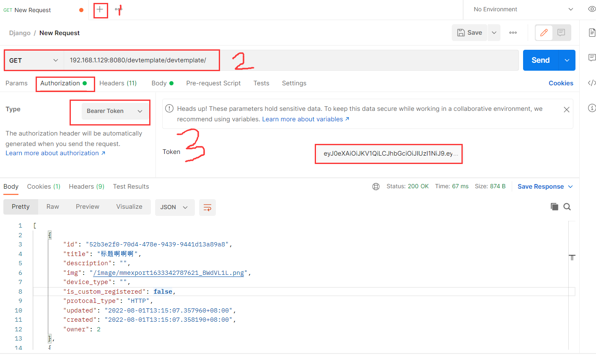
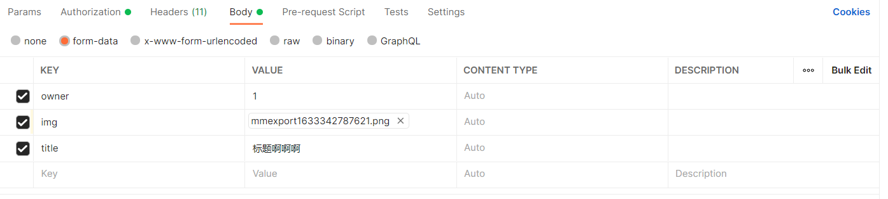

# 目标

​	1.使用JWT实现身份认证

​	2.User类拓展

​	3.ORM基础2


# 使用JWT实现身份认证

## 身份验证和JWT

​	之前开发的接口可以直接访问到,实际开发中需要用户提供一种能证明他身份的东西,判断这个用户有没有权限访问这个接口

​	django REST framework默认使用的是cookie和session结合的方式

​	JWT 为json web token的简称,不需要使用数据库来进行验证,它生成的token是一个加密的字符串,有过期时间,内部可以包含用户数据

## 安装并配置

```python
$ pip install djangorestframework-simplejwt # 安装框架

======settings.py======
INSTALLED_APPS = [
    'django.contrib.admin',
    'django.contrib.auth',
    'django.contrib.contenttypes',
    'django.contrib.sessions',
    'django.contrib.messages',
    'django.contrib.staticfiles',
    'devtemplate',
    'rest_framework',
    'drf_yasg',
    'rest_framework_simplejwt',
]

REST_FRAMEWORK = {
    # Use Django's standard `django.contrib.auth` permissions,
    # or allow read-only access for unauthenticated users.
    'DEFAULT_PERMISSION_CLASSES': [
        #  'rest_framework.permissions.DjangoModelPermissionsOrAnonReadOnly'
    ],
    'DEFAULT_AUTHENTICATION_CLASSES': (
        'rest_framework.authentication.TokenAuthentication',
        'rest_framework_simplejwt.authentication.JWTAuthentication',
        'rest_framework.authentication.SessionAuthentication',
        'rest_framework.authentication.BasicAuthentication',
    ),
    'DEFAULT_SCHEMA_CLASS': 'rest_framework.schemas.coreapi.AutoSchema'
}

from datetime import timedelta

SIMPLE_JWT = {
    'ACCESS_TOKEN_LIFETIME': timedelta(hours=6), # AccessToken的过期时间，timedelta表示时间差
    'REFRESH_TOKEN_LIFETIME': timedelta(days=7), # RefreshToken的过期时间
    'ROTATE_REFRESH_TOKENS': False,
    'BLACKLIST_AFTER_ROTATION': False,

    'ALGORITHM': 'HS256', # 使用到的加密算法
    'SIGNING_KEY': SECRET_KEY, # 使用到的密钥，值为django自动生成的
    'VERIFYING_KEY': None,

    'AUTH_HEADER_TYPES': ('Bearer',), # 头文件写法: Bearer ******
    'USER_ID_FIELD': 'id',
    'USER_ID_CLAIM': 'user_id',

    'AUTH_TOKEN_CLASSES': ('rest_framework_simplejwt.tokens.AccessToken',),
    'TOKEN_TYPE_CLAIM': 'token_type',

    'SLIDING_TOKEN_REFRESH_EXP_CLAIM': 'refresh_exp',
    'SLIDING_TOKEN_LIFETIME': timedelta(minutes=5),
    'SLIDING_TOKEN_REFRESH_LIFETIME': timedelta(days=1),
}

#swagger页面认证界面采用 Authorization: Bearer ****
SWAGGER_SETTINGS = {
    'SECURITY_DEFINITIONS': {
        'api_key': {
            'type': 'apiKey',
            'in': 'header',
            'name': 'Authorization'
        }
    },
    'USE_SESSION_AUTH': False,
    'JSON_EDITOR': True,
}
======settings.py======
======urls.py======
from rest_framework_simplejwt.views import TokenRefreshView, TokenVerifyView, TokenObtainPairView

    re_path(r'^token-api/token/$', TokenObtainPairView.as_view(), name='token_obtain_pair'),
    re_path(r'^token-api/token/refresh/$', TokenRefreshView.as_view(), name='token_refresh'),
    re_path(r'^token-api/token/verify/$', TokenVerifyView.as_view(), name='token_verify'),
======urls.py======
======views.py======
from rest_framework_simplejwt import authentication
    ...
    # 规定使用的身份认证类
    authentication_classes = (authentication.JWTAuthentication,)
	...
    def list(self, request,):
        # 限制查出数据的范围
        queryset = DevTemplate.objects.filter(owner=request.user).order_by('-created')
        # queryset = DevTemplate.objects.all()

        self.check_object_permissions(request,DevTemplate)
        serializer = DevTemplateSerializer(queryset, many=True)
        return Response(serializer.data)
    
    def retrieve(self, request, pk=None):
        # 限制查出数据的范围
        queryset = DevTemplate.objects.filter(owner=request.user)
        # queryset = DevTemplate.objects.all()
        queryset_tmp = get_object_or_404(queryset, pk=pk)
        self.check_object_permissions(request,DevTemplate)
        serializer = DevTemplateSerializer(queryset_tmp)
        return Response(serializer.data)
======views.py======
```

## 使用swagger测试

首先获取access token







将access token信息填入



​	注意在Token前面接上Bearer



现在重新测试接口，可以使用

## 使用Postman测试

1.新建一个测试

2.填入接口地址并选择请求的方法

3.填入认证信息



若需要有请求体，则在Body中写入



# 用户管理模块扩展

使用django-allauth和django-rest-auth两个包实现用户管理模块的扩展

django-allauth用于实现业务逻辑，支持微信第三方登录等功能，文档:https://django-allauth.readthedocs.io/en/latest/overview.html

django-rest-auth用于将allauth实现的功能转化成rest接口

```python
# 安装前判断是否有这三个包, 通过指令 "pip list | grep 扩展包名" 通过返回的结果来查看是否有包
python3-openid==3.2.0
requests==2.26.0
requests-oauthlib==1.3.0

pip install django-allauth
pip install django-rest-auth
```


## django-allauth

### 进行配置

```
======settings.py======
INSTALLED_APPS = [
	...
    #django-allauth配置需要
    'django.contrib.sites',
    'allauth',
    'allauth.account',
    ...
]

SITE_ID = 1

UTHENTICATION_BACKENDS = [

    # Needed to login by username in Django admin, regardless of `allauth`
    'django.contrib.auth.backends.ModelBackend',

    # `allauth` specific authentication methods, such as login by e-mail
    'allauth.account.auth_backends.AuthenticationBackend',
]

ACCOUNT_LOGOUT_ON_GET = True
REST_SESSION_LOGIN = True

EMAIL_BACKEND = 'django.core.mail.backends.smtp.EmailBackend'
EMAIL_HOST = 'smtp.**.com'
EMAIL_PORT = 25
EMAIL_HOST_USER = '***@**.com'
EMAIL_HOST_PASSWORD = '**'
DEFAULT_FROM_EMAIL = '你好，欢迎注册<iotplus@**.com>'
======settings.py======
```

### 创建数据库

```python
python manage.py migrate
```


## django-rest-auth

### 进行配置

```python
======settings.py======
INSTALLED_APPS = [
	...
    'rest_framework.authtoken',
    'rest_auth',
    ...
]
======settings.py======
======urls.py======
urlpatterns = [
    path('admin/', admin.site.urls),
    path('', include(router.urls)),
    path('api-auth/', include('rest_framework.urls', namespace='rest_framework')),
    re_path(r'^devtemplate/', include('devtemplate.urls')),
    re_path(r"^docs/", include_docs_urls(title="My API title")),
    path("swagger/", schema_view.with_ui("swagger", cache_timeout=0), name="schema-swagger"),
    path("redoc/", schema_view.with_ui("redoc", cache_timeout=0), name="schema-redoc"),
    re_path(r'^token-api/token/$', TokenObtainPairView.as_view(), name='token_obtain_pair'),
    re_path(r'^token-api/token/refresh/$', TokenRefreshView.as_view(), name='token_refresh'),
    re_path(r'^token-api/token/verify/$', TokenVerifyView.as_view(), name='token_verify'),
    re_path(r'^rest-auth/', include('rest_auth.urls')), # 添加此行
]
======urls.py======
```

### 创建数据库

```
python manage.py migrate
```

### 查看

启动项目并进入swagger查看

## 扩展用户信息

### 1.创建新应用accounts并配置

```
python manage.py startapp accounts

在setting.py文件中写入'accounts',
```

### 2.创建模型类

```
from __future__ import unicode_literals

from django.db import models
from django.dispatch import receiver
from django.db.models.signals import post_save
from django.contrib.auth.models import User
from django.utils.translation import ugettext as _


class MyProfile(models.Model):
    user = models.OneToOneField(User, related_name="profile", on_delete=models.CASCADE)
    phone_num = models.CharField(max_length=20, blank=True)
    mugshot = models.ImageField(upload_to='upload',default = 'upload/none.jpg', blank=True)
    is_developer = models.BooleanField(default=True)
    is_custom_user = models.BooleanField(default=False)

    def __str__(self):
        return self.user.username
# 信号,当User类创建时发送创建本类,post_save:当类创建的时候发送信号
@receiver(post_save, sender=User)
def create_profile(sender, instance=None, created=False, **kwargs):
    if created:
        profile, created = MyProfile.objects.get_or_create(user=instance)
```

### 3.配置admin管理后台

```
from django.contrib import admin
from .models import MyProfile

# Register your models here.

admin.site.register(MyProfile)
```

### 4.创建数据库,测试

```
python manage.py makemigrations
python manage.py migrate
```


### 5.序列化

serializers

```
from .models import MyProfile
from rest_framework import serializers

class MyProfileSerializer(serializers.ModelSerializer):
    class Meta:
        model = MyProfile
        fields = ('user','phone_num', 'mugshot')
```

### 6.视图类

```
from django.shortcuts import render
from .serializers import MyProfileSerializer
from .models import MyProfile
from rest_framework import viewsets
from rest_framework.response import Response

from rest_framework_simplejwt import authentication
from rest_framework import permissions


from django.http import HttpResponse
from rest_framework.renderers import JSONRenderer


from django.shortcuts import get_object_or_404

# 封装的工具类,为HttpResponse的子类,可将传进来的数据转换成json格式并封装进HttpResponse对象
class JSONResponse(HttpResponse):
    """
    An HttpResponse that renders its content into JSON.
    """
    def __init__(self, data, **kwargs):
        content = JSONRenderer().render(data)
        kwargs['content_type'] = 'application/json'
        super(JSONResponse, self).__init__(content, **kwargs)


class  MyProfileViewSet(viewsets.ModelViewSet):
    """
    list:
    查询个人信息列表

    create:
    创建个人信息

    retrieve:
    查询个人信息详情

    update:
    更新个人信息

    partial_update:
    更新个人信息部分属性

    destroy:
    删除个人信息

    """

    serializer_class =  MyProfileSerializer

    permission_classes = (permissions.IsAuthenticated,)
    authentication_classes = (authentication.JWTAuthentication,)

    queryset =  MyProfile.objects.all()

    def perform_create(self, serializer):
        serializer.save(user=self.request.user)

    def list(self, request,):
        queryset = MyProfile.objects.filter(user=request.user)
        qs = queryset[0]
        info = {
            'myprofile_id':qs.id,
            'user_id':qs.user.id,
            'username':qs.user.username,
            'email':qs.user.email,
            'phone_num':qs.phone_num,
            'mugshot':'/media/'+str(qs.mugshot)
            }
        return JSONResponse(info)

    def retrieve(self, request, pk=None):
        queryset = MyProfile.objects.filter(user=request.user)
        myprofile = get_object_or_404(queryset, pk=pk)
        serializer = MyProfileSerializer(myprofile)
        return Response(serializer.data)
```

### 7.配置url

应用下的urls.py

```
from django.conf.urls import include, url
from . import views
from rest_framework.routers import DefaultRouter
router = DefaultRouter()
router.register(r'myprofile', views.MyProfileViewSet, basename='myprofile')

urlpatterns = [
    url(r'^', include(router.urls)),
]
```

全局的

```
from django.contrib import admin
from django.urls import path,include,re_path
from django.conf.urls import url
from django.conf import settings

from django.contrib.auth.models import User
from rest_framework import routers, serializers, viewsets
from drf_yasg.views import get_schema_view
from drf_yasg import openapi
from rest_framework.documentation import include_docs_urls

from django.contrib.staticfiles.urls import staticfiles_urlpatterns
from django.conf.urls.static import static
schema_view = get_schema_view(
    openapi.Info(
        title="接口文档平台",  # 必传
        default_version="v1",  # 必传
        description="文档描述",
        terms_of_service="",
        contact=openapi.Contact(email="mhhcode@mhhcode.com"),
        license=openapi.License(name="BSD LICENSE")
    ),
    public=True,
    # permission_classes=(permissions.)  # 权限类
)

# 序列化的类，将数据转化为json格式
class UserSerializer(serializers.HyperlinkedModelSerializer):
    class Meta:
        model = User
        fields = ['url', 'username', 'email', 'is_staff','password']

# 视图函数类，处理业务逻辑
class UserViewSet(viewsets.ModelViewSet):
    queryset = User.objects.all()
    serializer_class = UserSerializer

# 配置路由
router = routers.DefaultRouter()
router.register(r'users', UserViewSet)

from rest_framework_simplejwt.views import TokenRefreshView, TokenVerifyView, TokenObtainPairView

urlpatterns = [
    path('admin/', admin.site.urls),
    path('', include(router.urls)),
    path('api-auth/', include('rest_framework.urls', namespace='rest_framework')),
    re_path(r'^devtemplate/', include('devtemplate.urls')),
    re_path(r"^docs/", include_docs_urls(title="My API title")),
    path("swagger/", schema_view.with_ui("swagger", cache_timeout=0), name="schema-swagger"),
    path("redoc/", schema_view.with_ui("redoc", cache_timeout=0), name="schema-redoc"),
    re_path(r'^token-api/token/$', TokenObtainPairView.as_view(), name='token_obtain_pair'),
    re_path(r'^token-api/token/refresh/$', TokenRefreshView.as_view(), name='token_refresh'),
    re_path(r'^token-api/token/verify/$', TokenVerifyView.as_view(), name='token_verify'),
    re_path(r'^rest-auth/', include('rest_auth.urls')), # 添加此行
    re_path(r'^myprofile/', include('accounts.urls')),
]

# static
# STATIC_URL和MEDIA_URL为在url中访问的地址
# STATIC_ROOT和MEDIA_ROOT为文件存放的路径
urlpatterns += staticfiles_urlpatterns()
urlpatterns += static(settings.STATIC_URL, document_root=settings.STATIC_ROOT )
urlpatterns += static(settings.MEDIA_URL, document_root=settings.MEDIA_ROOT )
```

### 8.静态路径配置

```
STATIC_URL = '/static/'

STATIC_ROOT = '/home/jzab/python/iotplus2'

MEDIA_URL = '/media/'

MEDIA_ROOT = '/home/jzab/python/iotplus2/'
```

# ORM基础2

查询操作

## 查询全部

​	objects.all() 查询全部记录

​	objects.values('字段名1','字段名2') 查询所有记录的相应字段,返回值是一个字典

​	objects.values_  list() 作用同上, 返回值是一个元组组成的集合

​	objects.order_by('字段名') 通过某字段排序,字段名前面加-为倒序

## 条件查询

​	objects.filter(属性1=值1,属性2=值2) 获取符合某条件的值,多个条件为 "与" 关系

​	objects.exclude() 与上面正好相反

​	objects.get() 获取符合条件的单条记录

## 组合起来

​	上面的函数,除了get其他返回结果都是QuerySet,QuerySet依旧可以调用这些函数.

​	比如先挑选出文科的,再按照分数进行排序

