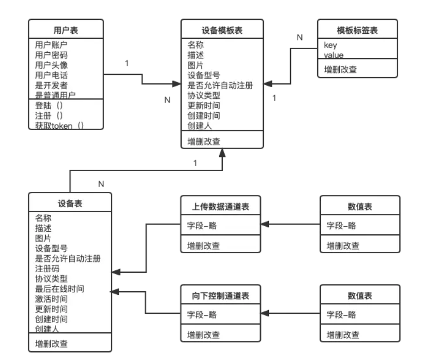

# 目标

1.完成设备表,向下控制通道和向下控制通道的数值表的开发

2.完成设备的接口开发

3.ORM基础3: 查询谓词,Q对象F对象,聚合查询



# 创建3个模型类

## 创建应用

```python
python manage.py startapp device
# 在setting文件中配置device
```

## 编写模型类

```python
from django.db import models
from django.utils.translation import ugettext_lazy as _
import uuid
# Create your models here.
class Device(models.Model):
    """
    设备模板表

    """
    MQTT = 'MQTT'
    HTTP = 'HTTP'
    #CoAP = 'CoAP'
    PROTOCOL_CHOICES = (
        (MQTT, 'MQTT'),
        (HTTP, 'HTTP'),
        #(CoAP, 'CoAP'),
    )
	# 新增一个元组,表示设备状态(在线,离线,未激活,激活)
    ONLINE = 'ONLINE'
    OFFLINE = 'OFFLINE'
    UNACTIVE = 'UNACTIVE'
    ACTIVE = 'ACTIVE'
    STATUS_CHOICES = (
        (ONLINE, 'ONLINE'),
        (OFFLINE, 'OFFLINE'),
        (UNACTIVE, 'UNACTIVE'),
        (ACTIVE, 'ACTIVE'),
    )


    id = models.UUIDField(primary_key=True, default=uuid.uuid4, editable=False)
    title = models.CharField(max_length=80, blank=True)
    description = models.TextField(_(u"Description"), blank=True)
    img = models.ImageField(upload_to='image',default = 'upload/none.jpg', blank=True)
    device_type = models.CharField( max_length=40, blank=True)
    is_custom_registered = models.BooleanField(default=False)
    # 注册码
    register_code = models.CharField( max_length=120, blank=True)
    # 设备状态
    status = models.CharField(max_length=20,choices=STATUS_CHOICES,default=UNACTIVE)
    protocol_type = models.CharField(max_length=20,choices=PROTOCOL_CHOICES,default=HTTP)
    # 最后在线时间
    last_online = models.DateTimeField(blank=True,null=True)
    # 激活时间
    activated = models.DateTimeField(blank=True,null=True)
    updated = models.DateTimeField(_(u"Updated date"), auto_now=True)
    created = models.DateTimeField(_(u"Creation date"), auto_now_add=True)
    owner = models.ForeignKey('auth.User', on_delete=models.CASCADE)


    def __str__(self):
        return self.title

class CtrlChannel(models.Model):
    """
    设备模板的控制通道，所谓控制通道，就是云端向设备发送的指令，
    控制点接受指令而执行一系列动作；
    因此，控制通道有两个方向，一是云端发送指令，是云端到设备的控制点；
    另外是设备的控制点需要实时向云端发送自身的状态；

    """
    DECIMAL = 'DECIMAL'
    MESSAGE = 'MESSAGE'
    SWITCH = 'SWITCH'
    GPS = 'GPS'
    DATATYPE_CHOICES = (
        (DECIMAL, '数值型'),
        (MESSAGE, '文本型'),
        (SWITCH, '开关型'),
        (GPS, 'GPS型'),
    )

    id = models.UUIDField(primary_key=True, default=uuid.uuid4, editable=False)
    device = models.ForeignKey(Device,  on_delete=models.CASCADE)
    title = models.CharField(max_length=80, blank=True)
    datatype = models.CharField(max_length=200,choices=DATATYPE_CHOICES,default=DECIMAL)

    def __str__(self):  # Python 3: def __str__(self):
        return self.title

class MetricData(models.Model):
    """
    控制通道的数值型数据，具有两个方向，UP表示设备上报的状态数据
    DOWN表示设备接收的控制数据
    """
    UP = 'UP'
    DOWN = 'DOWN'
    DIRECTION_CHOICES = (
        (UP, 'UP'),
        (DOWN, 'DOWN'),
    )

    ctrlchannel = models.ForeignKey(CtrlChannel,  on_delete=models.CASCADE)
    value = models.FloatField(blank=True)
    direction = models.CharField(max_length=10, choices=DIRECTION_CHOICES,default=UP)
    timestamp = models.DateTimeField(_(u"timestamp"), auto_now_add=True)
    #只有数据变化时才更新
    def save(self, *args, **kwargs):
        # 查出当前数据通道下面的方向为上传的数值们
        queryset = MetricData.objects.filter(ctrlchannel=self.ctrlchannel,direction='UP')
        # 若之前没有数据则可以保存,
        if queryset:
            # 若之前有数值则看最后一次上传的数值是否与当前一致,若一致则无需保存
            tmp = queryset[len(queryset)-1]
            if((self.value == tmp.value) and (self.direction =='UP')):
                pass
            else:
                super(MetricData, self).save(*args, **kwargs)
        else:
            super(MetricData, self).save(*args, **kwargs)
```

## 更新数据库,配置admin,启动项目

```python
from django.contrib import admin
from .models import *
# Register your models here.

admin.site.register(Device)
admin.site.register(CtrlChannel)
admin.site.register(MetricData)
```

```
python manage.py makemigrations
python manage.py migrate
python manage.py runserver 0:8080
```

# 编写视图

## 序列化

```
from rest_framework import serializers
from .models import Device,CtrlChannel,MetricData

class DeviceSerializer(serializers.ModelSerializer):

    class Meta:
        model = Device
        fields = ('id','title', 'description','img','device_type','is_custom_registered','register_code','status','protocol_type','last_online','activated','owner','updated','created')

class CtrlChannelSerializer(serializers.ModelSerializer):

    class Meta:
        model = CtrlChannel
        fields = ('id','device', 'title', 'datatype')

class MetricDataSerializer(serializers.ModelSerializer):

    class Meta:
        model = MetricData
        fields = ('id','ctrlchannel', 'value', 'direction', 'timestamp')
```

## 视图函数

```python
from django.shortcuts import render
from .models import Device,CtrlChannel,MetricData
from .serializers import DeviceSerializer,CtrlChannelSerializer,MetricDataSerializer

from django.shortcuts import get_object_or_404

from rest_framework import viewsets
from rest_framework.response import Response
from rest_framework_simplejwt import authentication

from django.http import HttpResponse
from rest_framework.renderers import JSONRenderer


class JSONResponse(HttpResponse):
    """
    An HttpResponse that renders its content into JSON.
    """
    def __init__(self, data, **kwargs):
        content = JSONRenderer().render(data)
        kwargs['content_type'] = 'application/json'
        super(JSONResponse, self).__init__(content, **kwargs)

class DeviceViewSet(viewsets.ModelViewSet):
    """
    list:
    查询设备列表

    create:
    创建设备

    retrieve:
    查询设备详情

    update:
    更新设备

    partial_update:
    更新设备部分属性

    destroy:
    删除设备

    createDevByTpl:
    根据提供的模板创建设备及相关的数据、控制通道

    """

    serializer_class = DeviceSerializer
    authentication_classes = (authentication.JWTAuthentication,)
    queryset = Device.objects.all()

    def perform_create(self, serializer):
    	serializer.save(owner=self.request.user)

    def list(self, request,):
        queryset = Device.objects.filter(owner=request.user).order_by('-created')
        self.check_object_permissions(request,Device)
        serializer = DeviceSerializer(queryset, many=True)
        return Response(serializer.data)

    def retrieve(self, request, pk=None):
        queryset = Device.objects.filter(owner=request.user)
        queryset_tmp = get_object_or_404(queryset, pk=pk)
        self.check_object_permissions(request,Device)
        serializer = DeviceSerializer(queryset_tmp)
        return Response(serializer.data)


class CtrlChannelViewSet(viewsets.ModelViewSet):
    """
    list:
    查询控制通道列表

    create:
    创建控制通道

    retrieve:
    查询控制通道详情

    update:
    更新控制通道

    partial_update:
    更新控制通道部分属性

    destroy:
    删除控制通道

    """

    serializer_class = CtrlChannelSerializer
    authentication_classes = (authentication.JWTAuthentication,)
    queryset = CtrlChannel.objects.all()

    def list(self, request, devices_pk=None):
        queryset = CtrlChannel.objects.filter(device=devices_pk)
        # serializer = CtrlChannelSerializer(queryset, many=True)
        # return Response(serializer.data)
        tmplist = []
        for dl in queryset:
            tmplist.append({"id":dl.id,"device":dl.device.id,"title":dl.title,"datatype":dl.datatype,"device_title":dl.device.title})
        return JSONResponse(tmplist)

    def retrieve(self, request, pk=None, devices_pk=None):
        queryset = CtrlChannel.objects.filter(pk=pk, device=devices_pk)
        queryset_tmp = get_object_or_404(queryset, pk=pk)

        serializer = CtrlChannelSerializer(queryset_tmp)
        return Response(serializer.data)


class MetricDataViewSet(viewsets.ModelViewSet):
    """
    list:
    查询数据点列表

    create:
    提交数值数据
    如果方向为DOWN，支持MQTT发布消息

    retrieve:
    查询数值数据详情

    update:
    更新数值数据，不建议使用

    partial_update:
    更新数值数据部分属性，不建议使用

    destroy:
    删除数值单位
    """

    serializer_class = MetricDataSerializer
    authentication_classes = (authentication.JWTAuthentication,)
    queryset = MetricData.objects.all()

    def list(self, request, devices_pk=None,ctrlchannels_pk=None):
        queryset = MetricData.objects.filter(ctrlchannel=ctrlchannels_pk)
        serializer = MetricDataSerializer(queryset, many=True)
        return Response(serializer.data)

    def retrieve(self, request, pk=None, devices_pk=None,ctrlchannels_pk=None):
        queryset = MetricData.objects.filter(pk=pk,ctrlchannel=ctrlchannels_pk)
        queryset_tmp = get_object_or_404(queryset, pk=pk)

        serializer = MetricDataSerializer(queryset_tmp)
        return Response(serializer.data)
```

## Url配置

```python
from django.conf.urls import include, url

from rest_framework_nested import routers
from .views import DeviceViewSet,CtrlChannelViewSet,MetricDataViewSet

from django.conf import settings
router = routers.SimpleRouter()
router.register(r'devices', DeviceViewSet,basename='devices')
#先创建一个路由实例，再注册一个url
#第一级URL

device_router = routers.NestedSimpleRouter(router, r'devices', lookup='devices')
device_router.register(r'ctrlchannels', CtrlChannelViewSet, basename='ctrlchannels')

ctrlchannel_router = routers.NestedSimpleRouter(device_router,r'ctrlchannels',lookup='ctrlchannels')
ctrlchannel_router.register(r'metricdata',MetricDataViewSet,basename='metricdata')


urlpatterns = [
    url(r'^', include(router.urls)),
    url(r'^', include(device_router.urls)),
    url(r'^', include(ctrlchannel_router.urls)),
]
```

```
	re_path(r'^device/', include('device.urls')),
```

可能会报错，需要使用 pip install drf-nested-routers 安装扩展

# ORM基础3

## 查询谓词

在查询时为了使查询更加灵活引入了查询谓词,表示一些条件

使用方法: objects.filter(score__gt=90)

```
__exact: 等值匹配,可以用来转换isNull

 

__contains: 包含指定值,模糊查询

__startswith: 以XXX开始

__endswith: 以XXX结束

 

__gt: 大于

__gte: 大于等于

__lt: 小于

__lte: 小于等于

 

__in: 字段在某个列表中 country__in=['中国','美国','加拿大']

__range: 字段在某个数字范围内 id__range=(10,20)
```


## F对象,Q对象

这两个类在 django.db.models 下面

**F对象: 用于灵活地取出字段的值来,可以抗并发**

​	设想一个场景,要实现一个视频的点赞功能,若视频十分热门,一毫秒内产生数不清的数据,按常规做法,先取出旧的值,然后加一,再写入数据库,如果一个进程取出时是1,再存入时数据库内的值已经被其他进程修改,变成了3,但现在这个进程要存入的是2,就会产生错误

把加一的操作交给数据库处理,数据库处理过程中会加锁

​	另一个使用场景是字段之间的比较: objects.filter(english_score__gt=F('math_score'))

**Q对象:  用于表示,与或非,实现灵活的条件组合**

​	objects.filter(Q(key=value) | Q(key=value))

​	& 与, | 或, ~ 非

## 聚合查询

​	用于统计如求总和,求个数,最大值最小值等,聚合函数也在django.db.models下面

​	常用聚合函数：Sum,Avg,Count,Max,Min

​	全部聚合: objects.aggregate(结果名=聚合函数())

​	分组聚合: objects.values()获得只有某个字段的querySet,再在它后面跟annotate()

```
Student.objects.values('major').annotate(sum=Sum('score'),max=Max('score'))
<QuerySet [{'major': '文', 'sum': 188, 'max': 98}, {'major': '理', 'sum': 161, 'max': 94}]>
```

​	

