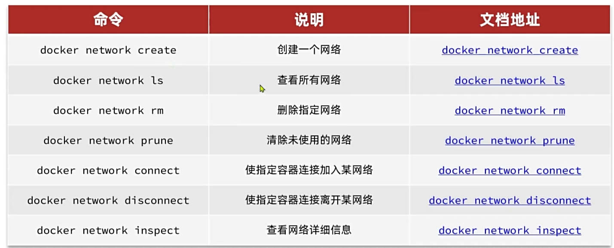

## 快速入门

首先参考官方文档安装docker: https://docs.docker.com/engine/install/ubuntu/

然后查看是否安装成功

```shell
docker ps
docker images
docker -v
```

可以在阿里云配置: 容器镜像服务-镜像工具-镜像加速器

尝试安装mysql

```shell
docker run -d \
 --name mysql \
 -p 3306:3306 \
 -e TZ=Asia/Shanghai \
 -e MYSQL_ROOT_PASSWORD=123 \
 -v ./data:/var/lib/mysql \
 -v ./conf:/etc/mysql/conf.d \
 -v ./init:/docker-entrypoint-initdb.d \
 mysql
 
// docker run: 创建并运行容器，-d表示在后台运行
// --name 创建的容器的名字
// -p 宿主机端口:容器内端口
// -e KEY=VALUE: 设置环境变量，不同的镜像需要的变量不一样
// mysql 镜像的名字，一般有两部分组成 [repository]:[tag] 镜像名称:镜像版本，不指定版本则默认latest最新版
```

用docker安装应用时，Docker会自动搜索并下载**镜像**(image)，包含应用本身，运行所需的环境、配置、系统环境库

docker会在运行镜像时创建一个隔离的环境，称之为**容器**（continaer）

**镜像仓库**: 存储和管理镜像的地方，docker官方维护了一个公共的镜像仓库 Docker Hub

## docker命令


> 下载镜像

docker pull

> 查看镜像

docker images

> 删除镜像

docker rmi

> 创建镜像

docker build

> 打包镜像到本地

docker save

> 安装本地镜像

docker load

> 上传镜像

docker push

> 查看镜像，默认只显示开启的，使用-a显示所有的

docker ps [-a]

> 创建并运行容器

docker run

> 停止运行容器

docker stop

> 启动容器

docker start

> 删除容器 使用-f强制删除

docker rm [-f]

> 查看日志，使用-f实时监控日志

docker logs [-f] 容器名

> 在容器内执行指令 使用-it同时指令名部分传入bash采用可交互的命令行

docker exec [-it] 容器名 指令名

### 命令别名

在root文件夹下的.bashrc文件中进行配置，配置完成后，输入```source .bashrc```让配置生效

```shell
alias dps='docker ps --format "table {{.ID}}\t{{.Image}}\t{{.Ports}}\t{{.Status}}\t{{.Names}}"'
alias dis='docker images'
alias ns='netstat -nultp'

```

## 数据卷挂载

数据卷(volume)是一个虚拟目录，是容器内目录和宿主机之间映射的桥梁

数据卷内的文件会双向绑定


docker run的时候使用```-v 数据卷:容器内目录```可以挂载数据卷

创建容器时挂载的数据卷不存在会自动创建数据卷

创建容器后无法挂载数据卷

```shell
docker run --name nginx -p 80:80 -v html:/usr/share/nginx/html nginx
```

查看容器是否有挂载

```shell
docker inspect 容器
```

默认会有匿名卷

```json
{
"Mounts": [
            {
                "Type": "volume",
                "Name": "s数据卷名称",
                "Source": "宿主机目录",
                "Destination": "容器内目录",
                "Driver": "local",
                "Mode": "z",
                "RW": true,
                "Propagation": ""
            }
        ]
}
```

## 本地目录挂载

语法和数据卷挂载一致，本地目录必须以/或者./开头，否则会被认为成数据卷

> -v 本地目录:容器内目录

## 自定义镜像

1. 准备linux运行环境
2. 安装jre运行环境并配置环境变量
3. 拷贝jar包
4. 编写运行脚本


DockerFile: 

一个文本文件，包含一个个的指令，用指令来说明要执行什么操作来构建镜像。将来docker可以根据Dockerfile构建镜像。


例如:

```dockerfile
# 基础镜像
FROM openjdk:11.0-jre-buster
# 设定时区
ENV TZ=Asia/Shanghai
RUN ln -snf /usr/share/zoneinfo/$TZ /etc/localtime && echo $TZ > /etc/timezone
# 拷贝jar包
COPY docker-demo.jar /app.jar
# 入口
ENTRYPOINT ["java", "-jar", "/app.jar"]
```

dockerfile写完后通过下面的指令就可以构建镜像，构建完成后就可以在本地的镜像列表中找到

```dockerfile
# 镜像版本可以不传,默认latest
docker build -t 镜像名称[:镜像版本] dockerfile路径
```

## 容器网络互连


可以使用自定义网络



使用docker network connect将容器连接到网络后，可以直接在容器内通过其他容器的名字访问到其他容器

也可以在创建容器时添加选项```--network 网络名```来让容器在创建的时候就加入指定的网络

## DockerCompose

通过一个单独的docker-compose.yml文件，将多个相关的Docker容器进行快速部署


```yml
# 版本信息
version: "3.8"

# 所有的容器
services:
  mysql:
    image: mysql
    container_name: mysql
    ports:
      - "3306:3306"
    environment:
      TZ: Asia/Shanghai
      MYSQL_ROOT_PASSWORD: 123
    volumes:
      - "./mysql/conf:/etc/mysql/conf.d"
      - "./mysql/data:/var/lib/mysql"
      - "./mysql/init:/docker-entrypoint-initdb.d"
    networks:
      - hm-net
  hmall:
    # 创建前先打包
    build:
      # dockerfile文件地址
      context: .
      # dockerfile文件名称
      dockerfile: Dockerfile
    container_name: hmall
    ports:
      - "8080:8080"
    networks:
      - hm-net
    depends_on:
	# 依赖于mysql容器
      - mysql
  nginx:
    image: nginx
    container_name: nginx
    ports:
      - "2048:18080"
      - "1205:18081"
    volumes:
      - "./nginx/config/nginx.conf:/etc/nginx/nginx.conf"
      - "./nginx/html:/usr/share/nginx/html"
    depends_on:
      - hmall
    networks:
      - hm-net
# 声明网络的标识和名称
networks:
  hm-net:
    name: hmall
```


注意: up的时候 后面添加 -d后台运行