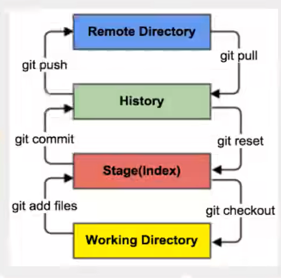
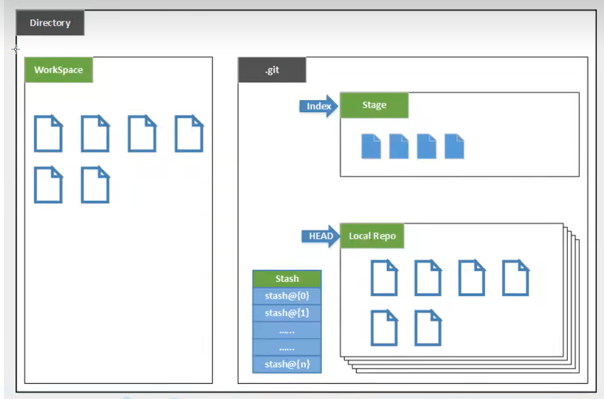
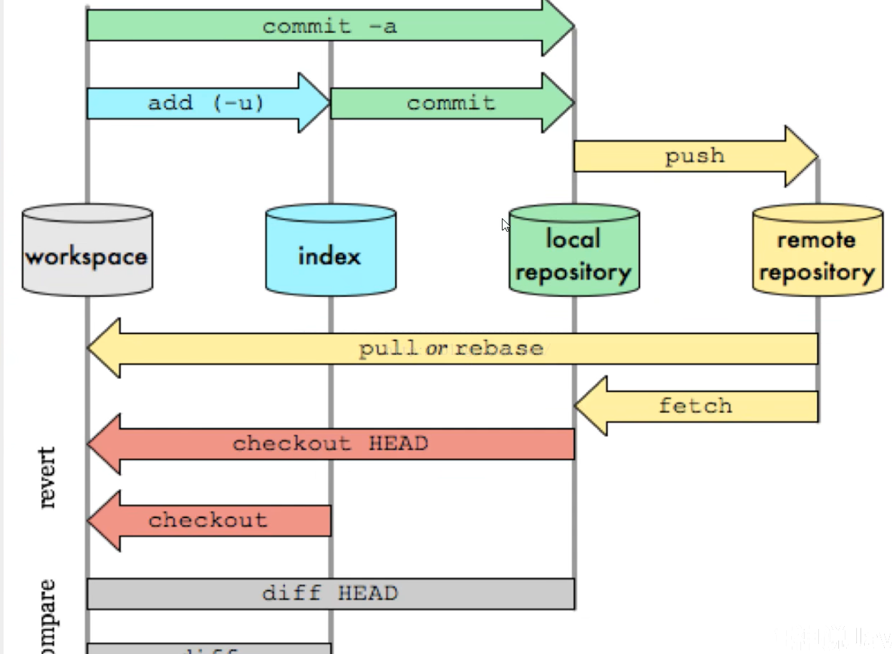
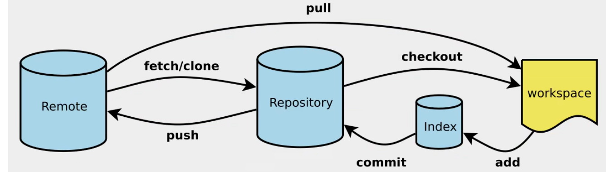
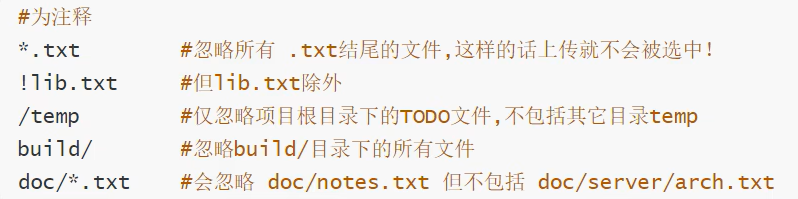

# 版本控制

记录文件的更新历史，方便管理和回溯

可以用于多人协同开发，统计工作量

常用的：git，svn

## 集中式

svn是集中式的，所有的数据都保存在服务器上，需要及时从服务器下载最新的

## 分布式

git是分布式的，每个电脑都有自己的版本控制中心，每个人拥有全部的代码


git最初是用于方便管理开发linux的

# GIT

下载地址: https://git-scm.com/

镜像地址: http://npm.taobao.org/mirrors/git-for-windows/

git Bash: 类似linux的命令行

git CMD: 类似windows的命令行

git GUI: 图形化界面

# 指令

```bash
# 列出所有配置
git config [--list 或 -l]
# 列出系统配置, 保存在: 安装目录/etc/gitconfig文件内
git config --system [--list 或 -l]
# 列出本地全局配置 保存在: 用户文件夹/.gitconfig文件内
git config --global -l

#配置用户名和邮箱
git config --global user.name "jzab-nb"
git config --global user.email "1970717299@qq.com"
```

# 工作原理

本地有三个区域: 工作目录, 暂存区(stage), 资源库 加上远程的git仓库有四个区域



工作区: 存放代码的地方

暂存区: 本质是一个文件,保存即将提交到文件列表的信息

资源库(本地仓库): 存放所有版本的数据 



先提交到本地在push到远程



# 操作步骤

常用命令: 



```bash
# 1.初始化
git init
# 通过克隆远程仓库初始化
git clone [url] 

# 2.所有文件添加暂存区
git add .

# 3.查看装填
git status

# 4.提交到本地仓库
git commit -m "消息"

# 5.gitee提交
git remote add origin https://gitee.com/jzab/2048.git
git push -u origin "master"
```

# .gitignore

/在开头表示从文件根目录开始匹配

/在末尾表示要匹配的是文件夹



# 配置ssh公钥

```bash
# 1.生成公钥
ssh-keygen -t rsa
# 2.公钥粘贴到网站上即可
```

# idea集成git

带有.git的项目都会被idea识别

傻瓜式操作

# 分支

```bash
# 新建一个分支
git branch [名称]

# 新建一个分支,并切换到该分支
git checkout -b [名称]

# 合并指定分支到当前分支
git merge [分支名]

# 删除分支
git branch -d [名称]

# 删除远程分支
git push origin --delete [名称]
git branch -dr [remote/branch]
```

# 完整流程

```cmd
# 初始化仓库
git init
# 设置远程仓库
git remote add 仓库名 仓库地址
# 拉取仓库上的分支
git pull 仓库名 分支名
# 本地提交
git add .
git commit -m ""
# 提交到远程仓库
git push 仓库名 分支名
```


