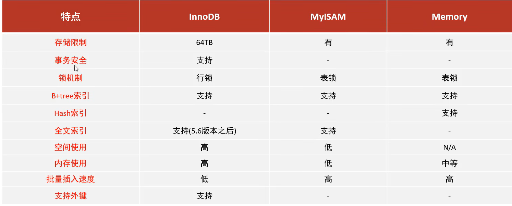
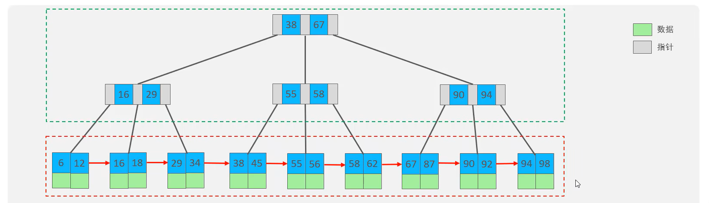

**mysql数据库**

# 基础

## 概述

​	数据库为存储数据的仓库,mysql为数据库管理系统,SQL语言为统一的操作数据库的标准语言

### 安装

### 启动/停止

在windows的系统服务中启动或停止或在管理员模式的cmd使用下面的代码

 ```shell
    net start mysql
    net stop mysql
    // 服务器也有可能是mysql80
 ```


### 连接

```shell
	mysql -h127.0.0.1 -P3306 -uroot -Pxxxxxx
	// -h选项为连接的ip地址
	// -P(大写)选项为连接的端口
	// -u为连接使用的用户
	// -p为密码,可以不跟在后面直接回车之后再输入
```

### 数据模型

关系型数据库,通过二维表存储数据并连接

## SQL语句

### 通用语法

可以写成一行或者多行,最终以分号结尾.

允许存在空格或缩进,个数不受限制

不区分大小写

单行注释: --内容 或 #内容

多行注释: /* 内容*/

### DDL语句(数据库定义,表字段等)

#### 数据库

```sql
-- 查询所有数据库
show databases;
-- 查询当前数据库
select database();
-- 切换数据库
use 数据库名;
-- 创建数据库 (字符集建议使用utf8mb4)
create database [if not exists] 数据库名 [default charset 字符集][collate 排序规则];
-- 删除数据库
drop database [if exists] 数据库名;
-- 查看一个数据库的创建语句
show create database 数据库名;
```

#### 表

##### 查询创建表

```sql
-- 查询库中所有的表
show tables;

-- 查看某个表的结构
desc 表名;

-- 查看创建表的语句
show create table 表名;

-- 创建表
create table [if not exists 表名](
	字段名 字段类型 [字段属性] [comment '注释'],
	字段名 字段类型 [字段属性] [comment '注释'],
    ......
	字段名 字段类型 [字段属性] [comment '注释']
);
```

##### 字段类型

数值:

```shell
Tinyint 极小的int(1字节)

Smallint 较小的int(2字节)

Mediumint 中等的int(3字节)

Int 标准的int(4字节)

Bigint 较大的数字(8字节)

Float 浮点数(4字节)

Double 浮点数(8字节)

Decimal(总位数,小数点后位数) 字符串形式的浮点数,不会丢失精度

对于Double类型,定义的时候也可以使用 Double(总位数,小点后位数)来表示
```

文本:

```shell
Char 定长字符串 0-255字符 (性能高)

Varchar 可变长字符串 0-65535字符 (性能差)

Tinytext 微型文本 2^8-1字符(255)

Text 文本2^16-1字符

mediumtext 中等长度文本

longtext 长文本

对应text还有blob类型,他是存储的二进制数据,不常用
```

日期:

```

    Date YYYY-MM-DD 年月日,日期格式

    Time HH:mm:ss 时分秒,时间格式

    Datetime YYYY-MM-DD hh:mm:ss 日期加时间,最常用

    timestamp 时间戳 1970.1.1到现在的毫秒数,最大表示到2038年1月19日

    year 年份表示
```

案例:


```sql
	create table employee(
    	id int,
        em_id varchar(10),
        em_name varchar(10),
        sex char(1),
        age tinyint unsigned,
        id_card char(18),
        in_time date
    );
```

##### 修改删除表

``` sql
-- 添加字段,字段信息写法同创建表
alter table 表名 add 字段信息;
-- 修改字段类型(新字段类型可以带附加属性,注释等)
alter table 表名 modify 字段名 新字段类型;
-- 修改字段名和类型,新字段信息写法同创建
alter table 表名 change 旧字段名 新字段信息;
-- 删除字段
alter table 表名 drop 字段名;
-- 重命名表
alter table 表名 rename [to] 新表名;
-- 重命名字段
alter table 表名 rename column 旧字段名 to 新字段名;

-- 删除表
drop table [if exists] 表名;
-- 删除表中数据
truncate table 表名;
```

### DML语句(数据库管理,增删改)

#### 添加数据

```sql
-- 只给指定字段添加值
insert into 表名 values(字段1,字段2,...) values(值1,值2);
-- 给所有字段添加值
insert into 表名 values(值1,值2,...);
-- 批量添加值
insert into 表名 values
	(值11,值12,...),
	(值21,值22,...),
	(值31,值32,...);
```

#### 修改数据

```sql
-- 更新数据
update 表名 set 
	字段名1=字段值2,字段名=字段值2 
	where 条件;
```

#### 删除数据

```sql
-- 删除数据
delete from 表名 where 条件;
```

### DQL语句(数据库查询)


#### 基础查询

```sql
-- 查询所有数据(用*会影响效率)
select * from 表名;
-- 查询部分字段,可以加别名
select 字段1 [as 别名1],字段2 [as 别名2] from 表名;
-- 查询出来的结果去重
select distinct 字段列表 from 表名;
```

#### 条件查询

```sql
select 字段列表 from 表名 where 条件列表;
```

| 运算符 | 功能     |
| ------ | -------- |
| >      | 大于     |
| >=     | 大于等于 |
| <       | 小于|
|<|小于等于|
|=|等于|
|!=或<>|不等于|
|in()|在某个列表中,逗号隔开|
|between a and b|在[a,b]范围内|
|like '匹配字符串'|模糊查询,匹配字符串中,%代表多个字符,_代表一个字符|
|is null/ is not null|为空/不为空|

|逻辑运算符|功能|
|---|---|
|and 或者 &&|逻辑与|
|or 或者 \|\| |逻辑或|
|not 或 !|逻辑非|

#### 聚合函数

将表中的一列作为整体进行聚合计算的函数,null值不参与计算

| 函数名 | 函数作用 |
| ------ | -------- |
|   max     |最大值          |
|min|最小值|
|avg|平均值|
|sum|求和|
|count|计数|

```sql
select 聚合函数(字段名) from 表名 where 条件;
```


#### 分组查询

where是对分组之前的数据进行过滤,having对分组之后的数据进行过滤

分组查询是将数据按照分组字段的类别分成多个组,在每个组内计算聚合函数

比如对性别分组然后计算两个性别各自的总和

可以给聚合出来的结果起一个别名,然后在having里面判断别名的条件

```sql
select 字段列表 from 表名 [where 条件列表] group by 分组字段名 [having 条件列表];
```

#### 排序

排序方式: asc升序(默认), desc降序

```sql
select 字段列表 from 表名 order by 排序字段1 排序方式1,排序字段2,排序方式2;
```

#### 分页

从起始索引位置开始返回给定的长度的数据

起始索引是从0开始的
起始索引 = (页码-1)*每页长度

```sql
select 字段列表 from 表名 limit 起始索引,返回长度;
```

#### 执行顺序

​		from->where->group by having->select->order by->limit

​		验证时主要通过定义别名并使用的方式来进行

​		where中无法使用select中定义的别名

​		having中可以使用

### DCL语句(数据控制,创建用户,控制访问权限)

#### 用户

控制哪些用户可以访问,每个用户的访问权限

用户名+主机才能精准的定位一个用户,主机为%代表任意主机都可访问

```sql
-- 查询所有用户
select * from mysql.user;
-- 创建用户
create user '用户名'@'主机名' indetified by '密码';
-- 修改用户密码,with指定加密方式
alter user '用户名'@'主机名' indetified [with mysql_native_password] by '新密码';
set password for `用户` = password('密码');
-- 删除用户
drop user '用户名'@'主机名';
```

#### 权限


控制权限的语句

```sql
-- 查询权限
show grants for '用户名'@'主机名';
-- 授予权限
grant 权限列表 on 库名.表名 to '用户名'@'主机名';
-- 收回权限
revoke 权限列表 on 库名.表名 from '用户名'@'主机名';
```

## 函数

用法:

```sql
select 函数();
updata 表名 set 字段=函数();
```

### 字符串函数

•char_length()返回字符串的长度

•concat(s1,s2,s3,....,sn)字符串拼接

•insert(str1,a,b,str2)插入将str1从a位置开始b长度的字符串替换成str2

•replace(str,a,b)将str中出现的a替换成b

•lower,upper小写,大写

•instr(str1,str2)将str2第一次在str1中出现的位置记录下来,没有返回0

•substr(str,a,b)将字符串中从a位置开始b长的字符串截取下来,索引从1开始,不是0

•reverse()字符串翻转

•lpad(str,n,pad)/rpad(str,n,pad) 用pad对str进行左/右填充,填充到指定长度,若pad长度>1填充到达指定长度后会将pad截断

•trim(str) 去除字符串前后的空格

### 数值函数

•abs()绝对值

•ceiling()向上取整,floor()向下取整

•rand()返回一个0-1之间的随机数

•sign()返回参数的符号,结果有0,-1,1

•round(x,y)对x四舍五入,保留y位小数

•mod(x,y) 返回x对y取模, 同 x % y

### 日期函数

•current_date()获取当前日期

•now() 当前日期时间

•localtime()当前日期时间

•sysdate()系统日期时间

•year,hour,second……年月日等等传入一个data对象返回相应的值

•date_add(时间对象, interval 数字 单位) 传入的时间往后推多少时间

•datediff(时间a,时间b) 计算a-b得出的天数

### 流程控制函数(重点)

```sql
-- IF判断,条件为真时返回t为假时返回f
IF(判断条件,t,f)

-- 如果v1不为空返回v1,为空返回v2
IFNULL(v1,v2)

-- CASE语句
case
when 条件1 then 结果1
when 条件2 then 结果2
...
else 默认结果
end

-- 另一种形式的case语句,当变量==对应的值的时候走对应的分支
case 变量
when 值1 then 结果1
when 值2 then 结果2
...
else 默认结果
end
```

## 约束

作用于字段上的规则

| 约束类型 | 描述                   | 关键字   |
| -------- | ---------------------- | -------- |
| 非空约束 | 对应的字段中值不能为空 | not null |
|唯一约束|对应在字段不能重复|unique|
|主键约束|非空且不能重复|primary key|
|默认约束|保存数据时,若没有传值则设置默认值|defautl|
|检查约束(8.0.16版本之后)|判断值满足某个条件|check|
|外键约束|用于和其他表建立联系|foreign key|
|自增约束|值自动增加|auto_increment|

### 外键

一个表中的某个字段和其他表的主键建立起关系来称为外键,保证数据的一致性和完整性

具有外键的表为子表(从表)

被关联的表称为父表(主表)

```sql
-- 在创建表时定义外键
[constraint 外键名] foreign key(外键字段名) references 关联的表(关联的表中的字段)
[on update 更新行为 on delete 删除行为];
-- 对已有的表添加外加
alter table 表名 add  [constraint 外键名] foreign key(外键字段名) references 关联的表(关联的表中的字段);
-- 删除外键
alter table 表名 drop foreign key 外键名;
```

#### 外键的删除/更新行为

| 行为名称           | 说明     |
| ------------------ | -------- |
| no action/restrict | 禁止删除 |
|cascade|级联删除,删除主表中的元素,从表中的也被删除|
|set null|删除主表,从表对应外键字段设置为null|
|set defautl|设置为默认值,删除主表从表设置为之前设置的默认值(innodb不支持)|

## 多表查询

多表关系: 一对多,多对多,一对一

多对多需要创建中间表来进行关联

一对一关系用于提升查询效率,将基础信息放到一个表中,详细信息放在另一个表中

笛卡尔积: A表中的一条和B表中的每一条互相配队返回,不加任何约束的多表查询就会返回笛卡尔积

```sql
select * from 表A,表B;
```

### 连接查询

#### 内连接

返回两个表的交集,不加限制条件会返回笛卡尔积

##### 隐式内连接

```sql
-- 可以给表起别名,但加了别名之后,在条件部分就不能用原来的表名来指定字段,只能使用别名
select * from 表A,表B where 条件;
```

##### 显式内连接

```sql
select * from 表A inner join 表B on 条件;
```

#### 外连接

##### 左连接

```sql
-- 完全包含左表的信息,左表中不符合条件的行对应右表的字段会设置为空
select * from 表A left join 表B on 条件;
```

##### 右连接

```sql
-- 完全包含右表的信息
select * from 表B right join 表B on 条件;
```

#### 自连接

```sql
-- 可以是内连接,也可以是外连接
select * from 表 别名A join 表 别名B on 条件;
```

### 联合查询

```sql
-- 将两个查询的结果拼接起来返回,要求两个查询返回的列名一致,加all直接合并,不加all会去重
select * from 表A
union [all]
select * from 表B;
```

### 子查询

外层可以是增删改查语句的任意一种,常见的是查询语句

```sql
slect 字段列表 from 表A where 字段=(select 字段列表 from 表B);
```

#### 标量子查询

子查询返回的结果是一个标量,外层查询可以用=,!=,>,<等运算符来进行比较

```sql
select name,id from user where role=(select id from roles where name='管理员');
```

#### 列子查询

子查询返回的结果是一列(可以是多行)

外层查询常用 in, not in, any, some, all

```sql
-- 查询字段在某个子查询返回的结果集内
字段 in(子查询)
-- 查询某字段比子查询所有的都大
字段>all(列子查询)
-- 查询某字段比子查询任意一个大
字段>any(列子查询)
```

#### 行子查询

子查询返回的结果是一行

外层查询常用: =, !=, in, not in

```sql
(字段1,字段2,...) = (行子查询)
```

#### 表子查询

查询返回的结果是一个表

外层查询常用: in

```sql
(字段1,字段2,...) in (表子查询)
-- 从一个子查询中查询进一步的结果
select * from(子查询) where 条件;
```

### 练习


```sql
select t1.name,t1.age,t2.name '部门名称',t1.job
from emp t1,dept t2
where t1.dept_id = t2.id;

select t1.name,t1.age,t2.name '部门名称',t1.job
from emp t1 inner join dept t2
on t1.dept_id = t2.id
where t1.age<30;

select distinct t2.name, t2.id
from emp t1 inner join dept t2
on t1.dept_id = t2.id;

select t1.name,t2.name as '部门名称'
from emp t1 left join dept t2
on t1.dept_id = t2.id
where t1.age > 40;

select t1.*,t2.grade
from emp as t1,salgrade as t2
where t1.salary between t2.losal and t2.hisal;

select t1.*,t2.grade,t3.`name` as '部门名称'
from emp as t1, dept as t3, salgrade as t2
where t3.id = t1.dept_id and t3.`name`="研发部"
and (t1.salary between t2.losal and t2.hisal);

select avg(t1.salary)
from emp as t1 inner join dept as t2
on t2.id=t1.dept_id
where t2.name="研发部";

select *
from emp
where salary>(select salary from emp where name="灭绝");

select *
from emp
where salary>(select avg(salary) from emp);

-- 工资比本部门平均工资低的员工
select avg(salary) from emp group by dept_id;

select t1.*,t2.name
from emp as t1 inner join dept as t2
on t1.dept_id = t2.id
where t1.salary<(select avg(t3.salary) from emp t3 where t3.dept_id=t1.dept_id);

select t1.*
from emp as t1 inner join (select avg(salary) as avgn,dept_id from emp group by dept_id) as t2
on t1.dept_id = t2.dept_id
where t1.salary < t2.avgn;

-- 统计部门的员工人数
select t1.*, (select count(*) from emp as t2 where t2.dept_id = t1.id) '人数'
from dept as t1;
```

## 事务

一组操作的集合,成功则全部成功,失败则全部失败

中途异常则回滚,恢复初始状态

mysql事务默认提交,每一条sql语句都是一个事务

### 事务操作

控制事务(方式1): 

```sql
-- 将自动提交关闭
set @@autocommit=0

-- 提交事务
commit

-- 事务回滚
rollback
```

控制事务(方式2):

```sql
-- 开启事务
start transaction 或 begin
-- 提交事务
commit
-- 回滚事务
rollback
-- 设置保存点
savepoint 保存点名
-- 回滚到保存点
rollback 保存点名
-- 撤销保存点
release 保存点名
```

### ACID四大特性

原子性(Atomicity): 事务是一个不可分割的操作过程,要么全部成功,要么全部失败

一致性(Consistency): 事务完成时,所有的数据保持一致的状态,余额之和是一个固定的值

隔离性(Isolation): 并发情况下,不同事务之间互不影响

持久性(Durability): 事务提交或回滚后,数据永久保存,不会恢复

### 并发事务问题

脏读: 一个事务读取到了另一个事务未提交的数据

​	事务B插入了一条新数据,或更新了数据,未提交,事务A查询到了

不可重复读:  一个事务先后读取同一条记录,两次结果不同

​	事务A第一次查询数据是结果1,中间事务B提交了,事务A第二次查询结果变成了2

幻读: 一个事务查询时发现没有数据行,插入时数据行又出现了,被另一个事务提前插入了

​	事务A查询id=1的数据,为空,此时事务B插入并提交了

​	事务A插入id=2的数据,失败;

### 事务的隔离级别

从上到下,隔离级别越来越高,性能越来越低

| 隔离级别 | 脏读 | 不可重复读 | 幻读 |
| -------- | ---- | ---------- | ---- |
| Read uncommitted| √|       √     |   √   |
|Read committed|×|√|√|
|Repeatable Read(mysql 默认)|×|×|√|
|Serializable(会阻塞,等待其他事务提交)|×|×|×|

```sql
-- 查看事务的隔离级别
select @@Transaction_isolation;

-- 设置事务的隔离级别
set [session|global] transaction isolation level 隔离级别;
```

## 项目中的数据库设计

1. 分析业务和需要处理的数据,分出表和表里需要的数据
2. 表里的数据细化到字段
3. 设计E-R图,标识实体之间的关系

## 三大范式

第一范式: 每一列不可再分(原子性)

第二范式: 每一列都依赖于主键(一个表只做一件事情)

第三范式: 所有的列都和主键直接相关

规范和性能之间要做权衡: 关联查询的表不能超过三个

为了提高查询速度,可以适当的增加一些冗余的字段

# 进阶

## 存储引擎

### Mysql体系结构


### 存储引擎简介

​		存储引擎是存储数据,建立索引,更新/查询数据的实现方式,存储引擎基于表而不是库,存储引擎也叫表类型;

​		mysql5.5之后默认引擎为Innodb

### 设置与查看

```sql
-- 查看支持的存储引擎
show engines;

-- 创建表时指定存储引擎
create table(
	...
)engine = 存储引擎;
```

### InnoDB

兼具高可靠性和高性能的通用存储引擎

特点: 

1. DML遵循ACID模型,支持事务

2. 行级锁,提高并发性能
3. 支持外键约束,保证数据完整性和正确性

每一个InnoDB引擎的表都有一个 .ibd表空间文件,里面存储了表结构(frm,sdi两种,现在使用的为sdi),数据和索引等

```shell
// 从ibd文件中提取sdi表结构
ibd2sdi ibd文件名
```

innodb引擎的逻辑结构


### MyIsam

​		mysql早期的默认引擎

​		不支持事务,不支持外键

​		不支持行锁,支持表锁

​		访问速度快

存储文件:

​		xxx.sdi 表结构

​		xxx.MYD 数据

​		xxx.MYI 索引

### Memory

​		数据存放在内存中,断电即失,只能用于临时表或缓存,支持hash索引

​		文件只有xxx.sdi文件,存储表结构

### 三者区别



### 使用场景

Innodb适用于: 对事务的完整性和并发性要求高

MyIsam: 主要操作为插入和读,对更新和删除要求不高

Memory: 临时表和缓存

## 索引

### 索引概述

用于高效获取数据的有序的数据结构,指向原始数据,可以在这种数据结构上实现高级查找算法

无索引的数据查询时会进行全表扫描

优点: 高效获取数据,降低IO成本,降低排序成本,减轻cpu消耗

缺点: 占用空间高,降低插入更新删除效率

### 索引结构

索引在存储引擎中实现,索引的结构依赖于存储引擎

| 索引类型 | 简介 |
| -------- | ---- |
|B+树索引|最常见的索引类型,大部分存储引擎都支持      |
|Hash索引|通过哈希表实现,不支持范围查询,只能精确匹配|
|R-tree(空间索引)|用于地理位置信息(MyIsam)|
|Full-text(全文索引)|倒排索引,快速匹配文档类似于ES|

| 索引 | InnoDB | MyIsam | Memory |
| ---- | ------ | ------ | ------ |
| B+tree索引 | 支持 | 支持 | 支持 |
|Hash索引|不支持|不支持|支持|
|R-tree索引|不支持|支持|不支持|
|Full-text|5.6之后支持|支持|不支持|

#### 二叉树

顺序插入时容易形成链表,一个节点只有两个孩子,数据量大时层数过深,哪怕是相对平衡的红黑树也无法解决第二个弊端


#### B树(多路平衡查找树)

一颗最大度数为5的b-树(每个节点最多存储4个key,5个指针)


插入时一个节点满了则中间元素向上分裂

#### B+树

所有的元素都在叶子结点,非叶子节点只有索引,所有的叶子节点组成单向列表



mysql中的叶子节点组成双向循环链表,一页的大小是固定的,使用B+树可以让非叶子节点存储更多的指针,降低层高


#### 哈希索引

计算键的哈希值存入哈希表,发生哈希冲突使用链表解决

### 索引分类

| 索引 | 含义 | 特点 | 关键字 |
| ---- | ---- | ---- | ------ |
| 主键索引 | 针对表中的主键创建的 | 默认自动创建,只能有一个 | primary |
|唯一索引|避免表中某一列重复|可以有多个|unique|
|常规索引|加快查询速度|可以有多个||
|全文索引|查找文本中的关键词,比较的不是索引中的值|可以有多个|fulltext|

innoDB中还可以这么分类索引:

| 分类 | 含义 | 特点 |
| ---- | ---- | ---- |
| 聚集索引 | 数据与存储放在一起,叶子节点保存行数据 | 有且只有一个 |
|二级索引|叶子节点保存主键|可以有多个|

有主键时聚集索引就是主键,没有主键,聚集索引就是第一个出现的唯一索引,若都没有,则引擎自动生成一个隐藏的rowid

回表查询: 先在二级索引中找到对应的主键,再去聚集索引中找到数据

### 索引语法

```sql
-- 创建索引
create [unique|fulltext] index 索引名字 on 表名(字段名,...);
-- 查看索引
show index from 表名;
-- 删除索引
drop index 索引名 on 表名;
```

### SQL性能分析

#### 查询执行频次

通过下面的指令查看不同操作的执行次数

```sql
show global status like "com_______"
```

#### 慢查询日志

记录所有执行时间超过默认值的查询,可以通过查看该日志定位查询速度慢的sql语句;

在my.ini(/etc/my.ini)配置文件进行开启

```sql
-- 查看慢查询相关配置
show variables like "slow%";

// 可以实时查看文件末尾出现的内容
tail -f 日志文件;
```

#### show profiles

```sql
-- 查看数据库是否支持profile操作
select @@have_profiling;
-- 查看profile是否开启
select @@profiling;
-- 开启profile
set profiling=1;

-- 查看所有语句的耗时情况
show profiles;
-- 查看指定的查询每个阶段花费的时间
show profile for query 指定的查询id;
-- 查看每个阶段对cpu的占用
show profile cpu for query 指定的查询id;
```

#### explain

查看一条select语句的执行计划

```sql
explain/desc select语句;
```

各列结果含义:

| 列名              | 含义                                                         |
| ----------------- | ------------------------------------------------------------ |
| id                | 执行顺序(多表的时候),id相同则从上向下执行,id不同则id大的先执行 |
| select_type       | 查询的类型,有simple(简单的,不使用连接或子查询),primary(外层查询),union(union中后面跟的表),subquery(子查询) |
| table             | 表的名字,取了别名会显示别名                                  |
| partitions        |                                                              |
| **type**          | 连接类型,性能由好到坏分别为NULL(不访问任何表),system(访问系统表),const(根据主键或唯一索引访问),eq_ref,ref(非唯一索引),range,index,all |
| **possible_keys** | 可能用到的索引                                               |
| **key**           | 实际用到的索引                                               |
| **key_len**       | 使用到的索引的字节数(越短越好)                               |
| ref               |                                                              |
| **rows**          | 返回的行数,是一个估计值                                      |
| filtered          | 返回的行数占需要读取的行数的百分比(越大越好)                 |
| **extra**         | 额外的信息                                                   |

### 索引使用规则

#### 最左前缀法则

索引了多列的数据(联合索引),查询时从最左边的列开始,不跳过中间的列,跳过某个列,中间的索引会失效,只要出现在条件部分就可以,出现的顺序不影响

#### 范围查询

联合索引中,出现范围查询(>,<)时,范围字段之后(右面)的字段会失效,使用>=和<=则不会

#### 索引失效的情况

在索引列上进行运算会导致索引失效

字符串数据查询时不加引号会导致索引失效

模糊查询时,模糊的部分在头部(%a)索引会失效,模糊的部分在后(a%)索引不会失效

or条件连接的条件中一个有索引另一个无,不会用到索引,所有的条件都有索引才会用到

mysql评估索引比全表扫描慢会走全表扫描,不走索引

####  sql提示

当一个字段有多个索引时,使用sql提示来选择使用的索引是哪一个

```sql
-- 使用索引
select * from 表 use index(索引名) where 条件;

-- 忽略索引
select * from 表 ignore index(索引名) where 条件;

-- 必须使用指定索引
select * from 表 force index(索引名) where 条件;
```

#### 覆盖索引

select返回的列在索引中可以全部找到称为覆盖索引,非覆盖索引会回表查询(通过索引找到主键再通过主键查询数据)

多用覆盖索引,减少select *的使用

explain的额外的信息部分: 


#### 前缀查询

对一个大字符串提取前面一部分建立索引,可以节省空间

语法: 

```sql
-- n就是前缀的长度
create index 索引名字 on 表名(字段名(n));
```

通过计算选择性来判断要取前缀的长度

选择性是: 不重复的字段/总的字段数

```sql
-- 计算总的选择性
select count(distinct 字段)/ count(*) from 表;

-- 计算前缀的选择性
select count(distinct substring(字段,1,长度))/ count(*) from 表;
```

#### 单列索引&联合索引

两个具有单列索引的字段用and组合时,只会用其中一个的单列索引

涉及多个查询条件的,建议建立联合索引

### 索引设计原则

1. 对于数据量大(>100W),且查询频繁的表需要建立索引
2. 常作为查询,排序,分组的字段建立索引
3. 尽量选择区分度高的列建立索引,尽量建立唯一索引,区分度越高索引效率越高
4. 长字符串建立使用前缀索引
5. 尽量使用联合索引,减少单列索引
6. 控制索引的数量,不是越多越好
7. 索引列不能包含null值

## SQL优化

### insert 插入

1. 批量插入, 一个insert语句插入多条数据(500-1000最佳)(100W,6s)

2. 手动事务提交(100W,28s,和上面结合100W 5s)

3. 主键按顺序插入

4. 使用load加载本地磁盘文件(csv)

   ```sql
   -- 客户端连接服务器时,加上参数
   mysql --local-infile -u -root -P
   -- 设置全局参数local_infile为1,开启从本地加载文件的开关
   set global local_infile = 1;
   -- 执行load指令,将文件中的数据加载到表中,后面两个为字段分隔符,行分隔符
   load data local infile '路径' into table user fields terminated by ',' lines terminated by '\n';
   ```

### 主键

mysql中,表数据都是根据主键顺序存放,这种组织方式称为索引组织表(IOT)

**页分裂**: 页可以为空,也可以只存一半,也可以填充100%,每个页包含2-N行数据,

顺序插入时,一个页满了去申请第二个页

乱序插入时,页1,页2都有数据,要往页1末尾插入数据,这时候页1从50%处取出后半部分数据和新数据一起放入新的页,再将新页链接到页1页2中间

**页合并**: 删除数据时,一个页中删除超过了50%查看临近页能否合并

主键设计规则:

1. 满足业务需求的情况下,尽可能的降低主键的长度
2. 插入数据时顺序插入,选择auto_increment自增主键
3. 尽量不适用uuid,身份证等作为主键,因为长度过长且无序
4. 避免对主键进行修改

### order by 排序

using filesort: 先全表扫描拿到数据,再在排序缓冲区中进行排序

using index: 直接通过索引按序返回

```sql
-- 设置索引时可以指定升序(asc)或降序(desc)
create index 索引名 on 表(字段1 排序方法, 字段2 排序方法)
```

优化思路:

1. 根据排序字段建立索引.多字段排序时,遵循最左前缀法则
2. 尽量使用覆盖索引,非覆盖索引会使用filesort
3. 多字段排序,一个升序一个降序时,可以在创建索引时制定好顺序
4. 若不可避免filesort可以手动增大缓冲区的大小 sort_buffer_size(默认256k)

### group by 分组

using index: 直接通过索引分组

using temporary: 使用临时表

遵循最左前缀法则

where中出现第一个字段,group by中出现第二个字段,也满足最左前缀

### limit 分页

大数据量时,查找后面的页会很慢,通过覆盖索引+子查询的形式来进行优化

```sql
select * from user as t1, (select id from user limit 0,10) as t2 where t1.id=t2.id;
```

### count 计数

innodb中count(*)会读取每一行,myisam中 count( * )会直接返回计数

没有太好的优化方案,可以使用redis数据库存储记录行数的值

count(*): 总行数,不取值,直接按行累加

count(主键): 总行数, 每一行取主键,直接累加,不用判断是否为空

count(字段): 对应字段非空的记录数,需要判断是否为空.若有not null则无需判断

count(1): 总行数,遍历整张表,但是不取值

建议使用count(*)因为数据库进行了专门的优化,效率最高

### update 更新

更新时根据索引字段进行更新,这时候是行锁,根据非索引字段更新是表锁

加锁时引擎是根据索引去加锁,而不是记录

一定要根据索引字段进行更新

## 视图/存储过程/触发器

## 锁

一种并发保护数据的机制

### 全局锁-锁住所有表

锁住整个数据库实例,锁住后数据库处于只读状态,所有的更新操作都会阻塞

一般用于对全库的数据进行备份

```sql
flush tables with read lock;
mysqldump -uroot -pxxx 数据库名 > 文件名
```

问题:

1. 在主库上加全局锁,会导致业务停摆
2. 在从库上加全局锁,会导致主从延迟

使用下面的语句可以完成不加锁的数据一致性备份

```shell
mysqldump --single-transaction -uroot -pxxx 数据库名 > 文件名
```

### 表级锁-锁住当前表

每次操作锁住整张表,锁定粒度大,发生锁冲突的概率高,并发度最低

#### 表锁

##### 表共享读锁

不会阻塞其他连接的读取操作,但会阻塞写入删除等

##### 表独占写锁

阻塞其他客户端的读写操作,自己可以读写

##### 语法

```sql
-- 加锁
lock tables 表名 read/write;
-- 解锁
unlock tables;
```

#### 元数据锁(MDL)

无需手动控制,系统自动控制

当表中有未提交的事务时,无法修改表结构


```sql
-- 查询所有的MDL
select object_type, object_schema,object_name,lock_type,lock_duration from `performance_schema`.metadata_locks;
```

#### 意向锁

对已经具有行锁的表加表锁,数据库会扫描每一行是否有锁,效率低,所以引入意向锁

事务执行行操作时加上意向锁,另一个客户端要加锁前检查是否具有意向锁,若要加的锁类型与意向锁类型兼容则加锁,否则阻塞等待到意向锁释放

意向共享锁 IS: 由查询操作添加,与表共享读锁兼容(read),与表排他锁(write)互斥

意向排他锁 IX: 有插入删掉更新以及select from update操作添加,与表锁共享锁和排他锁都互斥,意向锁直接不互斥

```sql
-- 查看意向锁及行锁的加锁情况
select object_schema,object_name,idnex_name,lock_tyoe,lock_mode,lock_data from performance_scheam.data_locks;
```

直接select不会加IS,需要使用下面的语句才会加锁

```java
select ...  lock in share mode;
```

update会自动加IX锁

### 行级锁-锁住数据行

所得粒度最小,发生冲突的概率最低,并发度最高,应用在innodb引擎中

针对索引项进行锁

#### 行锁

Record Lock, 锁定单个行记录的锁,防止其他事务对此进行更新和删除,在RC和RR隔离级别下都支持

共享锁(S): 允许其他事务设置共享锁,禁止排他锁

排他锁(X): 禁止其他事务设置任何锁

增删改加排他锁,select不加锁,手动加lock in share mode加共享锁,手动加 for update加排他锁

不针对索引执行sql语句时,会升级为表锁

#### 间隙锁&临键锁

Gap Lock, 锁定索引记录间隙,不包含记录,防止其他事务在间隙进行插入,产生幻读,在RR隔离级别有用

Next-Key Lock 行锁和间隙锁的结合,同时锁住数据,并锁住数据前面的间隙Gap,在RR隔离级别下支持

1. 索引上的等值查询(唯一索引),给不存在的记录加锁时,优化为间隙锁。比如更新id=5的数据,但是id=5不存在,则锁住比5大的那个数据之前的间隙
2. 索引上的等值查询(普通索引), 向右遍历,最后一个值不满足时,临键锁优化为间隙锁,查找18,会在18前后进行加锁
3. 唯一索引上使用范围查询,会访问到不满足条件的第一个数据为止,查找>19的会锁住19到最后一条数据的数据和间隙,以及最后一条数据之后到正无穷的间隙

间隙锁可以共存

## InnoDB

### 逻辑存储结构

表空间-段-区-页-行


表空间: 生成ibd文件存储记录和索引

段: 分为数据段,索引段,回滚段,数据段为叶子节点,索引段为非叶子节点

区: 一个区为1M,一个区包含64个连续的页

页: 磁盘管理的最小单元,每个页为16KB,引擎每次申请4-5个区

行: 内有Trx_id字段和roll_pointer字段,Trx_id记录事务的id,roll_pointer指向改动之前的旧记录

### 架构

mysql5.5之后,默认使用innodb引擎,擅长事务处理,具有崩溃恢复等特性


#### 内存架构

Buffer Poll(缓冲池): 存储磁盘中经常操作的真实数据, 执行增删改查操作时,先查看缓冲区中有无对应的数据,若有则先修改缓冲区若无则操作磁盘并把数据缓存,触发特定条件或者一定时间后再刷新到磁盘,减少磁盘IO
Buffer Pool以页为单位,一个页有三种状态:

- free page: 空闲页,未被使用
- clean page: 被使用的页,但数据未被修改
- dirty page: 脏页,数据被修改,与磁盘数据不一致

Change Pool(更改缓冲区): 对于非唯一的二级索引, 执行DML操作且buffer Poll无对应的数据时,先把操作存储在该缓冲区中,当对磁盘该分区进行读取操作时,再将更改缓冲区的数据与读取出来的数据进行合并,再放入Buffer Poll,同时刷新磁盘对应的数据

Adaptive Hash Index: 自适应Hash索引, 用于优化对Buffer Pool数据的查询. InnoDB存储引擎会监控对表上各个索引页的查询,如果观察带Hash索引可以提升速度,则建立Hash索引,称之为自适应哈希,无需人工干预,系统自动生成

​	开关参数: adaptive_hash_index

log_buffer: 日志缓冲区,保存要写入到磁盘的log日志数据(redo log, undo log), 默认大小为16MB, 日志缓冲区的日志会定期刷新到磁盘中. 如果需要更新,插入或删除许多行的事务,增加日志缓冲区的大小可以节省磁盘IO

参数:

innodb_log_buffer_size: 缓冲区大小

innodb_flush_log_at_trx_commit: 日志刷新到磁盘的时机

​	1: 每次事务提交时写入并刷新到磁盘

​	0: 每秒写入并刷新

​	2: 每次事务提交后写入,每秒刷新到磁盘

#### 磁盘架构

System Tablespace: 系统表空间是更改缓冲区的存储区域,如果表是在系统表空间而不是每个表文件或通用表空间中创建的,它也可能包含表和索引数据(在MYSQL5.x版本还包含Innodb数据字典,undolog等)

​	参数: innodb_data_file_path, 看到data文件夹内的ibdata1文件

File_Pre_Table Tablespace: 表空间文件,以.ibd结尾的文件们,包含数据和索引,每个表都有自己的

​	参数: innodb_file_per_table

General Tablespaces: 通用表空间,需要通过CREATE TABLESPACE 语法创建通用表空间,在创建表时,可以指定该表空间

```sql
CREATE TABLESPACE 表空间名称 ADD DATAFILE `文件名.ibd` ENGINE = 数据引擎;
-- 在对应的表空间创建表
create table xxx tablespace 表空间名称;
```

undo tablespaces: 撤销表空间, 默认自动创建两个默认的undo表空间(大小16M),用于存储undo log日志,undo_001,undo_002两个文件

temporary tablespaces: 临时表空间,存储用户创建的临时表,分为会话和全局

Doublewrite Buffer Files: 双写缓冲区, innoDB引擎将数据页从Buffer Pool刷新到磁盘前,先将数据写入双写缓冲区文件中,便于系统异常时恢复数据 后缀为.dblwr就是双写缓冲区

redo log: 重做日志, 用来实现事务的持久性,该日志文件由两部分组成,重做日志缓冲(redo log buffer) 以及重做日志文件(redo log), 前者是在内存中,后者在磁盘中.当事务提交之后会把所有修改信息存到日志中,发生错误时,进行数据恢复使用.

​	redo log两个文件会循环写入


#### 后台线程

在合适的时刻将缓冲区的数据写入磁盘

Master Thread: 核心后台线程,负责调度其他线程,负责将缓冲区的数据异步刷新到磁盘,保持数据的一致性,还包括脏页的刷新,合并插入缓存.undo页的回收

IOThread: 使用AIO(异步非阻塞)来处理IO请求,IOthread主要负责这些IO的回调,

| 线程类型 | 个数 | 职责 |
| -------- | ---- | ---- |
| Read Thread | 4 | 负责读操作 |
|Write Thread|4|负责写操作|
|Log Thread|1|负责将日志缓冲区刷新到磁盘|
|Insert buffer thread|1|负责将写缓冲区刷新到磁盘|

Purge Thread: 回收事务已经提交了的undo log(撤销日志),事务提交了 undo log就不用了

Page Clear Thread: 协助Master Thread回收脏页,减轻压力,减少阻塞

### 事务原理

原子性,一致性,持久性由两个日志解决

隔离性由锁和MVCC解决

#### redo log 保证持久性

重做日志. 记录事务提交时物理页的修改,redo log包含两部分,redo log缓冲区和redo log文件,前者在内存,后者在磁盘,事务提交之后会把修改信息存入该文件,当刷新脏页(修改过导致数据不一致的页)到磁盘中发生错误时,使用该日志文件

#### undo log 保证原子性

回滚日志,记录数据修改前的信息,提供回滚和MVCC

undo log为逻辑日志,可以认为当删除一条信息时,undo log会记录一条插入操作,当更新信息时,会记录一条相反的更新操作,执行回滚时从对应的位置进行读取并回滚

undo log销毁: 在事务执行时产生,事务提交时不会立即删除,因为这些日志可能用于MVCC

undo log存储: undo log采用段的方式进行管理和记录,存放在前面介绍的roll back segment回滚段中,内部包含1024个回滚段

### MVCC

多版本并发控制

#### 基本概念

当前读: 读取的是当前记录的最新版本,读取时还要保证其他并发事务不能修改当前记录,会对读取的记录进行加锁,如select ... lock in share mode(共享锁), insert updata delete select ... for update(排他锁)都是当前读.

快照读: 简单的select语句(不加锁)就是快照读, 读取的是该记录的可见版本,有可能是历史数据,不加锁,是非阻塞

RC(Read Committed): 每次select都生成一个快照读

RR(Repeatable Read): 开启事务后第一个select才是快照读的地方

Serializable: 快照读会退化为当前读

mvcc: 多版本并发控制,维护一个数据的多个版本,使得读写操作没有冲突,快照读为MYSQL实现MVCC提供了一个非阻塞读功能,MVCC的具体实现需要依赖于数据库中的三个隐藏字段,undo log,readView

#### 三个隐藏字段

DB_TRX_ID: 最近修改该记录的事务ID

DB_ROLL_PTR:  指向记录的上一个版本,配合undo log找到上一个版本

DB_ROW_ID:  没有主键时,作为隐藏的主键

## Mysql管理

# 运维

 # JDBC

程序通过数据库驱动和数据库打交道

JDBC为一个java操作数据库的统一规范,规范的实现由数据库厂商实现

## 最小系统实现

```java
// 1.加载驱动
Class.forName("com.mysql.cj.jdbc.Driver");

// 2.填写用户信息,三个参数分别为,是否使用中文编码,具体的中文编码是什么,是否使用安全连接
String url = "jdbc:mysql://127.0.0.1/test?useUnicode=true&characterEncoding=utf8&useSSL=true";
String username = "root";
String password = "102099";

// 3.连接数据库
Connection connection = DriverManager.getConnection(url,username,password);

// 4.创建执行SQL的对象
Statement statement = connection.createStatement( );

//5.执行sql,取回结果,除了Query还有Update,插入更新删除都适用于Update
ResultSet resultSet = statement.executeQuery("select * from user;");

// 取值的时候可以传入列名或者列序号
while (resultSet.next()){
    System.out.println(resultSet.getObject(1) );
    System.out.println(resultSet.getObject(2) );
    System.out.println(resultSet.getObject(3) );
}
// 6.关闭连接,按照开启的顺序反向关闭
resultSet.close();
statement.close();
connection.close();
```

## 各个对象解释

> 1.加载驱动

```java
// 这种写法会运行类里面的静态代码块, 静态代码块内部会执行这一条语句
// DriverManager.registerDriver(new Driver());
Class.forName("com.mysql.cj.jdbc.Driver");
```

> 2.连接url

```java
// jdbc:mysql://主机:端口/数据库名?参数1&参数2&参数3
// useUnicode=true
// characterEncoding=utf8
// useSSL=true
```

> 3.Connection对象

```java
DriverManager.getConnection(url,username,password);
// 代表数据库,可以设置事务
```

> 4.Statement对象

执行sql的对象,prepareStatement为它的升级版

```java
// 可以执行任意的语句,返回结果为布尔值,效率偏低
statement.execute();
// 可以执行查询语句,返回结果为结果集
statement.executeQuery();
// 可以执行增删改语句,返回的结果为受影响的行数
statement.executeUpdate();
```

> 5.ResultSet对象

封装了所有的查询结果

可以通过get指定的类型来获取不同类型的值

## 工具类封装

MyConnect.java

```java
package jzab.xyz.util;

import java.sql.*;
import java.util.ResourceBundle;

public class MyConnect{
    // 获取statement
    public static Connection getConnection() throws SQLException, ClassNotFoundException {
        ResourceBundle bundle = ResourceBundle.getBundle("db");
        String host = bundle.getString("host");
        String port = bundle.getString("port");
        String base = bundle.getString("base");
        String username = bundle.getString("username");
        String password = bundle.getString("password");
        String driver = bundle.getString("driver");
        // 1.加载驱动
        Class.forName(driver);

        // 2.填写用户信息
        String url = "jdbc:mysql://"+host+":"+port+"/"+base+"?useUnicode=true&characterEncoding=utf8&useSSL=true";

        // 3.连接数据库
        return DriverManager.getConnection(url,username,password);
    }

    public static void close(Connection connection, Statement statement, ResultSet resultSet){
        if(resultSet!=null){
            try {
                resultSet.close();
            } catch (SQLException throwables) {
                throwables.printStackTrace( );
            }
        }
        if(statement!=null){
            try {
                statement.close();
            } catch (SQLException throwables) {
                throwables.printStackTrace( );
            }
        }
        if(connection!=null){
            try {
                connection.close();
            } catch (SQLException throwables) {
                throwables.printStackTrace( );
            }
        }
    }
}

```

## PreparedStatement

可以防止sql注入,效率更高

```java
// 传入预定义的sql语句,使用?占位符代替参数的位置
PreparedStatement statement = connection.prepareStatement("select * from user where id=?");
// 使用setXXX方法来将参数传入,第一位为下标(从1开始),第二位为值
statement.setInt(1,1);
// 执行
statement.executeQuery();
```

## 事务

```java
Connection connection = MyConnect.getConnection( );

try{
    // 1.关闭自动提交
    connection.setAutoCommit(false);
    // 业务代码
    // 2.提交事务
    connection.commit();
}catch (Exception e){
    // 3.失败则回滚
    connection.rollback();
}
```

## 数据库连接池(数据源)

准备一些已经预先连接好的connect,不关闭,因为连接很耗费资源

开源数据库连接池的实现:

​	DBCP

​	C3P0

​	Druid(阿里巴巴)

使用了这些之后,不需要手动连接数据库

编写数据库连接池要实现DataSource接口

### DBCP

首先将dbcp,pool和logging三个包导入到项目,这三个包都可以从apache common官网下载

https://commons.apache.org/

然后创建配置文件写入配置信息

```java
# dbcp.properties
driverClassName=com.mysql.cj.jdbc.Driver
url=jdbc:mysql://127.0.0.1:3306/test?useUnicode=true&characterEncoding=utf8&useSSL=true
username=root
password=102099

# 初始化连接数
initialSize=10

# 最大连接数量
maxActive=50

# 最大空闲连接数量, 暂时不释放的数量
maxIdle=20

# 最小空闲连接数量
minIdle=5

# 超时等待时间,单位为毫秒
maxWait=60000
```

实现相关的工具类

```java
package jzab.xyz.util;

import org.apache.commons.dbcp2.BasicDataSource;
import org.apache.commons.dbcp2.BasicDataSourceFactory;

import java.io.FileInputStream;
import java.io.FileNotFoundException;
import java.io.InputStream;
import java.sql.Connection;
import java.sql.ResultSet;
import java.sql.SQLException;
import java.sql.Statement;
import java.util.Properties;
import java.util.ResourceBundle;

public class DbcpUtils {
    public static BasicDataSource dataSource;
    static {
        try{
            InputStream in = new FileInputStream("配置文件路径");
            Properties properties = new Properties();
            properties.load(in);
            dataSource = BasicDataSourceFactory.createDataSource(properties);
        }catch (Exception e){
            e.printStackTrace();
        }

    }
    public static Connection getConnection() throws SQLException {
        dataSource.getConnection();
    }

    public static void close(Connection connection, Statement statement, ResultSet resultSet){
        if(resultSet!=null){
            try {
                resultSet.close();
            } catch (SQLException throwables) {
                throwables.printStackTrace( );
            }
        }
        if(statement!=null){
            try {
                statement.close();
            } catch (SQLException throwables) {
                throwables.printStackTrace( );
            }
        }
        if(connection!=null){
            try {
                connection.close();
            } catch (SQLException throwables) {
                throwables.printStackTrace( );
            }
        }
    }
}

```

### C3P0

### Druid

# 面试题

## 自增ID和非自增ID

适用的场景: 单库单表的场景, 经常插入,经常范围查询的

数据经常迁移,分库分表时不建议使用自增ID

替代方法: UUID, 雪花算法等

