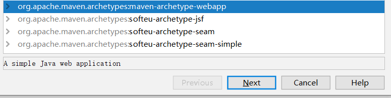
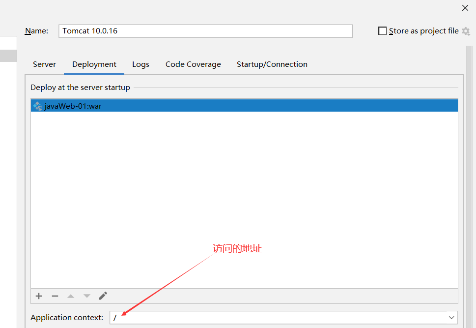
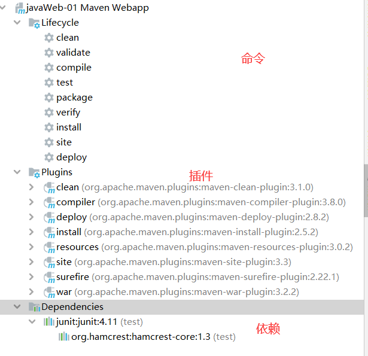
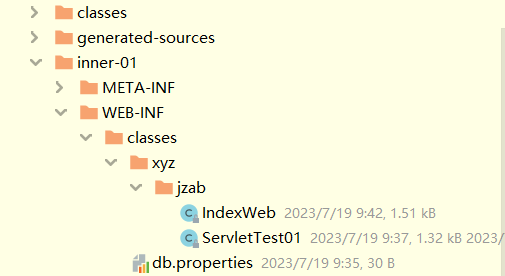
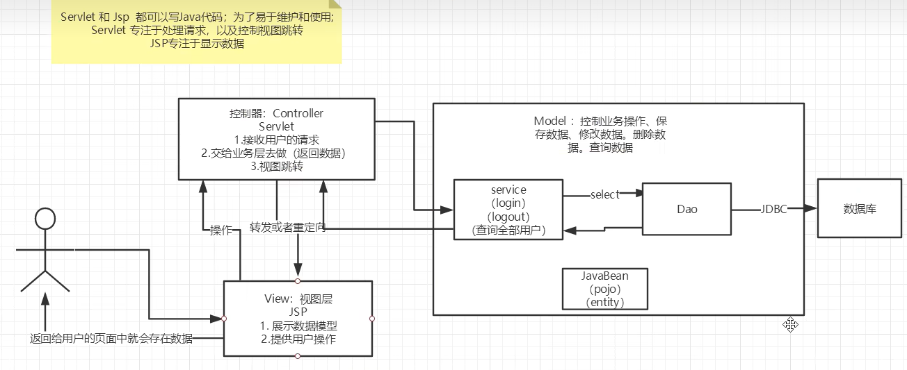

# 概念

## 三大web技术

ASP: 

- 国内最早流行的ASP,微软开发的
- HTML中嵌入VB的脚本
- 一个页面上千行的业务代码,十分混乱
- 维护成本高
- 开发语言为C#
- 依赖IIS服务器

PHP:

- 开发速度快,功能强大,跨平台,代码简答
- 无法承载大访问量

JSP/Servlet:

- sun公司主推的(B/S,浏览器服务器)
- 基于java语言
- 可以承载三高问题带来的影响(高性能,高可用,高并发)
- 语法像ASP

## web服务器

IIS: 微软开发,windows自带

tomcat: apache开发,轻量

## TOMCAT

安装完毕后,进入bin目录

> 启动: startup.bat
>
> 关闭: shutdown.bat

conf/server.xml为核心配置文件

可以配置启动的端口(默认8080),网站目录(默认webapps)等

访问时直接访问webapps下面的文件夹名字,会访问到文件夹内的index.html

```
-- webapps
	-- ROOT
	-- 自己的网站目录
		--WEB-INF
			-- classes java程序
			-- lib 依赖的jar包
			-- web.xml 配置
		-- index.html 首页
		-- static 静态资源
```

## HTTP请求

1.0和1.1的区别为: 1.1支持保持连接

请求行: url+方式

请求头: 

```
Accept: 支持的数据类型
Accept-Encoding: 支持的编码格式 GBk ISO8859-1 GB2312
Accept-Language: 支持的语言
Cache-Control: 缓存控制
Connection: 是否保持连接
HOST: 主机地址(地址栏内输入的)
```

响应状态码:

200: 成功

3XX: 重定向

404: 找不到

5XX: 服务端错误

502: 网关错误

# MAVEN

项目架构管理工具,可以方便导入jar包

核心思想: 约定大于配置

maven规定的项目的结构

## 环境变量设置

```
M2_HOME = maven安装目录下的bin目录
MAVEN_HOME = maven安装目录

path里面配置:
	%MAVEN_HOEM%\bin
```

## 配置文件

conf/settings.xml

```xml
<?xml version="1.0" encoding="UTF-8"?>
<settings xmlns="http://maven.apache.org/SETTINGS/1.2.0"
          xmlns:xsi="http://www.w3.org/2001/XMLSchema-instance"
          xsi:schemaLocation="http://maven.apache.org/SETTINGS/1.2.0 https://maven.apache.org/xsd/settings-1.2.0.xsd">
    <!-- 本地仓库 -->
    <localRepository>D:\environment\apache-maven-3.8.4\maven-repo</localRepository>
    <pluginGroups>
    </pluginGroups>
    <proxies>
    </proxies>
    <servers>
    </servers>
    <!-- 镜像配置 -->
    <mirror>
        <id>aliyunmaven</id>
        <mirrorOf>*</mirrorOf>
        <name>阿里云公共仓库</name>
        <url>https://maven.aliyun.com/repository/public</url>
    </mirror>
    <mirror>
        <id>maven-default-http-blocker</id>
        <mirrorOf>external:http:*</mirrorOf>
        <name>Pseudo repository to mirror external repositories initially using HTTP.</name>
        <url>https://maven.aliyun.com/mvn/guide/</url>
        <blocked>true</blocked>
    </mirror>
    </mirrors>
<profiles>
</profiles>
</settings>

```

## IDEA使用maven

### 1.创建javaweb项目

从模板创建,可以手动指定maven的配置和仓库



### 2.项目结构

```
-- src
	-- main
		-- java 代码文件
		-- resources 资源文件
		-- webapp 网站文件(javaweb特有)
	-- test 测试目录
```

### 3.配置tomcat



### 4.maven侧边栏



### 5.pom.xml配置

```xml
<?xml version="1.0" encoding="UTF-8"?>

<project xmlns="http://maven.apache.org/POM/4.0.0" xmlns:xsi="http://www.w3.org/2001/XMLSchema-instance"
         xsi:schemaLocation="http://maven.apache.org/POM/4.0.0 http://maven.apache.org/xsd/maven-4.0.0.xsd">
    <modelVersion>4.0.0</modelVersion>
    <!--GAV-->
    <groupId>xyz.jzab</groupId>
    <artifactId>javaWeb-01</artifactId>
    <version>1.0-SNAPSHOT</version>
    <!--  打包方式 jar:java项目 war:javaweb项目-->
    <packaging>war</packaging>

    <name>javaWeb-01 Maven Webapp</name>
    <!-- FIXME change it to the project's website -->
    <url>http://www.example.com</url>

    <!--  配置 -->
    <properties>
        <!-- 编译时的编码 -->
        <project.build.sourceEncoding>UTF-8</project.build.sourceEncoding>
        <maven.compiler.source>1.7</maven.compiler.source>
        <maven.compiler.target>1.7</maven.compiler.target>
    </properties>

    <!-- 项目依赖,会帮你导入jar包所依赖其他jar包 -->
    <dependencies>
        <dependency>
            <groupId>junit</groupId>
            <artifactId>junit</artifactId>
            <version>4.11</version>
            <scope>test</scope>
        </dependency>
    </dependencies>

    <!--  项目构建用的-->
    <build>
        <finalName>javaWeb-01</finalName>
    </build>
</project>
```

# servlet

servlet是一门动态web技术

sun公司提供一个叫servlet的接口,实现这个接口并将程序放入web服务器即可完成开发

把实现了这个接口的java程序叫做servlet

## HelloServlet

### 1.创建项目及初始化

创建一个maven项目,在项目内继续创建模块,这样可以方便管理,创建好java,resources等包

servlet依赖:

```xml
<dependency>
    <groupId>jakarta.servlet</groupId>
    <artifactId>jakarta.servlet-api</artifactId>
    <version>5.0.0</version>
    <scope>provided</scope>
</dependency>
```

### 2.编写一个普通类继承HttpServlet

sun公司默认servlet有两个实现类,这里使用HttpServlet,继承自抽象类GenericServlet,抽象类实现接口Servlet

核心方法为: 

```java 
public void service(ServletRequest req, ServletResponse res) throws ServletException, IOException;
```

### 3.重写doGet,doPost等

```java
@Override
protected void doGet(HttpServletRequest req, HttpServletResponse resp) throws ServletException, IOException {
    PrintWriter writer = resp.getWriter( );
    writer.println( "Hello World" );
}
```

### 4.注册url映射

```xml
<!--  注册java类 -->
<servlet>
    <servlet-name>inner-01</servlet-name>
    <servlet-class>xyz.jzab.ServletTest01</servlet-class>
</servlet>
<!--  对应的请求地址-->
<servlet-mapping>
    <servlet-name>inner-01</servlet-name>
    <url-pattern>/</url-pattern>
</servlet-mapping>
```

### 5.配置tomcat

## 原理

web容器(tomcat)接收到浏览器的请求之后,会封装成request对象然后调用service方法,service方法返回响应给容器,容器再和浏览器交互

## Mapping问题

1. 一个servlet可以指定多个url

2. 可以使用通配符*指定通配路径

```xml
<servlet-mapping>
    <servlet-name>test01</servlet-name>
    <url-pattern>/jjj/*</url-pattern>
</servlet-mapping>
```

3. 默认请求路径,index.jsp就是这个路径

```xml
<servlet-mapping>
    <servlet-name>test01</servlet-name>
    <url-pattern>/*</url-pattern>
</servlet-mapping>
```

4. 可以自定义后缀,但*前不能加任何东西

```xml
<servlet-mapping>
    <servlet-name>test01</servlet-name>
    <url-pattern>*.后缀</url-pattern>
</servlet-mapping>
```

5. 指定了固定的url,优先级更高,找不到再走默认的

## ServletContext

```java
this.getServletContext( ); //获取一个ServletContext对象
```

web容器在启动的时候,会为每一个web程序创建ServletContex对象,他代表了当前的web应用

他凌驾于所有Servlet之上,可以负责在不同Servlet之间传递数据

```java
// 1.共享数据
// 设置值
servletContext.setAttribute("key", value);
// 取值
servletContext.getAttribute("key");
// 2.获取web.xml中配置的初始化参数
servletContext.getInitParameter("url");
//<context-param>
//    <param-name>url</param-name>
//    <param-value>127.0.0.1:3306</param-value>
//</context-param>

// 3.请求转发,转发到指定的servlet类执行,对前端隐藏,不是重定向
servletContext.getRequestDispatcher("/index").forward(req,resp);

// 4.读取资源文件
// 新建Properties对象
Properties properties2 = new Properties(  );
// 从指定路径读取文件到流并装载到properties中
properties2.load(this.getServletContext().getResourceAsStream("/WEB-INF/classes/db.properties"));
System.out.println("password:"+properties2.getProperty("password"));
```

resources路径下和java路径下的文件都会被打包到同一个地方,这个地方就是类路径(classes)



## Response

### 1.大致分类

给浏览器发送数据的

```java
// 字节输出流
resp.getOutputStream();
// 字符输出流
resp.getWriter();
```

设置响应头

```java
void setCharacterEncoding(String var1);

void setContentLength(int var1);

void setContentLengthLong(long var1);

void setContentType(String var1);

void setDateHeader(String var1, long var2);

void addDateHeader(String var1, long var2);

void setHeader(String var1, String var2);

void addHeader(String var1, String var2);

void setIntHeader(String var1, int var2);

void addIntHeader(String var1, int var2);
```

设置状态码

```java
void setStatus(int var1);

/** @deprecated */
@Deprecated
void setStatus(int var1, String var2);
```


### 2.常见应用

#### 1.向浏览器输出消息

#### 2.下载文件

```java
ServletContext servletContext = this.getServletContext( );
// 获取文件的真实路径
String realPath = servletContext.getRealPath("/index.jsp");
System.out.println(realPath );
// 获取文件名
String fileName = realPath.substring(realPath.lastIndexOf("\\") + 1);
System.out.println(fileName );

// 设置响应头为下载,中文文件名可以使用URLEncode,UTF-8来进行编码
resp.setContentType("application/octet-stream");
resp.setHeader("Content-Disposition", "attachment;filename="+ URLEncoder.encode(fileName,"UTF-8"));

// 获取输入流
FileInputStream in = new FileInputStream(realPath);
// 创建缓冲区
byte[] buffer = new byte[1024];
// 创建输出流
ServletOutputStream outputStream = resp.getOutputStream( );
int len=0;
// 循环读取写入
while((len=in.read(buffer))>0){
    outputStream.write(buffer,0,len);
}
// 关闭输入输出流
in.close();
outputStream.close();
```

#### 3.图片验证码

```sql
// 设置刷新频率
resp.setHeader("refresh","5");
// 生成图片
BufferedImage bufferedImage = new BufferedImage(80,20,BufferedImage.TYPE_INT_RGB);
// 获取画笔
Graphics graphics = bufferedImage.getGraphics( );
// 设置黑色背景
graphics.setColor(Color.BLACK);
graphics.drawRect(0,0,80,20);
// 设置白色字体并写字
graphics.setColor(Color.WHITE);
graphics.drawString("114514",10,2);

// 设置返回的数据类型
resp.setContentType("image/png");
// 过期时间为-1
resp.setHeader("expires","-1");
// 不要进行缓存
resp.setHeader("Cache-Control","no-cache");
resp.setHeader("Pragma","no-cache");

// 写入到输出流
ImageIO.write(bufferedImage,"png",resp.getOutputStream());
```

#### 4.重定向

```java
// 重定向的路径是从端口号后面开始算的
resp.sendRedirect("/inner01/img");
// 原理,状态码为302
resp.setHeader("location","/inner01/img");
resp.setStatus(HttpServletResponse.SC_FOUND);
```

## Request

封装请求发来的数据

### 请求转发

```java
req.getRequestDispatcher("/index").forward(req,resp);
```

### 获取参数

```java
// 获取参数字典
req.getParameterMap();
// 获取参数名字
req.getParameterNames( );
// 获取参数
req.getParameter();
// 获取数组参数
req.getParameterValues();
```

## Cookie&Session

会话: 打开浏览器,进行各种访问操作

有状态会话: 保存用户的登录状态

## Cookie

一种客户端技术,通过响应中设置set-cookie字段来设置

一个站点最多发送20个cookie,一个浏览器最多有300个cookie

```java
// 获取Cookie列表
for(Cookie c: req.getCookies()){
    // 获取键和值
    System.out.println("key: "+c.getName( )+" "+"value: "+c.getValue( ));
}
// 新建cookie对象
Cookie cookie = new Cookie("username","102099");
// 设置过期时间为1天,不能设置为0,默认为-1
cookie.setMaxAge(24*60*60);
// cookie添加到响应
resp.addCookie(cookie);
```

删除Cookie: 设置有效期为0,不设置有效期关闭浏览器则删除

中文类型使用URLEncoding来进行存储

## Session

​	服务器技术,服务端可以保存会话状态数据,建议保存用户登录信息,购物车信息,经常使用的数据

```java
// 获取session列表
HttpSession session = req.getSession( );
// 设置session值
session.setAttribute("username","name"+System.currentTimeMillis());
// 获取sessionID
session.getId();
// session是否是新的
session.isNew();
// 删除session中的字段
session.removeAttribute("username");
// session手动注销
session.invalidate();

<session-config>
    <!--    15分钟后session自动生效,单位为分钟-->
    <session-timeout>15</session-timeout>
</session-config>
```

# JSP

Java Server Page(java服务端页面)

是一款模板引擎,允许在前端写java代码

浏览器向服务器发送请求都是访问servlet

JSP本质就是servlet的子类,实现了创建销毁和service方法

```java
public void _jspInit()

public void _jspDestroy()

public void _jspService(final jakarta.servlet.http.HttpServletRequest request, final jakarta.servlet.http.HttpServletResponse response)
```

内置了一些对象

```java
final jakarta.servlet.jsp.PageContext pageContext; // 页面上下文
jakarta.servlet.http.HttpSession session = null;   // session
final jakarta.servlet.ServletContext application;  // servlet上下文
final jakarta.servlet.ServletConfig config;		   // 配置
jakarta.servlet.jsp.JspWriter out = null;		   // 输出
final java.lang.Object page = this;				   // 当前页面
```

输出页面前

```java
application = pageContext.getServletContext();
config = pageContext.getServletConfig();
session = pageContext.getSession();
out = pageContext.getOut();
```

JSP中只要是java代码就会原封不动的输出,html代码转换为out.write("内容")

## JSP语法

```jsp
// 将程序的结果输出到客户端
<%= java代码 %>

// 多行脚本
<%
	java代码
%>

// for循环输出Html元素
<%
	for(i=0,i<5,i++){
%>

HTML元素

<%
	}
%>

// JSP声明, 定义外部方法和静态代码块(类空间内)
<%!
    
%>

// jsp注释,不会在客户端显示
<%-- --%>
// Html注释,在f12可以查看
<!-- -->
```

## JSP指令

```jsp
<%-- 导入包 --%>
<%@ page import="java.util.Date" %>
<%-- 指定错误页面 --%>
<%@ page errorPage="error/404.jsp" %>
<%-- 或者在web.xml中进行配置 --%>
<error-page>
    <error-code>404</error-code>
    <location>/error/404.jsp</location>
</error-page>

<%-- 包含子页面,直接静态代码合并替换,变量的命名空间会冲突 --%>
<%@include file="error/404.jsp"%>
<%-- 通过jsp标签包含子页面,生成之后再代码里面引用 --%>
<jsp:include page="/error/404.jsp"/>
```

## 内置对象

```java
// 一个页面有效,第三个参数可以传作用域数字1-4,对应这四条
pageContext.setAttribute("name1","111");
// 一个请求有效,请求转发会携带这个数据
request.setAttribute("name2","222");
// 在一个会话中有效
session.setAttribute("name3","333");
// 在一个服务器中有些
application.setAttribute("name4","444");

// 查找变量,四个层次都会查找
pageContext.findAttribute("查找变量")
```

## JSP,JSTL标签,EL表达式

### EL

语法: ${}

需要在jsp中使用下面的语句来启动el表达式

```jsp
<%@ page isELIgnored="false" %>
// el表达式获取参数
${param.参数名}
```

- 获取数据
- 执行运算
- 获取WEB开发的常用对象

### JSP标签

```jsp
// 包含子页面
<jsp:include page="/error/404.jsp"/>
// 转发请求,可以带参数
<jsp:forward page="/index.jsp">
    <jsp:param name="key1" value="value1"/>
    <jsp:param name="key2" value="value2"/>
</jsp:forward>
```

### JSTL标签

tomcat中没有jstl的包,需要手动复制导入,参考下面地址

https://blog.csdn.net/Aurinko324/article/details/124607724

```jsp
// 在jsp文件使用该语句包含jstl
<%@ taglib prefix="c" uri="http://java.sun.com/jsp/jstl/core" %>

// if条件语句
<c:if test="布尔值,可以用el表达式来计算" var="存储结果的变量">
    
</c:if>
// 输出
<c:out value="输出的值"/>

// 多路分支
<c:choose>
    <c:when test="${条件}">

    </c:when>
    <c:when test="${条件}">

    </c:when>
</c:choose>

// 循环
<%
	// 构造列表
    List<String> list = new ArrayList<>(  );
    list.add("name1");
    list.add("name2");
    list.add("name3");
    list.add("name4");
	// 将列表放入请求参数,否则下面获取不到
    request.setAttribute("list",list);
%>

// 遍历,items为要遍历的对象,var为遍历出来的对象存入什么变量
<c:forEach var="name" items="${list}">
    <c:out value="${name}"/>
</c:forEach>

// 定义其实数字和结束数字,包含前后边界
<c:forEach begin="0" end="10" step="1" var="i">
    <c:out value="${i}"/>
</c:forEach>
```

## JavaBean

必须有无参构造,属性必须私有,必须有get/set方法

一般用来和数据库做ORM

pojo/entity: 各种实体类的合称

PO: 数据库对象,用于从数据库获取值,一般无get/set之外的方法

BO: 业务对象,一般在业务层使用,是多个实体对象的组合

DTO: 数据传输对象,向数据层外围传输的对象,介于业务层控制层和前端之间,相较于上一层删减了一些数据,更加轻量

VO: 直接向前端传递的对象,可能会针对前端需求对数据进行一些处理

jsp中使用bean:

```jsp
<jsp:useBean id="user" class="xyz.jzab.pojo.User" scope="page"/>
<jsp:setProperty name="user" property="username" value="root"/>
<jsp:setProperty name="user" property="password" value="102099"/>
<h1>
    <jsp:getProperty name="user" property="username"/>
    <jsp:getProperty name="user" property="password"/>
</h1>
```

# MVC三层架构

Model 模型,连接数据库

View 视图,展示给用户

Controller 控制器,控制跳转

Service 处理业务逻辑




# 过滤器

设计类继承Filter类(servlet包下的)

```java
package xyz.jzab.filter;

import jakarta.servlet.*;
import jakarta.servlet.http.HttpServletRequest;

import java.io.IOException;

public class MyFilter implements Filter {
    @Override
    public void init(FilterConfig filterConfig) throws ServletException {
        System.out.println("创建" );
    }

    @Override
    public void doFilter(ServletRequest servletRequest, ServletResponse servletResponse, FilterChain filterChain) throws IOException, ServletException {
        HttpServletRequest request = (HttpServletRequest) servletRequest;
        System.out.println(request.getRequestURI( ));
        // 执行前
        // 将请求交给下一个过滤器
        filterChain.doFilter(request,servletResponse);
        // 执行后
    }

    @Override
    public void destroy() {
        System.out.println("销毁" );
    }
}

```

在web.xml中配置过滤器

```xml
<filter>
    <filter-name>myf</filter-name>
    <filter-class>xyz.jzab.filter.MyFilter</filter-class>
</filter>
<filter-mapping>
    <filter-name>myf</filter-name>
    <url-pattern>/*</url-pattern>
</filter-mapping>
```

# 监听器

监听各种事件如session的创建等

# 单元测试

导入Junit包,在方法(非静态方法)上加@Test注解

# 文件上传

1. 为保证服务器安全,上传的文件应该放在外界无法直接访问的目录下,比如放于WEB-INF目录下
2. 为防止文件覆盖的现象发生,要围上传文件产生一个唯一的文件名
3. 要限制上传文件的最大值
4. 可以限制上传文件的类型,在收到上传文件名是,判断后缀是否合法

# 邮件发送

要想实现需要有邮件服务器

```java
public void send() throws Exception{
    Properties prop = new Properties(  );
    // 基础配置
    prop.setProperty("mail.host","smtp.qq.com");
    prop.setProperty("mail.transport.protocol","smtp");
    prop.setProperty("mail.smtp.auth","true");

    // 设置qq邮箱的ssl加密
    MailSSLSocketFactory sf = new MailSSLSocketFactory(  );
    sf.setTrustAllHosts(true);
    prop.put("mail.smtp.ssl.enable","true");
    prop.put("mail.smtp.ssl.socketFactory",sf);

    // 创建session对象,该结构qq独有
    Session session = Session.getDefaultInstance(prop, new Authenticator( ) {
        @Override
        protected PasswordAuthentication getPasswordAuthentication() {
            // 自己的邮箱地址和授权码
            return new PasswordAuthentication("1970717299@qq.com","eohmxuizuuaibiga");
        }
    });
    // 获得发送邮件的对象
    Transport transport = session.getTransport( );
    // 连接服务器
    transport.connect("smtp.qq.com","1970717299@qq.com","eohmxuizuuaibiga");
    // 创建邮件
    MimeMessage mimeMessage = new MimeMessage(session);
    // 指明发件人与收件人
    mimeMessage.setFrom(new InternetAddress("1970717299@qq.com"));
    mimeMessage.setRecipient(Message.RecipientType.TO,new InternetAddress("hsy040506@163.com"));
    // 主题
    mimeMessage.setSubject("主题");
    // 正文
    mimeMessage.setContent("<h1>Hello World</h1>","text/html;charset=UTF-8");
    // 发送
    transport.sendMessage(mimeMessage,mimeMessage.getAllRecipients());
    transport.close();
}
```

# 登录项目

支持登录注册,登出,找回密码

√密码登录为: 用户名+密码+图形验证码,登录后会发邮件提示

√邮件登录为: 用户名+邮箱+邮箱验证码

注册: 用户名+密码+邮箱,注册时会使用邮箱接收链接

找回密码: 提供注册的邮箱,向邮箱发送链接,点击链接跳转到重置密码的页面

## 数据库设计

用户表: 主键,用户名,密码(md5),邮箱

## 页面

登录页面: 包含用户名,密码,图形验证码,提交按钮

注册页面: 包含用户名,密码,确认密码,邮箱,邮箱验证码,验证码60s重新发送按钮

密码找回页面: 包含用户名,邮箱

​	重设密码页面: 设置新密码和新密码验证

## 接口

登录接口

注册接口

生成找回链接的接口(MD5加盐生成字符串存session,然后进行比对)

重设密码接口

## 经验总结

```java
// 在非servlet的类中获取类路径并找到properties配置文件的方法
String path = DbcpUtils.class.getClassLoader( ).getResource("").toURI( ).getPath( );
InputStream in = new FileInputStream(path+ "/dbcp.properties");

// jsp文件头部这么写才能支持导入外部的css文件
<!DOCTYPE html  PUBLIC "-//W3C//DTD HTML 4.01 Transitional//EN">
```

