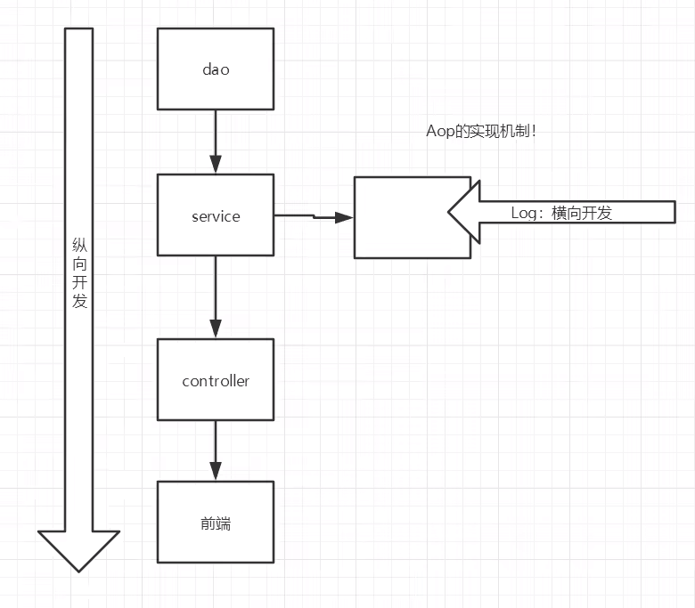

# Mybatis

官网: https://mybatis.org/mybatis-3/zh/index.html

持久层框架,简化jdbc开发

jdbc的缺点: 配置信息和sql语句硬编码,手动设置参数,封装结果集繁琐

mybatis: 配置文件, 提供函数简化代码

## 快速入门

1. 创建表和数据
2. 创建项目导入pom
3. 编程核心配置文件
4. 编写sql映射文件
5. 编写代码(实体类,加载核心配置文件获取sqlSessionFactory对象,获取sqlSession对象,执行sql语句,释放资源)

### 导入依赖和日志配置

``` xml
pom.xml

<!--mybatis的依赖-->
<dependency>
    <groupId>org.mybatis</groupId>
    <artifactId>mybatis</artifactId>
    <version>3.5.13</version>
</dependency>
<!--数据库驱动-->
<dependency>
    <groupId>mysql</groupId>
    <artifactId>mysql-connector-java</artifactId>
    <version>8.0.24</version>
</dependency>

<!--单元测试-->
<dependency>
    <groupId>junit</groupId>
    <artifactId>junit</artifactId>
    <version>4.11</version>
    <scope>test</scope>
</dependency>

<!--日志相关依赖-->
<dependency>
    <groupId>org.slf4j</groupId>
    <artifactId>slf4j-api</artifactId>
    <version>1.7.20</version>
</dependency>
<dependency>
    <groupId>ch.qos.logback</groupId>
    <artifactId>logback-classic</artifactId>
    <version>1.2.3</version>
</dependency>
<dependency>
    <groupId>ch.qos.logback</groupId>
    <artifactId>logback-core</artifactId>
    <version>1.2.3</version>
</dependency>

logback.xml

<?xml version="1.0" encoding="UTF-8"?>
<configuration>
    <!--    console表示当前日志信息是可以输出到控制台的-->
    <appender name="Console" class="ch.qos.logback.core.ConsoleAppender">
        <encoder>
            <pattern>【%level】  %cyan(【%thread】) %boldGreen(%logger{15}) - %msg %n</pattern>
        </encoder>
    </appender>
    <logger name="com.Carter_x" level="DEBUG" additivity="false">
        <appender-ref ref="Console"/>
    </logger>
</configuration>
```

### 书写核心配置文件

```xml
jdbc.properties

driver=com.mysql.cj.jdbc.Driver
url=jdbc:mysql://localhost:3306/mybatis?serverTimezone=UTC&useUnicode=true&characterEncoding=utf-8&useSSL=true
username=root
password=xxxxxx

mybatis.xml

<?xml version="1.0" encoding="UTF-8" ?>
<!DOCTYPE configuration
        PUBLIC "-//mybatis.org//DTD Config 3.0//EN"
        "https://mybatis.org/dtd/mybatis-3-config.dtd">
<configuration>
<!--    引入外部配置-->
    <properties resource="jdbc.properties"></properties>
    <environments default="development">
        <environment id="development">
            <transactionManager type="JDBC"/>
            <dataSource type="POOLED">
                <property name="driver" value="${driver}"/>
                <property name="url" value="${url}"/>
                <property name="username" value="${username}"/>
                <property name="password" value="${password}"/>
            </dataSource>
        </environment>
    </environments>
<!--    mapper文件路径配置-->
    <mappers>
        <mapper resource="mappers/UserMapper.xml"/>
    </mappers>
</configuration>
```

### 书写mapper映射文件

```xml
<?xml version="1.0" encoding="UTF-8" ?>
<!DOCTYPE mapper
        PUBLIC "-//mybatis.org//DTD Mapper 3.0//EN"
        "https://mybatis.org/dtd/mybatis-3-mapper.dtd">
<!-- 命名空间是dao层接口类-->
<mapper namespace="dao.UserMapper">
<!--    结果类型为对应的实体类 id为接口中的方法名-->
    <select id="select" resultType="pojo.User">
        select * from User where id = #{id}
    </select>

    <select id="selectAll" resultType="pojo.User">
        select * from User;
    </select>
</mapper>
```

### 执行sql语句

```java
// 1.创建sqlSessionFactory
String resource = "mybatis.xml";
InputStream inputStream = Resources.getResourceAsStream(resource);
SqlSessionFactory sqlSessionFactory = new SqlSessionFactoryBuilder().build(inputStream);

// 2.获取session
SqlSession session = sqlSessionFactory.openSession( );

// 3.获取mapper接口并返回结果
UserMapper userMapper = session.getMapper(UserMapper.class);
System.out.println(userMapper.selectAll( ));
```

## 关于sql语句提示问题

需要用idea连接数据库才可出现sql提示,若连接后仍不出现sql提示,则尝试在sql语句上 **alt+回车** 点击下面的位置,然后选择mysql即可


## Mapper代理开发

创建接口类

mapper映射文件与接口类在同一个包下

mapper映射文件内namespace配置类的全限定名

sql语句的id为接口内方法的名称

符合上述条件时,可以使用包扫描简化配置

```xml
<mappers>
    <!--        <mapper resource="mappers/UserMapper.xml"/>-->
    <package name="mappers"/>
</mappers>
```

## 核心配置文件

### properties

配置该行可以导入外部配置,配置数据库连接时直接使用${键名}取值即可

```xml
<properties resource="jdbc.properties"></properties>
```

### environments

配置数据库的连接环境,可以配置开发环境,测试环境,生产环境的environment,在environments上配置default为对应的环境

### 类型别名

配置完类型别名之后,在mappers文件中,返回类型和参数类型无需写全限定的类名,直接写类名即可

可以在实体类上使用@Alias("别名")注解来起别名

也可以在配置文件中使用typeAliases标签来起别名,该标签中可以使用typeAlias子标签来指定一个类的别名或者使用package子标签来指定一个包内所有类的别名

```xml
<typeAliases>
    <typeAlias type="xyz.jzab.pojo.Brand" alias="brand"/>
    <package name="xyz.jzab.pojo"/>
</typeAliases>
```

### 映射器

可以通过指定资源路径下的文件

或者指定类名

或者指定包名来指定xml文件,第二三种要求接口和配置文件在同一个包下,且文件名相同

```xml
<mappers>
    <mapper resource="xyz.jzab.mappers/UserMapper.xml"/>
    <mapper class="xyz.jzab.mappers/UserMapper.xml"/>
    <package name="xyz.jzab.mappers"/>
</mappers>
```

## MybatisX插件

settings->插件->搜索MybatisX

## xml配置文件

### 结果集映射

解决下划线命名与驼峰命名不兼容的问题,id为主键的映射,result为其他字段的映射,column为列名,property为属性名,查询语句的resultType替换为resultMap

```xml
<resultMap id="brandResult" type="Brand">
    <!--        <id column="" property=""></id>-->
    <result column="brand_name" property="brandName"></result>
    <result column="company_name" property="companyName"></result>
</resultMap>
```

### 占位符传参

#{} : 会替换为?的格式来设置参数,防止sql注入

${} : 直接拼接,会有sql注入问题,可以用于表名,列名不固定时,动态地查询

parameterType可以省略

### 特殊字符

xml中的sql语句,个别字符会报错,如<,可以使用CDATA区或者转义字符来解决

```xml
<![CDATA[ 特殊字符 ]]>
&lt;
```

### 多参数传递

#### 散装参数

直接使用散装参数传递,但需要@param注解来指定对应的占位符的名字

```java
List<Brand> selectByIdAndName(@Param("status") int status, @Param("name")String name);
```

#### 对象传参

要求占位符和传入的对象的参数名一致

#### map传参

需要map的键名称和占位符一致

### 动态sql

if标签,test部分写测试条件,条件为true则内部sql语句片段生效,使用占位符的名字进行判断,运算符为sql语法

where标签,被该标签包裹的部分不用害怕条件连接出错

```xml
select * from tb_brand
<where>
    <if test="status != null">
        status=#{status}
    </if>
    <if test="name != null and name != ''">
        and brand_name like #{name};
    </if>
</where>
```

choose标签,类似于switch,when类似于case,otherwise类似于default

```xml
<choose>
    <when test=""></when>
    <otherwise></otherwise>
</choose>
```

sql片段

```xml
<sql id="pd">
    片段
</sql>
<select id="">
    <include refid="pd"/>
</select>
```


### 主键返回

为插入语句设置useGeneratedKeys="true" keyProperty="id"可以将添加后生成的主键返回给传入的对象

```xml
<insert id="insert" useGeneratedKeys="true" keyProperty="id">
    insert into tb_brand(brand_name, company_name, ordered, description, status)
    values (#{brandName}, #{companyName}, #{ordered}, #{description}, #{status});
</insert>
```

### 动态更新

使用set标签和if标签组合的形式来解决

```xml
<update id="updateActive">
    update tb_brand
    <set>
        <if test="brandName!=null and brandName!=''">
            brand_name=#{brandName},
        </if>
        <if test="companyName!=null and companyName!=''">
            company_name=#{companyName},
        </if>
        <if test="ordered!=null">
            ordered=#{ordered},
        </if>
        <if test="description!=null">
            description=#{description},
        </if>
        <if test="status!=null">
            status=#{status}
        </if>
    </set>
    where id=#{id};
</update>
```

### 批量删除

在接口上用param注解规定传入的数组的名字,使用foreach标签取值

```xml
int deleteBatch(@Param("ids") int[] ids);

<delete id="deleteBatch">
    delete from tb_brand where id in
    <foreach collection="ids" item="id" open="(" close=")" separator=",">
        #{id}
    </foreach>
</delete>
```

### 参数传递

#### 多个参数

多个参数传入时会被封装到map集合中

key为: arg0-arg(n-1) 或者: param1-paramn , n为传入的参数个数

给对应的参数使用@param注解,会替换对应的arg键为注解内的名字,param键不会变

#### 单个参数

POJO: 占位符名和属性名一致即可

Map类型: 占位符名和键名一致

Collection: 通过arg0或者collection获得

List: 通过arg0或者collection或者list获得

Array(数组): 通过arg0或者array获得

其他类型: 如int,占位符写什么都可以接收到

## 注解开发

适用于基础的增删改查,在对应的接口上面进行注解

```java
@Select("sql语句")
@Update()
@Insert()
@Delete()
```

## 生命周期和作用域

使用错误会导致严重的并发问题

SqlSessionFactoryBuilder,放在局部变量中即可,生成工厂后他就没有用了

SqlSessionFactory,作用类似于数据库连接池,创建后应当一直存在,没有必要多次重建,使用单例模式

SqlSession,类似于一次请求,每个线程都应该有自己的SqlSession,需要开启和关闭

## 日志

### 日 志工厂

 SLF4J 

 LOG4J（3.5.9 起废弃） 

 LOG4J2 

 JDK_LOGGING 

 COMMONS_LOGGING 

 STDOUT_LOGGING （标准的日志工厂实现）

 NO_LOGGING

### log4j2配置

导入配置

```xml
<!--Log4j2自带的日志门面-->
<dependency>
    <groupId>org.apache.logging.log4j</groupId>
    <artifactId>log4j-api</artifactId>
    <version>2.17.1</version>
</dependency>
<!--Log4j2具体的日志实现-->
<dependency>
    <groupId>org.apache.logging.log4j</groupId>
    <artifactId>log4j-core</artifactId>
    <version>2.17.1</version>
</dependency>
```

可以自定义日志输出到文件或者gui中,通过配置文件控制

书写log4j2.xml文件作为配置文件,在mybatis的配置文件中选择使用log4j2

```xml
<settings>
    <setting name="logImpl" value="LOG4J2"/>
</settings>
```

log4j2.xml配置文件

```xml
<?xml version="1.0" encoding="UTF-8"?>
<Configuration>

    <Appenders>
        <!--        日志输出到控制台-->
        <Console name="CONSOLE" target="SYSTEM_OUT">
            <PatternLayout pattern="%d{DEFAULT} [%t] %-5level %logger{36} - %msg%n"/>
        </Console>

        <!--        日志输出到文件-->
        <File name="LOGFILE" fileName=".\mybatis.log" append="true">
            <PatternLayout pattern="%d{DEFAULT} [%t] %-5level %logger{36} - %msg%n"/>
        </File>
    </Appenders>

    <Loggers>
        <!--        自定义日志记录器-->
        <Logger name="xyz.jzab.mappers" level="trace" additivity="false">
            <AppenderRef ref="CONSOLE"/>
            <AppenderRef ref="LOGFILE"/>
        </Logger>

        <!--        根日志记录器-->
        <Root level="trace" >
            <AppenderRef ref="CONSOLE"/>
            <AppenderRef ref="LOGFILE"/>
        </Root>
    </Loggers>

</Configuration>
```

### log4j2使用

```java
Logger logger = LogManager.getLogger(this.getClass( ));
logger.fatal(" 严重错误，一般造成系统崩溃并终止运行");
logger.error(" 错误信息，不会影响系统运行");         //默认级别
logger.warn(" 警告信息，可能会发生问题");
logger.info(" 运行信息，数据连接，网络连接，IO操作等");
logger.debug(" 调试信息，一般在开发中使用，记录程序变量传递信息等等");
logger.trace(" 追踪信息，记录程序所有的流程信息");
```

## 分页查询

### limit

向sql语句传入 startIndex和PageSize两个参数来控制分页的大小

### rowBounds

弊端: 会查出前面所有的数据,再选择一部分

```java
RowBounds rowBounds = new RowBounds(5*20,20);
List<User> users = session.selectList("xyz.jzab.mappers.UserMapper.selectAll", null, rowBounds);
System.out.println(users );
```

### 分页插件

pageHelper: https://pagehelper.github.io/

```xml
<dependency>
    <groupId>com.github.pagehelper</groupId>
    <artifactId>pagehelper</artifactId>
    <version>官网首页查看最新版本</version>
</dependency>
```

## lombok

```xml
<dependency>
    <groupId>org.projectlombok</groupId>
    <artifactId>lombok</artifactId>
    <version>1.18.28</version>
</dependency>
```

## 多表查询

### 多对一

多个学生对应一个老师,查找学生时,学生的老师属性也被正确赋值

通过association查询对象属性的值,可以直接设置或者通过另一个查询来解决

```xml
<resultMap id="studentResult" type="Student">
    <id column="t1.id" property="id"/>
    <result column="t1.name" property="name"/>
    <association property="teacher" javaType="Teacher">
        <id property="id" column="teacher_id"/>
        <result property="name" column="t2_name"/>
    </association>
    <!--<association property="teacher" column="teacher_id" select="查询老师" javaType="Teacher"/>-->
</resultMap>

<select id="selectAll" resultMap="studentResult">
    select t1.id, t1.name, teacher_id, t2.name t2_name
    from student as t1, teacher as t2
    where teacher_id=t2.id;
</select>
```

### 一对多

查询一个老师下面所有的学生

通过collection标签实现,传入ofType指定集合内的泛型类型

```xml
<resultMap id="teacherDtoResult" type="TeacherDto">
    <id property="id" column="t2_id"/>
    <result property="name" column="t2_name"/>
    <collection property="users" ofType="Student">
        <id column="t1_id" property="id"/>
        <result column="t1_name" property="name"/>
    </collection>
</resultMap>

<select id="getTeachers" resultMap="teacherDtoResult">
    select t2.id t2_id,t2.name t2_name, t1.name t1_name,t1.id t1_id
    from student t1,teacher t2
    where t1.teacher_id = t2.id;
</select>
```

## 缓存

经常查询且不经常改变的数据需要缓存与之相反的则不能使用缓存

mysql默认定义了两级缓存, 一级缓存和二级缓存

默认情况下,只有一级缓存是开启的(sqlSession级别的缓存,也称为本地缓存)

二级缓存需要手动开启,是namespace级别的缓存

可以通过Cache接口实现自定义二级缓存

### 一级缓存

在一个session中两次进行相同的查询不会查询两次,只有第一次走查询,之后的查询走缓存
两次查询之间有增删改的操作会导致缓存失效

session.clearCache(); 可以清除缓存

### 二级缓存

在mapper文件中加cache标签同时全局设置中开启允许缓存(默认是开启的)即可开启二级缓存

```xml
mybatis.xml
<setting name="cacheEnabled" value="true"/>
mapper中
<cache
       eviction="FIFO"
       flushInterval="60000"
       size="512"
       readOnly="true"/>
```

查询后数据放到一级缓存中,sqlSession关闭时会将数据传到mapper的二级缓存中

### 自定义缓存

ehcache,可以分布式使用,先导入pom配置

```xml
<!--引入ehcache核心库/jar-->
<dependency>
    <groupId>net.sf.ehcache</groupId>
    <artifactId>ehcache-core</artifactId>
    <version>2.6.11</version>
</dependency>
<!--引入mybatis整合ehcache库/jar-->
<dependency>
    <groupId>org.mybatis.caches</groupId>
    <artifactId>mybatis-ehcache</artifactId>
    <version>1.2.1</version>
</dependency>
```

在配置缓存时带上类名

```xml
<cache
       type="org.mybatis.caches.ehcache.EhcacheCache"
       eviction="FIFO"
       flushInterval="60000"
       size="512"
       readOnly="true"/>
```


# spring

控制反转,面向切面的轻量级编程框架

2002年首次退出spring的雏形interface21

2004年3月24 spring诞生

spring的理念: 使现有的技术更加容易使用,本身是一个大杂烩


```xml
<dependency>
    <groupId>org.springframework</groupId>
    <artifactId>spring-webmvc</artifactId>
    <version>6.0.11</version>
</dependency>
```

## 优点

开源,免费,轻量,非入侵式

**控制反转(IOC),面向切面编程(AOP)**

支持事务,对框架整合的支持

## 七大模块


## Spring应用

SpringBoot: 一个快速开发脚手架,可以开发单个微服务

SpringCloud: 基于SpringBoot实现的,

## IOC

之前的业务一般为: service->dao的架构

若一个dao层接口存在多个实现类,当service层用属性包含dao层时,service层想要更换dao层的实现,需要修改代码中的new出来的对象

不同的需求会影响原来的代码,若程序很大,修改的代价很昂贵
我们实现一个set接口来设置dao层的实现

之前程序主动创建对象,控制权在程序手上

使用set注入之后,程序不再主动创建对象,而且由set注入

控制反转就是指,获得依赖对象的方式反转了

控制翻转是一种通过描述(XMl或注解)并通过第三方去生产或获取特定对象的方式。在spring中实现控制反转的是Ioc容器,其实现方法是依赖注入(DI)

## 快速入门

书写bean.xml配置文件

id为一个bean不重复的唯一标识, class为创造Bean的类,property标签用来设置bean的属性

```xml
<?xml version="1.0" encoding="UTF-8"?>
<beans xmlns="http://www.springframework.org/schema/beans"
       xmlns:xsi="http://www.w3.org/2001/XMLSchema-instance"
       xsi:schemaLocation="http://www.springframework.org/schema/beans
		https://www.springframework.org/schema/beans/spring-beans.xsd">

    <bean id="hello" class="xyz.jzab.Hello">
        <!-- 设置属性和值,value可以换成ref代表引用另一个spring对象 -->
        <property name="name" value="Hello World"/>
    </bean>
</beans>
```

获取spring的上下文对象,通过该对象获取Bean,执行第一行时会创建所有注册的bean

```java
ApplicationContext context = new ClassPathXmlApplicationContext("bean.xml");
System.out.println(context.getBean("hello"));
```

## IOC创建对象的方式

默认通过无参构造创建对象,在bean标签内部写该子标签可以通过有参的形式构造对象

name可以替换为index=n ,指定是第几个参数

```
<constructor-arg name="name" value="Hello World2"/>
```

## Spring配置

### 别名

对一个bean起别名

```
<alias name="原名" alias="别名"/>
```

### bean的配置

id: bean的唯一名, class: bean的全限定类名 , name: 别名,可以起多个别名,中间的分隔符可以是逗号,空格,分号等等

    <bean id="hello" class="xyz.jzab.Hello" name="别名1,别名2">
        <!-- 设置属性和值,value可以换成ref代表引用另一个spring对象 -->
        <property name="name" value="Hello World"/>
    </bean>
### import

用一个配置文件包含其他的配置文件

```xml
<import resource="bean.xml"/>
```

## DI依赖注入

### 构造器注入

之前学过

### set注入

依赖: bean对象的创建基于容器

注入: bean中的所有属性由容器来注入

#### 普通注入

```xml
<property name="name" value="侯森垚"/>
```

#### 对象注入

```xml
<property name="address" ref="address"/>
<property name="address2">
    <bean class="xyz.jzab.Address">
        <property name="address" value="石家庄"/>
    </bean>
</property>
```

#### 数组注入

```xml
<property name="books">
    <array value-type="java.lang.String">
        <value>书本1</value>
        <value>书本2</value>
        <value>书本3</value>
        <value>书本4</value>
    </array>
</property>
```

#### list注入

```xml
<property name="numbers">
    <list value-type="java.lang.String">
        <value>114513</value>
        <value>114514</value>
    </list>
</property>
```

#### set注入 

```xml
<property name="games">
    <set value-type="java.lang.String">
        <value>游戏1</value>
        <value>游戏2</value>
        <value>游戏3</value>
    </set>
</property>
```

#### map注入

```xml
<property name="card">
    <map key-type="java.lang.String" value-type="java.lang.String">
        <entry key="身份证" value="111222333"/>
        <entry key="学生证件" value="421xxxxx"/>
    </map>
</property>
```

#### null注入

```xml
<property name="wife">
    <null/>
</property>
```

#### properties注入

```xml
<property name="info">
    <props>
        <prop key="学号">420000</prop>
    </props>
</property>
```


### 拓展方式注入 p,c命名空间

p命名空间,导入之后可以直接配置一些简单的属性,要在xml文件头部引入命名空间

```xml
       xmlns:p="http://www.springframework.org/schema/p"
<bean id="hello" class="xyz.jzab.Hello" p:name="Hello World"/>
```

c命名空间,导入之后可以直接配置有参构造传入

```xml
       xmlns:c="http://www.springframework.org/schema/c"
<bean id="hello" class="xyz.jzab.Hello" c:name="Hello C"/>
```

## Bean的作用域

可以在bean标签上设置bean的作用域

```xml
<bean id="hello" class="xyz.jzab.Hello" c:name="Hello C" scope="prototype"/>
```

### singleton单例模式

全局存在唯一一个实例

### prototype原型模式

每一次获得(getBean)都是不同的对象

### 其余的

request,session,Application是在web情景下才生效的

## Bean的自动装配

Spring可以在上下文中自动寻找并装配属性,自动装配是Spring满足Bean依赖的一种方式

三种装配方式: 1. xml 2. 在java中显式配置 3. 隐式自动装配

### ByName

bean标签上配置autowire="byName",spring会在上下文中寻找beanId和自己的set方法重名的bean来进行装配

要求bean的id唯一

```xml
<bean id="dog" class="xyz.jzab.Dog"/>
<bean id="cat" class="xyz.jzab.Cat"/>

<bean id="person" class="xyz.jzab.Person" autowire="byName"/>
```

### ByType

寻找和自己对象属性类型一致的,必须保证一个类中的属性类型唯一

```xml
<bean id="person" class="xyz.jzab.Person" autowire="byType"/>
```

### 注解自动装配

jdk1.5,spring2.5自动装配

要实现注解自动装配需要导入context命名空间,同时书写对应的标签支持注解

```xml
<?xml version="1.0" encoding="UTF-8"?>
<beans xmlns="http://www.springframework.org/schema/beans"
       xmlns:xsi="http://www.w3.org/2001/XMLSchema-instance"
       xmlns:context="http://www.springframework.org/schema/context"
       xsi:schemaLocation="http://www.springframework.org/schema/beans
		https://www.springframework.org/schema/beans/spring-beans.xsd
		http://www.springframework.org/schema/context
		https://www.springframework.org/schema/context/spring-context.xsd">

    <context:annotation-config/>
</beans>
```

#### @AutoWired

在属性上加@AutoWired可以舍弃set方法也能注入属性,前提是这个属性再IOC容器中存在,且名字一致

标注了required=false说明这个对象可以为空

加一个@Qualifier(value = "id")可以指定唯一的bean的id

```xml
@Autowired
private Cat cat;

@Autowired(required = false)
@Qualifier(value = "dog")
private Dog dog;
```

#### @Resource

java自带的自动装配注解

#### 区别

- **Autowired注解**先根据类型（byType）查找，如果存在多个（Bean）再根据名称（byName）进行查找；
- **Resource注解**先根据名称（byName）查找，如果（根据名称）查找不到，再根据类型（byType）进行查找。

## Spring注解开发

spring4之后要使用注解开发要保证aop的包已经导入了

需要导入contex约束且配置注解支持

使用component-scan来指定那些包下的被注解标记的类会生效,包含指定的包的所有子包里的类

```xml
<?xml version="1.0" encoding="UTF-8"?>
<beans xmlns="http://www.springframework.org/schema/beans"
       xmlns:xsi="http://www.w3.org/2001/XMLSchema-instance"
       xmlns:context="http://www.springframework.org/schema/context"
       xsi:schemaLocation="http://www.springframework.org/schema/beans
		https://www.springframework.org/schema/beans/spring-beans.xsd
		http://www.springframework.org/schema/context
		https://www.springframework.org/schema/context/spring-context.xsd">
    
    <context:component-scan base-package="xyz.jzab"/>
    <context:annotation-config/>
</beans>
```

```txt
@Component: 代表一个类被Spring托管
@Repository: 代表这个类是一个dao类且被Spring托管
@Service: 代表这个类是一个service类且被Spring托管
@Controller: 代表这个类是一个controller类且被Spring托管
@Value("Hello World"): 为属性或set方法注入值
@Scope("作用域"): 指明一个bean的作用域是单例还是原型或者其他
```

XML万能,注解开发具有局限性维护相对复杂

一般用xml管理bean,注解注入属性值

## 使用java的方式配置spring

```java
// 声明这是配置类
@Configuration
// 包扫描
@ComponentScan("xyz.jzab")
// 包含其他配置类
@Import(SpringConfig.class)
public class SpringConfig {
    // 注册一个bean,返回值类型就是bean的类型,返回值就是或得到的bean,方法名就是bean的id
    @Bean
    public User user(){
        User user = new User();
        ArrayList<String> list = new ArrayList<>( );
        for (int i = 0; i < 10; i++) {
            list.add(UUID.randomUUID().toString());
        }
        user.name = "Name";
        user.list = list;
        return user;
    }
}

@Test
public void test(){
    // java类配置bean时创建上下文时需要用不一样的方法,传入配置类的class对象
    ApplicationContext context = new AnnotationConfigApplicationContext(SpringConfig.class);
    System.out.println(context.getBean("user"));
}
```

纯java配置在SpringBoot中常见

## AOP

### 代理模式

SpringAop的底层就是代理模式


#### 静态代理

角色分析:

- 抽象角色: 一般使用接口或者抽象类来解决
- 真实角色: 被代理的角色
- 代理角色: 代理真实角色, 代理真实角色后,一般会增加一些附加操作
- 客户: 访问代理对象的人

代理模式的好处:

- 可以使真实角色的操作更加纯粹,不用去关注一些公共的业务
- 公共业务交给代理角色,实现了业务的分工
- 公共业务发生扩展的时候,方便集中管理

缺点: 一个真实角色就会出现一个代理角色,代码量翻倍,开发繁琐



#### 动态代理

角色和静态代理一致,类是动态生成的,不是直接写好的

可以分为两大类: 基于接口的动态代理, 基于类的动态代理

- 基于接口: jdk动态代理
- 基于类: cglib
- 基于字节码: JAVAssist

需要了解InvocationHandler和Proxy两个类

用一个类实现InvocationHandler接口,然后在这个类中书写获取代理类的方法,传入的参数分别是,自己的ClassLoader,代理的接口,自己的实例,然后重写invoke方法,在主函数中调用获取代理类的方法,并强转为代理接口的类型即可使用

优点: 一个类可以代理多个类,只要他们实现了同一个接口

```java
package xyz.jzab;

import java.lang.reflect.InvocationHandler;
import java.lang.reflect.Method;
import java.lang.reflect.Proxy;

public class MyInvocationHandler implements InvocationHandler {

    private Runnable before;
    private Runnable after;
    private Object target;

    public void setBefore(Runnable before) {
        this.before = before;
    }

    public void setAfter(Runnable after) {
        this.after = after;
    }

    public void setTarget(Object target) {
        this.target = target;
    }

    public Object getProxy(){
        return Proxy.newProxyInstance(this.getClass().getClassLoader(),target.getClass().getInterfaces(),this);
    }

    @Override
    public Object invoke(Object proxy, Method method, Object[] args) throws Throwable {
        before.run();
        Object result = method.invoke(target, args);
        after.run();
        return result;
    }
}


public static void main(String[] args) {
    MyInvocationHandler myInvocationHandler = new MyInvocationHandler( );
    myInvocationHandler.setTarget(new Host());
    myInvocationHandler.setBefore(()->{
        System.out.println("之前的事情" );
    });
    myInvocationHandler.setAfter(()->{
        System.out.println("之后的事情" );
    });
    Rent proxy = (Rent) myInvocationHandler.getProxy( );
    proxy.rent();
    proxy.noRent();
}
```

### 什么是AOP

通过预编译和动态代理实现程序功能的统一维护


### Aop在Spring中的作用

提供声明式事务,允许用户自定义切面

- 横切关注点: 与业务逻辑无关的功能,如: 日志,安全,缓存等等
- 切面(ASPECT): 横切关注点被模块化的特别对象,是实现上面功能的类
- 通知(Advice): 切面必须完成的工作,切面类中的具体方法
- 目标(Target): 被通知的对象, 被代理的类
- 代理(Proxy): 向目标对象应用通知之后创建的对象, 代理完之后的代理类
- 切入点(PointCut): 切面通知执行的"地点"的定义, 方法执行在业务之前还是之后
- 连接点(JoinPoint): 与切入点匹配的执行点

### 使用Aop

需要先导入一个包

```xml
<dependency>
    <groupId>org.aspectj</groupId>
    <artifactId>aspectjweaver</artifactId>
    <version>1.9.19</version>
</dependency>
```

#### 方式一: 使用spring的接口

##### 首先书写要被代理的接口和类和切面类(代理类)

切面类要实现aop包下的接口

```java
package xyz.jzab.log;

import org.springframework.aop.MethodBeforeAdvice;

import java.lang.reflect.Method;

public class Log implements MethodBeforeAdvice {

    @Override
    public void before(Method method, Object[] objects, Object o) throws Throwable {
        System.out.println("执行了"+method.getName() );
//        method.invoke(o,objects);
    }
}

package xyz.jzab.log;


import org.springframework.aop.AfterReturningAdvice;

import java.lang.reflect.Method;

public class AfterLog implements AfterReturningAdvice {

    @Override
    public void afterReturning(Object returnValue, Method method, Object[] args, Object target) throws Throwable {
        System.out.println("["+method.getName()+"] 执行完毕: "+returnValue);
    }
}
```

##### 然后将类注册到bean中,同时配置aop

```xml
<?xml version="1.0" encoding="UTF-8"?>
<beans xmlns="http://www.springframework.org/schema/beans"
       xmlns:xsi="http://www.w3.org/2001/XMLSchema-instance"
       xmlns:aop="http://www.springframework.org/schema/aop"
       xsi:schemaLocation="http://www.springframework.org/schema/beans
		https://www.springframework.org/schema/beans/spring-beans.xsd
        http://www.springframework.org/schema/aop
		https://www.springframework.org/schema/aop/spring-aop.xsd">


    <bean id="afterLog" class="xyz.jzab.log.AfterLog"/>
    <bean id="log" class="xyz.jzab.log.Log"/>
    <bean id="userService" class="xyz.jzab.service.UserServiceImpl"/>

<!--    方式一: 使用原生的API-->
    <aop:config>
<!--        定义切入点 第一个*是返回类型 -->
        <aop:pointcut id="pointcut" expression="execution(* xyz.jzab.service.UserService.*(..))"/>
<!--        执行环绕增加-->
        <aop:advisor advice-ref="log" pointcut-ref="pointcut"/>
        <aop:advisor advice-ref="afterLog" pointcut-ref="pointcut"/>
    </aop:config>
</beans>
```

##### 调用时传入接口的类型而不是实现类

```xml
ApplicationContext context = new ClassPathXmlApplicationContext("beans.xml");
UserService userService = context.getBean("userService",UserService.class);
userService.add();
```

#### 方式二: 使用自定义类实现

自己写一个普通类并写方法

然后进行注册,切面选择刚刚书写的类的bean,切面内部定义前后就行

```xml

<bean id="diy" class="xyz.jzab.log.DiyLog"/>

<aop:config>
    <aop:aspect ref="diy">
        <aop:pointcut id="pointcut" expression="execution(* xyz.jzab.service.UserService.*(..))"/>
        <aop:after method="after" pointcut-ref="pointcut"/>
        <aop:before method="before" pointcut-ref="pointcut"/>
    </aop:aspect>
</aop:config>
```

#### 方式三: 使用注解实现

书写一个类

```java
package xyz.jzab.log;

import org.aspectj.lang.annotation.After;
import org.aspectj.lang.annotation.Aspect;
import org.aspectj.lang.annotation.Before;

@Aspect
public class AnnotationLog {
    @Before("execution(* xyz.jzab.service.UserService.*(..))")
    public void before(){
        System.out.println("<---------------前--------------->" );
    }

    @After("execution(* xyz.jzab.service.UserService.*(..))")
    public void after(){
        System.out.println("<---------------后--------------->" );
    }
}
```

注册并开启注解

```xml
<bean id="annotationLog" class="xyz.jzab.log.AnnotationLog"/>
<aop:aspectj-autoproxy/>
```

## 整合Mybatis

首先导入一些包

```xml
<dependency>
    <groupId>org.springframework</groupId>
    <artifactId>spring-webmvc</artifactId>
    <version>5.2.25.RELEASE</version>
</dependency>

<dependency>
    <groupId>junit</groupId>
    <artifactId>junit</artifactId>
    <version>4.13.2</version>
    <scope>test</scope>
</dependency>
<!--        aop 织入-->
<dependency>
    <groupId>org.aspectj</groupId>
    <artifactId>aspectjweaver</artifactId>
    <version>1.9.19</version>
</dependency>

<dependency>
    <groupId>mysql</groupId>
    <artifactId>mysql-connector-java</artifactId>
    <version>8.0.16</version>
</dependency>
<dependency>
    <groupId>org.mybatis</groupId>
    <artifactId>mybatis</artifactId>
    <version>3.5.13</version>
</dependency>
<dependency>
    <groupId>org.springframework</groupId>
    <artifactId>spring-jdbc</artifactId>
    <version>5.2.0.RELEASE</version>
</dependency>
<dependency>
    <groupId>org.mybatis</groupId>
    <artifactId>mybatis-spring</artifactId>
    <version>2.1.1</version>
</dependency>


<!--Log4j2自带的日志门面-->
<dependency>
    <groupId>org.apache.logging.log4j</groupId>
    <artifactId>log4j-api</artifactId>
    <version>2.17.1</version>
</dependency>
<!--Log4j2具体的日志实现-->
<dependency>
    <groupId>org.apache.logging.log4j</groupId>
    <artifactId>log4j-core</artifactId>
    <version>2.17.1</version>
</dependency>
```

### 实现方式1

为mapper接口写实现类

```java
package xyz.jzab.mappers;

import org.mybatis.spring.SqlSessionTemplate;
import xyz.jzab.pojo.User;

import java.util.List;

public class UserMapperImpl implements UserMapper{
    SqlSessionTemplate sqlSession;

    public void setSqlSession(SqlSessionTemplate sqlSession) {
        this.sqlSession = sqlSession;
    }

    @Override
    public int add(User user) {
        UserMapper mapper = sqlSession.getMapper(UserMapper.class);
        return mapper.add(user);
    }

    @Override
    public int delete(int id) {
        UserMapper mapper = sqlSession.getMapper(UserMapper.class);
        return mapper.delete(id);
    }

    @Override
    public int update(User user) {
        UserMapper mapper = sqlSession.getMapper(UserMapper.class);
        return mapper.update(user);
    }

    @Override
    public List<User> selectAll() {
        UserMapper mapper = sqlSession.getMapper(UserMapper.class);
        return mapper.selectAll();
    }
}
```

在spring bean中进行一系列配置

```xml
<!--    注册spring的数据源到bean,这个数据源来自spring-jdbc包-->
<bean id="datasource" class="org.springframework.jdbc.datasource.DriverManagerDataSource">
    <property name="driverClassName" value="com.mysql.cj.jdbc.Driver"/>
    <property name="url" value="jdbc:mysql://localhost:3306/mybatis?serverTimezone=UTC&amp;useUnicode=true&amp;characterEncoding=utf-8&amp;useSSL=true"/>
    <property name="username" value="root"/>
    <property name="password" value="xxxxxx"/>
</bean>

<!--    sqlSessionFactory注册到bean-->
<bean id="sqlSessionFactory" class="org.mybatis.spring.SqlSessionFactoryBean">
    <property name="dataSource" ref="datasource"/>
    <property name="configLocation" value="classpath:mybatis.xml"/>
    <property name="typeAliasesPackage" value="xyz.jzab.pojo"/>
    <property name="mapperLocations" value="classpath:xyz/jzab/mappers/*.xml"/>
</bean>

<!--    sqlSessionTemplate注册到bean 通过构造器注入-->
<bean id="sqlSession" class="org.mybatis.spring.SqlSessionTemplate">
    <constructor-arg index="0" ref="sqlSessionFactory"/>
</bean>

<!--    Mapper接口的实现类注册到bean-->
<bean id="userMapper" class="xyz.jzab.mappers.UserMapperImpl">
    <property name="sqlSession" ref="sqlSession"/>
</bean>
```

直接获得注册的实现类并执行

```xml
ApplicationContext context = new ClassPathXmlApplicationContext("spring-dao.xml");
UserMapper userMapper = context.getBean("userMapper",UserMapper.class);
System.out.println(userMapper.selectAll( ));
```

### 实现方式2

为接口写实现类,并继承SqlSessionDaoSupport类,通过父类的getSession即可获得sqlSession

```java
package xyz.jzab.mappers;

import org.mybatis.spring.support.SqlSessionDaoSupport;
import xyz.jzab.pojo.User;

import java.util.List;

public class UserMapperImpl2 extends SqlSessionDaoSupport implements UserMapper {
    @Override
    public int add(User user) {
        UserMapper mapper = getSqlSession( ).getMapper(UserMapper.class);
        return mapper.add(user);
    }

    @Override
    public int delete(int id) {
        UserMapper mapper = getSqlSession( ).getMapper(UserMapper.class);
        return mapper.delete(id);
    }

    @Override
    public int update(User user) {
        UserMapper mapper = getSqlSession( ).getMapper(UserMapper.class);
        return mapper.update(user);
    }

    @Override
    public List<User> selectAll() {
        UserMapper mapper = getSqlSession( ).getMapper(UserMapper.class);
        return mapper.selectAll();
    }
}
```

配置bean,注入SqlSessionFactory属性

```xml
<!--    注册spring的数据源到bean,这个数据源来自spring-jdbc包-->
<bean id="datasource" class="org.springframework.jdbc.datasource.DriverManagerDataSource">
    <property name="driverClassName" value="com.mysql.cj.jdbc.Driver"/>
    <property name="url" value="jdbc:mysql://localhost:3306/mybatis?serverTimezone=UTC&amp;useUnicode=true&amp;characterEncoding=utf-8&amp;useSSL=true"/>
    <property name="username" value="root"/>
    <property name="password" value="xxxxxx"/>
</bean>

<!--    sqlSessionFactory注册到bean-->
<bean id="sqlSessionFactory" class="org.mybatis.spring.SqlSessionFactoryBean">
    <property name="dataSource" ref="datasource"/>
    <property name="configLocation" value="classpath:mybatis.xml"/>
    <property name="typeAliasesPackage" value="xyz.jzab.pojo"/>
    <property name="mapperLocations" value="classpath:xyz/jzab/mappers/*.xml"/>
</bean>

<bean id="userMapper2" class="xyz.jzab.mappers.UserMapperImpl2">
    <property name="sqlSessionFactory" ref="sqlSessionFactory" />
</bean>
```

## 事务

一组操作要么都成功,要么都失败,确保数据完整性和一致性

ACID: 原子性,一致性,隔离性,持久性

### 声明式事务: AOP

在bean中配置事务管理器并配置到业务切面中即可

```xml
<!--    配置事务管理器-->
<bean id="transactionManager" class="org.springframework.jdbc.datasource.DataSourceTransactionManager">
    <constructor-arg name="dataSource" ref="datasource"/>
</bean>

<!--    配置事务通知-->
<tx:advice id="txAdvice" transaction-manager="transactionManager">
    <!--        给哪些方法配置事务-->
    <tx:attributes>
        <!--            REQUIRED为默认的事务传播方式,事务存在则执行,否则新建事务-->
        <tx:method name="add" propagation="REQUIRED"/>
        <tx:method name="delete"/>
        <tx:method name="update"/>
        <!--            设置只读-->
        <tx:method name="select" read-only="true"/>
    </tx:attributes>
</tx:advice>

<!--    配置事务切入-->
<aop:config>
    <!--        配置切入点-->
    <aop:pointcut id="pointcut" expression="execution(* xyz.jzab.mappers.*.*(..))"/>
    <aop:advisor advice-ref="txAdvice" pointcut-ref="pointcut"/>
</aop:config>
```

### 编程式事务: 需要在代码中进行事务管理

# springMVC

MVC: 模型 - 视图 - 控制

优点: 

- 轻量级, 简单易学
- 高效, 基于请求响应
- 与spring兼容性好,无缝结合
- 约定优于配置
- 功能强大: RESTful、数据验证、格式化、本地化、主题等
- 简洁灵活

Spring的web框架围绕DispatcherServlet[调度Servlet] 设计, 它负责将请求分发到不同的处理器


请求流程


## 快速搭建

### 1.注册DispatcherServlet到web.xml中

```xml

<servlet>
    <servlet-name>springmvc</servlet-name>
    <servlet-class>org.springframework.web.servlet.DispatcherServlet</servlet-class>
    <!--        关联一个speringmvc的配置文件-->
    <init-param>
        <param-name>contextConfigLocation</param-name>
        <param-value>classpath:spingmvc-servlet.xml</param-value>
    </init-param>
    <!--启动级别为1-->
    <load-on-startup>1</load-on-startup>
</servlet>

<!--/匹配所有的不包含.jsp的请求-->
<!--/*匹配所有的的请求-->
<servlet-mapping>
    <servlet-name>springmvc</servlet-name>
    <url-pattern>/</url-pattern>
</servlet-mapping>
```

### 2.书写springmvc-servlet.xml配置文件

```xml
<?xml version="1.0" encoding="UTF-8"?>
<beans xmlns="http://www.springframework.org/schema/beans"
       xmlns:mvc="http://www.springframework.org/schema/mvc"
       xmlns:context="http://www.springframework.org/schema/context"
       xmlns:xsi="http://www.w3.org/2001/XMLSchema-instance"
       xsi:schemaLocation="
	http://www.springframework.org/schema/beans
	http://www.springframework.org/schema/beans/spring-beans.xsd
	http://www.springframework.org/schema/mvc
	http://www.springframework.org/schema/mvc/spring-mvc.xsd
	http://www.springframework.org/schema/context
	http://www.springframework.org/schema/context/spring-context.xsd">

    <bean class="org.springframework.web.servlet.handler.BeanNameUrlHandlerMapping"/>
    <bean class="org.springframework.web.servlet.mvc.SimpleControllerHandlerAdapter"/>

    <!--视图解析器-->
    <bean class="org.springframework.web.servlet.view.InternalResourceViewResolver" id="InternalResourceViewResolver">
        <!--前缀-->
        <property name="prefix" value="/WEB-INF/jsp/"/>
        <!--后缀-->
        <property name="suffix" value=".jsp"/>
    </bean>
</beans>
```

### 3.书写Controller

```java
package xyz.jzab.controller;

import org.springframework.web.servlet.ModelAndView;
import org.springframework.web.servlet.mvc.Controller;

import javax.servlet.http.HttpServletRequest;
import javax.servlet.http.HttpServletResponse;

public class UserController implements Controller {

    @Override
    public ModelAndView handleRequest(HttpServletRequest httpServletRequest, HttpServletResponse httpServletResponse) throws Exception {
        ModelAndView mv = new ModelAndView(  );
        mv.addObject("msg","Hello SpringMvc");
        mv.setViewName("hello");
        return mv;
    }
}
```

### 4.Controller配置到bean

```xml
<bean id="/hello" class="xyz.jzab.controller.UserController"/>
```

### 5.jar包添加到项目的导出


## 执行流程


1. 前置控制器接收用户的请求并拦截
2. HeadlerMapping为处理器映射, 前置控制器调用它,它根据请求的url查找handler
3. HandlerExecution为具体的Handler,作用为根据url查找控制器
4. HandlerExecution将解析完的数据返回给DispatcherSe rvlet
5. HandlerAdapter为处理器适配器,按照特定的规则执行Handler
6. Handler让具体的Controller执行
7. Controller返回执行结果,如ModelAndView
8. HandlerAdapter将视图逻辑名或模型传递给DispatcherServlet
9. 前置控制器调用视图解析器来解析传递的视图逻辑名
10. 视图解析器将解析的视图名返回
11. 前置控制器根据视图解析器的解析结果调用具体的视图
12. 视图呈现给用户

## 注解开发

### 1. 配置web.xml

```xml
<?xml version="1.0" encoding="UTF-8"?>
<web-app xmlns="http://xmlns.jcp.org/xml/ns/javaee"
         xmlns:xsi="http://www.w3.org/2001/XMLSchema-instance"
         xsi:schemaLocation="http://xmlns.jcp.org/xml/ns/javaee http://xmlns.jcp.org/xml/ns/javaee/web-app_4_0.xsd"
         version="4.0">
    
    <servlet>
        <servlet-name>springmvc</servlet-name>
        <servlet-class>org.springframework.web.servlet.DispatcherServlet</servlet-class>
        <init-param>
            <param-name>contextConfigLocation</param-name>
            <param-value>classpath:springmvc.xml</param-value>
        </init-param>
        <load-on-startup>1</load-on-startup>
    </servlet>

    <servlet-mapping>
        <servlet-name>springmvc</servlet-name>
        <url-pattern>/</url-pattern>
    </servlet-mapping>
</web-app>
```

### 2.配置spring

```xml
<?xml version="1.0" encoding="UTF-8" ?>
<beans xmlns="http://www.springframework.org/schema/beans"
       xmlns:xsi="http://www.w3.org/2001/XMLSchema-instance"
       xmlns:context="http://www.springframework.org/schema/context"
       xmlns:mvc="http://www.springframework.org/schema/mvc"
       xsi:schemaLocation="http://www.springframework.org/schema/beans
        http://www.springframework.org/schema/beans/spring-beans.xsd
        http://www.springframework.org/schema/context
        http://www.springframework.org/schema/context/spring-context.xsd
        http://www.springframework.org/schema/mvc
        http://www.springframework.org/schema/mvc/spring-mvc.xsd">
    <context:component-scan base-package="xyz.jzab"/>
    <!-- 让它不处理静态资源 -->
    <mvc:default-servlet-handler/>
    <!-- 支持mvc注解驱动-->
    <mvc:annotation-driven/>

    <bean id="internalResourceViewResolver" class="org.springframework.web.servlet.view.InternalResourceViewResolver">
        <property name="prefix" value="/WEB-INF/jsp/"/>
        <property name="suffix" value=".jsp"/>
    </bean>
</beans>
```

### 3. 书写Controller和jsp实现业务逻辑

### 注解总结

```txt
@Controller 指定一个类是控制层
@Component 将一个类放到spring bean中
@Service 指定一个类是service层
@Repository 指定一个类是dao层

@RequestMapping("/hello") 指定类或方法的请求地址,可以通过Method参数指定请求方式
@GetMapping等 RequestMapping的变种,每个请求方法都有对应的
@ResponseBody 指定一个方法的返回值不走视图解析,而是纯字符串类型
@PathVariable 指定一个方法中的参数是一个url传参,在url中使用{变量名}来指定参数的位置
```

## RestFul风格

使用不同的请求方式(GET,PUT,POST等),来获得不同的效果

## 转发和重定向

在不设置视图解析器的时候,方法返回值以斜杠开头如: `/WEB-INF/jsp/hello.jsp`

或者任何时候返回值以 forward:开头都代表请求的转发,转发到指定的地址

返回值用redirect:开头,会进行重定向

## 接收请求参数和数据回显

### 1.提交请求的参数和方法参数名一致

直接获取

### 2.名称不一致

在参数上加注解@RequestParam("请求参数名")来进行处理

### 3.传过来的是对象

会匹配传过来的参数名和字段名,一样则赋值

### 4.数据返回对象

LinkedHashMap: 父类,具有很多方法

Model: 简化的LinkedHashMap

ModelAndView: 在Model的基础上支持视图跳转

## 解决乱码问题

当直接返回文本时,使用注解来解决乱码问题

```xml
@RequestMapping(value="/login",produces ="text/html;charset=utf-8")
```

可以在spring中这么配置,就不需要使用注解了

```xml
<!-- 支持mvc注解驱动-->
<mvc:annotation-driven>
    <mvc:message-converters register-defaults="true">
        <bean class="org.springframework.http.converter.StringHttpMessageConverter">
            <constructor-arg value="UTF-8"/>
        </bean>
        <bean class="org.springframework.http.converter.json.MappingJackson2HttpMessageConverter">
            <property name="objectMapper">
                <bean class="org.springframework.http.converter.json.Jackson2ObjectMapperFactoryBean">
                    <property name="failOnEmptyBeans" value="false"/>
                </bean>
            </property>
        </bean>
    </mvc:message-converters>
</mvc:annotation-driven>
```

web.xml配置过滤器解决乱码问题

```xml
<filter>
    <filter-name>encoding</filter-name>
    <filter-class>org.springframework.web.filter.CharacterEncodingFilter</filter-class>
    <init-param>
        <param-name>encoding</param-name>
        <param-value>utf-8</param-value>
    </init-param>
</filter>

<filter-mapping>
    <filter-name>encoding</filter-name>
    <url-pattern>/*</url-pattern>
</filter-mapping>
```

## JSON

```js
// 前端将json转换为对象
JSON.parse(str);
// 前端将对象转换为json
JSON.stringify(obj);
```

### jackson

首先配置jar包

```xml
<!-- https://mvnrepository.com/artifact/com.fasterxml.jackson.core/jackson-databind -->
<dependency>
    <groupId>com.fasterxml.jackson.core</groupId>
    <artifactId>jackson-databind</artifactId>
    <version>2.15.2</version>
</dependency>
```

使用objectMapper来生成json字符串

可以对它设置时间解析的格式

```java
ObjectMapper objectMapper = new ObjectMapper( );
// 设置不把时间写成时间戳
objectMapper.configure(SerializationFeature.WRITE_DATES_AS_TIMESTAMPS,false);
objectMapper.setDateFormat(new SimpleDateFormat("yyyy-MM-dd HH:mm:ss"));
return objectMapper.writeValueAsString(new Date(  ));
```

### fastjson

```xml
<dependency>
    <groupId>com.alibaba</groupId>
    <artifactId>fastjson</artifactId>
    <version>2.0.22</version>
</dependency>
```

## ajax

## 拦截器

aop思想的体现，只有springMVC的项目中可以使用

拦截器只会拦截controller

定义一个类，实现HandlerInterceptor接口，重写他的三个方法

```java
// 返回true则执行下一个拦截器, 执行controller前执行
@Override
public boolean preHandle(HttpServletRequest request, HttpServletResponse response, Object handler) throws Exception {
    return true;
}

// 指定controller后执行
@Override
public void postHandle(HttpServletRequest request, HttpServletResponse response, Object handler, ModelAndView modelAndView) throws Exception {

}

// 清理时执行
@Override
public void afterCompletion(HttpServletRequest request, HttpServletResponse response, Object handler, Exception ex) throws Exception {

}
```

在MVC的配置文件中进行配置

```xml
<mvc:interceptors>
    <mvc:interceptor>
        // 拦截的地址
        <mvc:mapping path="/**"/>
        // 不拦截的地址
        <mvc:exclude-mapping path="/login"/>
        <mvc:exclude-mapping path="/register"/>
        <mvc:exclude-mapping path="/send_ver_code"/>
        // 使用哪个拦截器
        <bean class="xyz.jzab.handler.LoginHandler"/>
    </mvc:interceptor>
</mvc:interceptors>
```

## 文件上传下载

## 整合项目

