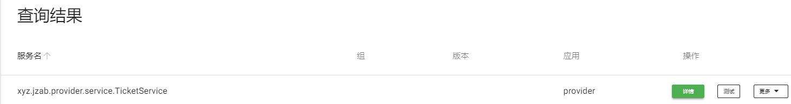

# 基础部分

## 什么是Spring Boot

简化Spring MVC的开发流程，使用约定优于配置的思想。

## 微服务架构风格

单体应用：所有功能放在同一个war、jar包中

微服务: 把每个功能拆分成不同的模块


## 快速入门

在官方网站在线生成或使用idea生成

网址: https://start.spring.io/


项目新建好后在Application类的同级写代码

Application类本身就是一个spring的组件

```xml
// 核心依赖包含tomcat, springMVC, spring中所有的依赖都以spring-boot-starter开头
<dependency>
    <groupId>org.springframework.boot</groupId>
    <artifactId>spring-boot-starter-web</artifactId>
</dependency>
```

配置文件:

```
# 更改端口
server.port=8080
```

在资源目录下写banner.txt可以自定义banner

## 原理初探

pom.xml:

- 官方的镜像会存在一个parent,里面存放了各个包的版本
- 导入包的时候无需指定版本,会由parent来指定
- springBoot会将各个业务场景封装成starter, 使用各个功能只需要导入对应的starter

入口程序:

```java
// 注解标明这是一个springboot程序
@SpringBootApplication
public class TestApplication {

    public static void main(String[] args) {
        // 调用静态方法,通过反射把这个类传进去
        SpringApplication.run(TestApplication.class, args);
    }
}
```

- 注解:

```java
@SpringBootConfiguration // springBoot的配置类
	@Configuration // spring的配置类
		@Component // spring组件

@EnableAutoConfiguration // 自动配置
	@Import({AutoConfigurationImportSelector.class}) // 自动配置导入选择
	@AutoConfigurationPackage // 自动配置包
		@Import({Registrar.class}) // 自动配置包注册

public class AutoConfigurationImportSelector{
    @Override
    public String[] selectImports(AnnotationMetadata annotationMetadata) {
        if (!isEnabled(annotationMetadata)) {
            return NO_IMPORTS;
        }
        // 获取自动装配
        AutoConfigurationEntry autoConfigurationEntry = getAutoConfigurationEntry(annotationMetadata);
        return StringUtils.toStringArray(autoConfigurationEntry.getConfigurations());
    }
    
    protected AutoConfigurationEntry getAutoConfigurationEntry(AnnotationMetadata annotationMetadata) {
		if (!isEnabled(annotationMetadata)) {
			return EMPTY_ENTRY;
		}
		AnnotationAttributes attributes = getAttributes(annotationMetadata);
        // 获取所有的配置
		List<String> configurations = getCandidateConfigurations(annotationMetadata, attributes);
		configurations = removeDuplicates(configurations);
		Set<String> exclusions = getExclusions(annotationMetadata, attributes);
		checkExcludedClasses(configurations, exclusions);
		configurations.removeAll(exclusions);
		configurations = getConfigurationClassFilter().filter(configurations);
		fireAutoConfigurationImportEvents(configurations, exclusions);
		return new AutoConfigurationEntry(configurations, exclusions);
	}
    
    protected List<String> getCandidateConfigurations(
        AnnotationMetadata metadata, AnnotationAttributes attributes
    ) {
        // 获取候选的配置并返回
        List<String> configurations = SpringFactoriesLoader.loadFactoryNames(
            getSpringFactoriesLoaderFactoryClass(),
            getBeanClassLoader()
        );
        Assert.notEmpty(configurations, "报错信息");
        return configurations;
    }

    protected Class<?> getSpringFactoriesLoaderFactoryClass() {
        // 把EnableAutoConfiguration的类传入,也就是启动类
		return EnableAutoConfiguration.class;
	}
}

public static List<String> loadFactoryNames(Class<?> factoryType, @Nullable ClassLoader classLoader) {
    ClassLoader classLoaderToUse = classLoader;
    if (classLoader == null) {
        classLoaderToUse = SpringFactoriesLoader.class.getClassLoader();
    }

    String factoryTypeName = factoryType.getName();
    // 获取spring工厂
    return (List)loadSpringFactories(classLoaderToUse).getOrDefault(factoryTypeName, Collections.emptyList());
}

private static Map<String, List<String>> loadSpringFactories(ClassLoader classLoader) {
    Map<String, List<String>> result = (Map)cache.get(classLoader);
    if (result != null) {
        return result;
    } else {
        HashMap result = new HashMap();

        try {
            // 获取spring.factories里面配置的url
            Enumeration urls = classLoader.getResources("META-INF/spring.factories");

            while(urls.hasMoreElements()) {
                // 通过url加载资源获取配置并返回
                URL url = (URL)urls.nextElement();
                UrlResource resource = new UrlResource(url);
                Properties properties = PropertiesLoaderUtils.loadProperties(resource);
                Iterator var6 = properties.entrySet().iterator();

                while(var6.hasNext()) {
                    Entry<?, ?> entry = (Entry)var6.next();
                    String factoryTypeName = ((String)entry.getKey()).trim();
                    String[] factoryImplementationNames = StringUtils.commaDelimitedListToStringArray((String)entry.getValue());
                    String[] var10 = factoryImplementationNames;
                    int var11 = factoryImplementationNames.length;

                    for(int var12 = 0; var12 < var11; ++var12) {
                        String factoryImplementationName = var10[var12];
                        ((List)result.computeIfAbsent(factoryTypeName, (key) -> {
                            return new ArrayList();
                        })).add(factoryImplementationName.trim());
                    }
                }
            }

            result.replaceAll((factoryType, implementations) -> {
                return (List)implementations.stream().distinct().collect(Collectors.collectingAndThen(Collectors.toList(), Collections::unmodifiableList));
            });
            cache.put(classLoader, result);
            return result;
        } catch (IOException var14) {
            throw new IllegalArgumentException("Unable to load factories from location [META-INF/spring.factories]", var14);
        }
    }
}


```

jar包内的META-INF/spring.factories文件是自动装配的核心文件,内部包含了很多自动配置类

```
@ConditionalOnXXX 符合某个条件时自动配置类才生效
```

结论: SpringBoot所有的自动配置都是在启动的时候扫描并加载，但是不一定生效，要判断条件是否成立（导入了对应的start）

1. 从META-INF/spring.factories获取指定的值(配置类)
2. 将配置类导入容器,自动配置就会生效
3. 所有需要导入的组件以类名的方式返回，这些类会被添加到容器
4. 很多组件都有自己的XXXAutoConfiguration类，可以导入自己需要的配置

## 主启动类

1. 推断应用的类型是普通的项目还是Web项目
2. 查找并加载所有可用初始化器, 设置到initializers属性中
3. 找出所有的应用程序监听器, 设置到listeners属性中
4. 推断并设置main方法的定义类，找到运行的主类

## yaml配置

application.propertise和application.yaml是两种配置文件

yaml为官方推荐的方法

```yaml
server:
  port: 8080
  
 # 对象赋值
student:
  name: jzab
  age: 3

# 单行写法
student2: {name: jzab, age: 3}

# 数组赋值
pets:
  - cat
  - dog
  - pig

# 单行写法
pets2: [cat, dog, pig]

# 占位符,前后可与普通字符拼接如: name_${}_ok
${random.uuid}
${random.int}
# 若person.a的值存在,则使用它的值,否则使用val
${paerson.a:val}
```

### 松散绑定:

可以自动将驼峰命名与下划线命名自动转换

### JSR303校验

```xml
# 类上使用
@Validated
#在属性上(还有很多校验规则), 这里要使用org.hibernate.validator.constraints.Email而不是javax下面的
@Email(message = "绑定失败")
# 需要导入两个包
<dependency>
    <groupId>jakarta.validation</groupId>
    <artifactId>jakarta.validation-api</artifactId>
    <version>2.0.2</version>
</dependency>
<dependency>
    <groupId>org.hibernate</groupId>
    <artifactId>hibernate-validator</artifactId>
    <version>5.3.0.Final</version>
</dependency>
    
```

### 配置文件加载优先级

1. 项目文件夹下的config文件夹内

2. 项目文件夹下

3. 类文件夹下的config文件夹内

4. 类文件夹下(默认生成的在这里)

### 多套配置文件

```yaml
# 创建多个配置文件,application-name.yaml,书写不同环境下的配置
# 在主配置文件中进行选择启用
spring:
  profiles:
    active: name
```

## 属性赋值

```java
// 1.在属性上通过@value来进行赋值
@Value("123")

// 2.通过yaml配置文件批量赋值(prefix为配置文件中的字段名), 一般用于给配置类注入值
@ConfigurationProperties(prefix = "student")

// 第二种方式会导致idea报警告,安装下面的依赖可以消除警告
<dependency>
    <groupId>org.springframework.boot</groupId>
    <artifactId>spring-boot-configuration-processor</artifactId>
    <optional>true</optional>
</dependency>
    
// 3. 使用properties,配置文件路径
@PropertySource(value = "classpath:application.properties")
// 在属性上与配置文件内的键绑定
@Value("${server.port}")
```

## 自动装配原理

在spring.factories文件内找一个配置类(以HttpEncodingAutoConfiguration举例)

```java
@Configuration(proxyBeanMethods = false)
// 允许通过properties进行属性赋值
@EnableConfigurationProperties(ServerProperties.class)
// 根据不同的条件判断当前配置是否生效
// 是servlet类型
@ConditionalOnWebApplication(type = ConditionalOnWebApplication.Type.SERVLET)
// 是否存在编码过滤器类
@ConditionalOnClass(CharacterEncodingFilter.class)
// server.servlet.encoding=enabled
@ConditionalOnProperty(prefix = "server.servlet.encoding", value = "enabled", matchIfMissing = true)
public class HttpEncodingAutoConfiguration {

}

// 对应到配置文件内的字段
@ConfigurationProperties(prefix = "server", ignoreUnknownFields = true)
public class ServerProperties {}
```


在配置文件中能配置的东西都存在一个规律: 一定会有XXXProperties文件来接收他的参数，被XXXAutoConfiguration来自动装配

**配置文件开启debug=true可以查看自动装配的结果**

# web开发

springBoot帮我们实现了什么:

- xxxAutoConfiguration，向容器中自动配置组件
- xxxProperties：自动配置类，装配配置文件中写的属性

web开发要解决的问题：

- 静态资源
- 首页
- 模板引擎
- 装配和扩展springMVC
- 增删改查
- 拦截器
- 国际化

## 静态资源

类路径下这三个文件内的文件都能被访问到，优先级从高到低为：

resources>static>public

可以手动指定静态资源路径，指定后默认的位置全部失效

## 首页与图标

在静态资源目录下写index.html和favicon.ico可以配置首页和图标

## 模板引擎

先导入相关依赖

```xml
<dependency>
    <groupId>org.springframework.boot</groupId>
    <artifactId>spring-boot-starter-thymeleaf</artifactId>
</dependency>
<dependency>
    <groupId>nz.net.ultraq.thymeleaf</groupId>
    <artifactId>thymeleaf-layout-dialect</artifactId>
</dependency>
```

使用@controller的接口返回模板文件名即可使用

所有模板文件写在templates文件夹下

### 使用

html标签要配置命名空间

```html
<html lang="en" xmlns:th="http://www.thymeleaf.org">
```

### 语法

0. ${name}取变量，在接口中调用model.addAttribute()来传值

1. th:utext可以将字符串转义,如:<h1>hello</h1>会被显示为标题,而th:text则是直接将字符串显示出来

2. 遍历th:each = “变量a ${集合名}” 然后 th:text = “${变量a}”即可

3. 模板引擎里的url,等本地文件的链接需要改成th:url,然后链接的内容需要用@{}括起来,在线的链接不需要改,这里面的请求带参数时用”(键值对)”即可

## springMVC扩展

在config包自定义配置类来进行配置

### 扩展视图解析器

```java
// 自定义的配置类,用来扩展springMVC的配置, 需要实现这个接口
@Configuration
public class MyMvcConfig implements WebMvcConfigurer {
    // 将自定义的视图解析器放到容器中就可以被自动配置上
    @Bean
    public ViewResolver myViewResolver(){
        return new MyViewResolver();
    }
}

//自定义视图解析器类实现视图解析器的接口
class MyViewResolver implements ViewResolver{
    @Override
    public View resolveViewName(String viewName, Locale locale) throws Exception {
        return null;
    }
}
```

### 日期格式

```yaml
spring:
  mvc:
    format:
      date: yyyy年MM月dd日
      time: HH时mm分ss秒
      date-time: yyyy年MM月dd日 HH时mm分ss秒
```

### 视图跳转

```
@Configuration
public class MyMvcConfig implements WebMvcConfigurer {
    @Override
    public void addViewControllers(ViewControllerRegistry registry) {
        registry.addViewController("test")
                .setStatusCode(HttpStatus.OK)
                // 模板名
                .setViewName("index");
    }
}
```

## 首页

页面的静态资源都要使用th:url=@{路径}来接管

```yaml
# 关闭缓存
spring:
	thymleaf:
		cache: false

# 所有的路径开头拼接/api
server:
	servlet:
		context-path: /api
```

## 国际化

在资源目录下新建i18n文件夹

在内部新建 xxx.properties xxx_zh_CN.properties xxx_en_US.properties等文件，idea会自动合并

```yaml
spring:
	# 我们的国际化配置文件的真实位置
  messages:
    basename: i18n.login
```

取值时,在模板引擎中使用#{}来取值

书写自己的国际化类

```java
public class MyLocalResolver  implements LocaleResolver{

    @Override
    public Locale resolveLocale(HttpServletRequest request) {
        // 获取参数
        String lang = request.getParameter("l");
        System.out.println(lang);
        // 获取默认的国际化
        Locale locale = Locale.getDefault();
        // 如果参数不为空
        if(!StringUtils.isEmpty(lang)){
            // 按下划线分开,并获取对应的国际化
            String[] split = lang.split("_");
            locale = new Locale(split[0],split[1]);
        }
        return locale;
    }

    @Override
    public void setLocale(HttpServletRequest request, HttpServletResponse response, Locale locale) {

    }
}
```

在MVC的配置文件中配置为bean，方法名必须为这个

```java
@Bean
public LocaleResolver localeResolver(){
    return new MyLocalResolver();
}
```

## 拦截器

```java
// 定义自己的拦截器
public class LoginHandlerInterceptor implements HandlerInterceptor {
    @Override
    public boolean preHandle(HttpServletRequest request, HttpServletResponse response, Object handler) throws Exception {

        //找session
        Object loginUser = request.getSession().getAttribute("loginUser");
        // 未登录则重定向
        if(loginUser == null){
            request.setAttribute("msg", "未授权,请登录");
            request.getRequestDispatcher("/index.html").forward(request, response);
            return false;
        // 登录成功则放行
        }else{
            return true;
        }
    }
}

// 配置类中
@Override
public void addInterceptors(InterceptorRegistry registry) {
    registry.addInterceptor(new LoginHandlerInterceptor()).addPathPatterns("/**").
        excludePathPatterns("/","/index","/index.html","/user/login","/*.css","/*.png","/*.jpg");
}
```

## 错误页面

在templates文件夹下创建error文件夹

里面写404.html,500.html等即可

# 数据库

## 导入相关依赖

```xml
<dependency>
    <groupId>mysql</groupId>
    <artifactId>mysql-connector-java</artifactId>
    <scope>runtime</scope>
</dependency>
<dependency>
    <groupId>org.springframework.boot</groupId>
    <artifactId>spring-boot-starter-jdbc</artifactId>
</dependency>
```

## 配置连接信息

```yaml
spring:
  datasource:
    username: root
    password: xxxxxx
    url: jdbc:mysql://localhost:3306/2048?serverTimezone=Asia/Shanghai&useUnicode=true&characterEncoding=utf-8&useSSL=true
    driver-class-name: com.mysql.cj.jdbc.Driver
```

## JDBC

直接自动装配数据源和jdbc模板

```java
@Resource
DataSource dataSource;

@Resource
JdbcTemplate jdbcTemplate;

@RequestMapping("/")
public String index(Model model){
    List<Map<String, Object>> list = jdbcTemplate.queryForList("select * from user;");
    System.out.println(list );
    return "index";
}
```

## Druid

首先安装对应的依赖

```xml
<dependency>
    <groupId>com.alibaba</groupId>
    <artifactId>druid</artifactId>
    <version>1.2.17</version>
</dependency>        
<!--Log4j2自带的日志门面-->
<dependency>
    <groupId>org.apache.logging.log4j</groupId>
    <artifactId>log4j-api</artifactId>
    <version>2.17.1</version>
</dependency>
<!--Log4j2具体的日志实现-->
<dependency>
    <groupId>org.apache.logging.log4j</groupId>
    <artifactId>log4j-core</artifactId>
    <version>2.17.1</version>
</dependency>
```

进行配置

```yaml
spring:
  datasource:
    username: root
    password: 102099
    url: jdbc:mysql://localhost:3306/2048?serverTimezone=Asia/Shanghai&useUnicode=true&characterEncoding=utf-8&useSSL=true
    driver-class-name: com.mysql.cj.jdbc.Driver
    type: com.alibaba.druid.pool.DruidDataSource
    # 这一行开启druid的监控,防止sql注入,日志
    filters: stat, wall, log4j2
```

配将数据源配置为bean

```java
@Configuration
public class DruidConfig {

    @Bean
    @ConfigurationProperties(prefix = "spring.datasource")
    public DataSource druidDataSource(){
        return new DruidDataSource(  );
    }

    // 后台监控页面的配置(servlet)
    @Bean
    public ServletRegistrationBean<StatViewServlet> statViewServlet(){
        // 某个路径对应某个servlet
        ServletRegistrationBean<StatViewServlet> bean = new ServletRegistrationBean<>(
                new StatViewServlet(),"/druid/*");
        HashMap<String, String> init  = new HashMap<>(  );
        init.put("loginUsername","admin");
        init.put("loginPassword","123456");
        init.put("allow","");
        bean.setInitParameters(init);
        return bean;
    }
    
    // 配置过滤器
    public FilterRegistrationBean<Filter> webStatFilter(){
        FilterRegistrationBean<Filter> bean = new FilterRegistrationBean<>( );
        bean.setFilter(new WebStatFilter());
        HashMap<String, String> init  = new HashMap<>(  );
        // 不进行统计
        init.put("exclusions","*.js,*.css,/druid/*");
        bean.setInitParameters(init);
        return bean;
    }
}
```

## mybatis

安装依赖

```xml
<!-- https://mvnrepository.com/artifact/org.mybatis.spring.boot/mybatis-spring-boot-starter -->
<dependency>
    <groupId>org.mybatis.spring.boot</groupId>
    <artifactId>mybatis-spring-boot-starter</artifactId>
    <version>2.3.1</version>
</dependency>

```

yaml配置

```yaml
mybatis:
  mapper-locations: classpath:mappers/*.xml
  type-aliases-package: xyz.jzab.test.pojo
```

书写mapper文件与接口进行调用即可

## redis

引入依赖

springBoot2.X之后jedis被替换成了lettuce

jedis: 采用直连,多线程操作不安全,需要使用连接池，更像Bio模式

lettuce: 底层使用netty,实例可以多线程共享,不存在线程不安全,可以减少线程数量，更像Nio模式

```xml
<dependency>
    <groupId>org.springframework.boot</groupId>
    <artifactId>spring-boot-starter-data-redis</artifactId>
</dependency>
```

配置yaml

```yaml
spring:
  redis:
    host: localhost
    port: 6379
```

操作redis

```java
@Resource
RedisTemplate<Object,Object> redisTemplate;

@Test
void contextLoads() {
    ValueOperations<Object, Object> valueOperations = redisTemplate.opsForValue( );
    valueOperations.set("name","你好");
    System.out.println( valueOperations.get("name"));
}
```

默认使用jdk序列化,会使字符串转义

需要自己定义配置类来进行序列化

对象要想存入redis，要么转换成json字符串，要么继承Serializable接口

或者自定义redisTemplate

```java
@Configuration
public class RedisConfig {

    @Bean
    public RedisTemplate<String, Object> redisTemplate(RedisConnectionFactory redisConnectionFactory){
        RedisTemplate<String, Object> template = new RedisTemplate<>();
        template.setConnectionFactory(redisConnectionFactory);

        StringRedisSerializer stringRedisSerializer = new StringRedisSerializer( );
        Jackson2JsonRedisSerializer<Object> objectJackson2JsonRedisSerializer = new Jackson2JsonRedisSerializer<>(Object.class);
        // 键的序列化
        template.setKeySerializer(stringRedisSerializer);
        template.setHashKeySerializer(stringRedisSerializer);
        // 值的序列化
        template.setValueSerializer(objectJackson2JsonRedisSerializer);
        template.setHashValueSerializer(objectJackson2JsonRedisSerializer);
        template.afterPropertiesSet();
        return template;
    }
}
```

真实的开发中一般不会用原生的api,一般自己封装工具类

# 安全

## springSecurity

导入依赖

```xml
<dependency>
    <groupId>org.springframework.boot</groupId>
    <artifactId>spring-boot-starter-security</artifactId>
</dependency>
```

## shiro

# swagger

简介: 世界上最流行的API框架，RestFul风格的文档在线自动生成工具，API文档与API定义同步更新，支持多种语言

导入相关依赖

```xml
<dependency>
    <groupId>io.springfox</groupId>
    <artifactId>springfox-swagger2</artifactId>
    <version>2.9.2</version>
</dependency>
<dependency>
    <groupId>io.springfox</groupId>
    <artifactId>springfox-swagger-ui</artifactId>
    <version>2.9.2</version>
</dependency>
```

配置配置yaml

```yaml
spring:
  mvc:
    pathmatch:
      matching-strategy: ant_path_matcher
```

配置swagger，用config类

```java
@Configuration
@EnableSwagger2
public class SwaggerConfig {
    // 接管默认的配置
    @Bean
    public Docket docket(){
        return new Docket(DocumentationType.SWAGGER_2).apiInfo(apiInfo());
    }

    // 配置基本信息
    private ApiInfo apiInfo(){
        return new ApiInfo(
                "2048的swagger",
                "2048后台的swagger文档",
                "1.0",
                "http://www.kbws.xyz/",
                new Contact("JZAb","http://vip.jzab.xyz/","1970717299@qq.com"),
                "Apache 2.0",
                "http://www.apache.org/",
                new ArrayList<>(  )
        );
    }
}
```

## 配置

```java
@Bean
public Docket docket(Environment environment){
    // 查看是否出在dev环境下,选择是否启用
    Profiles profiles = Profiles.of("dev");
    boolean enable = environment.acceptsProfiles(profiles);
    
    return new Docket(DocumentationType.SWAGGER_2).apiInfo(apiInfo())
        	.enable(enable)// 是否能在浏览器访问
            // 配置接口扫描的包
            .select().apis(RequestHandlerSelectors.basePackage("xyz.jzab.controller"))
            .build()
            // 根据方法上的注解去扫描
            .select().apis(RequestHandlerSelectors.withMethodAnnotation(GetMapping.class))
            .build()
            // 根据类上的注解去扫描
            .select().apis(RequestHandlerSelectors.withClassAnnotation(RestController.class))
            // 根据路径去过滤
            .paths(PathSelectors.ant("/theme/**"))
            .build();
}
```

## 配置多个分组

配置多个docket的bean即可

```java
@Bean
public Docket docket2(){
    return new Docket(DocumentationType.SWAGGER_2).groupName("分组2");
}

@Bean
public Docket docket3(){
    return new Docket(DocumentationType.SWAGGER_2).groupName("分组3");
}
```

## 配置实体类

接口的返回值有一个类,那么这个类就会被放到生成的文档中

```java
// 配置实体类的注释
@ApiModel("")
// 配置属性的注释
@ApiModelProperty("结果状态码")
// 用在接口上进行注释
@ApiOperation("登录接口")
// 用在接口参数上进行数值
@ApiParam("登录数据")
// 忽略一个参数, 让他不在文档上显示
@ApiIgnore
```

# 任务

## 异步任务

```java
// 异步方法上加这个注解
@Async
// 启动类上加这个注解
@EnableAsync
```

## 邮件任务

导入依赖

```xml
<dependency>
    <groupId>org.springframework.boot</groupId>
    <artifactId>spring-boot-starter-mail</artifactId>
</dependency>
<dependency>
    <groupId>javax.mail</groupId>
    <artifactId>mail</artifactId>
    <version>1.4.7</version>
</dependency>
```

编写yaml配置

```yaml
spring:
  profiles:
    active: dev
  datasource:
    driver-class-name: com.mysql.cj.jdbc.Driver
    username: root
    password: 102099
    url: jdbc:mysql://localhost:3306/2048?serverTimezone=Asia/Shanghai&useUnicode=true&characterEncoding=utf-8&useSSL=true
  mvc:
    pathmatch:
      matching-strategy: ant_path_matcher
  mail:
    host: smtp.qq.com
    username: 1970717299@qq.com
    password: xxxx(生成的密码)
    # 开启qq加密验证(2023/10/5测试,不开启也可)
    properties:
      mail.auth: true
```


注册一个bean

```java
@Configuration
public class MailConfig {
    @Bean
    public SimpleMailMessage simpleMailMessage(){
        SimpleMailMessage simpleMailMessage = new SimpleMailMessage( );
        simpleMailMessage.setFrom("1970717299@qq.com");
        return simpleMailMessage;
    }
}
```

调用

```java
@Resource
JavaMailSender javaMailSender;

@Resource
SimpleMailMessage simpleMailMessage;

@Async
public void sendMailSimple(String to, String subject, String content) throws Exception {
    Thread.sleep(10000);
    System.out.println("运行结束" );
    try {
        //用于接收邮件的邮箱
        simpleMailMessage.setTo(to);
        //邮件的主题
        simpleMailMessage.setSubject(subject);
        //邮件的正文，第二个boolean类型的参数代表html格式
        simpleMailMessage.setText(content);
        //发送
        javaMailSender.send(simpleMailMessage);

    } catch (Exception e) {
        throw new MessagingException("failed to send mail!", e);
    }
}
```

## 定时任务

```java
TaskScheduler; // 任务调度者
taskExecutor; // 任务执行者
@EnableScheduling; // 在启动类上配置, 开启定时任务
@Scheduled; // 什么时候执行, 内部写cron表达式

// 秒 分 时 日 月 周几
// 每三秒执行一次
@Scheduled(cron = "0/3 * * * * ?")
```

# 分布式系统

若干个相互独立的计算机系统的集合，在用户看来是一个整体

通过网络进行通信，为了完成共同的任务而协调工作的系统。

随着需求增大，分布式系统架构和流式计算架构势在必行，

## RPC

远程过程调用: A电脑上的A方法调用B电脑上的B方法


两个核心: 通信，序列化

序列化: 数据传输需要转换

## Dubbo

是一款高性能、轻量级的开源javaRPC框架，它提供了三大核心能力：面向接口的远程方法调用，智能容错和负载均衡，以及服务自动注册和发现

底层是Triple协议


服务提供者(Provider): 暴露服务的提供方，服务提供者在启动时，向注册中心注册自己提供的服务

服务消费者(Consumer): 调用远程服务的消费饭，启动后向注册中心订阅服务，从提供者列表中，基于软负载均衡算法，选一台提供者进行调用。如果调用失败再选另一台调用。

注册中心(Registry): 注册中心返回服务提供者的地址给消费者，如果变更，注册中心将基于长连接推送变更数据给消费者。

监控中心(Monitor): 服务消费者和提供者，在内存中累计调用次数和调用时间，定时每分钟发送一次统计数据到监控中心

## zookeeper

注册中心

安装地址:  [链接](https://www.apache.org/dyn/closer.lua/zookeeper/zookeeper-3.9.0/apache-zookeeper-3.9.0-bin.tar.gz)

下载完毕进行解压，运行bin内部的两个文件


运行服务端若闪退则在文件末尾添加一行pause

发现缺少配置文件 conf/zoo.cfg, 将另一个配置文件复制并改名

## Dubbo-admin

是一个监控管理后台，可以查看注册了哪些服务，哪些服务被消费了

下载地址: [链接](https://github.com/apache/dubbo-admin/tree/0.2.0)

下载完并解压发现是一个maven项目，找到配置文件配置注册中心的地址

```properties
# 端口不能使用8080因为zookeeper会占用
server.port=7001
dubbo.registry.address=zookeeper://127.0.0.1:2181
```

完成后在项目目录下进行打包

```shell
mvn clean package -Dmaven.test.skip=true
```

直接运行生成的jar包和zookeeper服务端即可

注意: java版本需要为1.8否则会有报错

## springboot整合dubbo+zookeeper

### 创建父项目并安装依赖

```xml
<!-- https://mvnrepository.com/artifact/org.apache.dubbo/dubbo-spring-boot-starter -->
<dependency>
    <groupId>org.apache.dubbo</groupId>
    <artifactId>dubbo-spring-boot-starter</artifactId>
    <version>2.7.23</version>
</dependency>

<!-- https://mvnrepository.com/artifact/com.github.sgroschupf/zkclient -->
<dependency>
    <groupId>com.github.sgroschupf</groupId>
    <artifactId>zkclient</artifactId>
    <version>0.1</version>
</dependency>

<!-- https://mvnrepository.com/artifact/org.apache.curator/curator-x-discovery -->
<dependency>
    <groupId>org.apache.curator</groupId>
    <artifactId>curator-x-discovery</artifactId>
    <version>5.1.0</version>
</dependency>

<!--        引入zookeeper并排除log4j12依赖-->
<dependency>
    <groupId>org.apache.curator</groupId>
    <artifactId>curator-framework</artifactId>
    <version>2.12.0</version>
</dependency>
<dependency>
    <groupId>org.apache.curator</groupId>
    <artifactId>curator-recipes</artifactId>
    <version>2.12.0</version>
</dependency>
<dependency>
    <groupId>org.apache.zookeeper</groupId>
    <artifactId>zookeeper</artifactId>
    <version>3.9.0</version>
    <exclusions>
        <exclusion>
            <groupId>org.slf4j</groupId>
            <artifactId>slf4j-log4j12</artifactId>
        </exclusion>
    </exclusions>
</dependency>
```

### 创建两个子项目配置不同的端口

### 服务提供者

书写接口并书写实现类,在实现类上进行注解

```java
// dubbo的service
@DubboService
// 添加到组件
@Component
public class TicketServiceImpl implements TicketService {
    @Override
    public String getTicket() {
        return "<Hello,OP>";
    }
}
```

在配置文件中进行注册

```yaml
dubbo:
  application:
    # 注册名字
    name: provider
  # 注册中心的地址
  registry:
    address: zookeeper://127.0.0.1:2181
  scan:
    base-packages: xyz.jzab.provider.service
```

先后启动zookeeper，dubboadmin，服务提供者boot项目



### 服务消费者

先配置yaml

```yaml
dubbo:
  application:
    name: consumer
  registry:
    address: zookeeper://127.0.0.1:2181
```

书写一个同路径的接口用来接收远程调用的类(真实开发中需要创建一个单独的接口maven模块,方便双方使用)

```java
@Service
public class UserServiceImpl implements UserService {
    // 想拿到生产者提供的票
    @DubboReference
    TicketService ticketService;

    @Override
    public void get() {
        System.out.println(ticketService.getTicket( ));
    }
}
```

## 微服务架构会遇到的四个核心问题

1. 客户端如何去访问
2. 服务之间如何沟通
3. 这么多服务如何管理
4. 服务挂了怎么办

解决方案: Spring Cloud生态圈，解决上面四个问题

1. Spring Cloud Netflix 出了一套解决方案，一站式解决方案

   1. API网关， zuul组件
   2. http通信，Feign --> HttpClient  --> 同步并阻塞的http通信
   3. 服务注册与发现, Eureka
   4. 熔断机制，Hystrix

   2018年底停止维护

2. Apache Dubbo ZooKeeper 第二套解决系统

   1. API网关，没有
   2. 通信，Dubbo，高性能基于java实现的RPC框架
   3. 服务注册与发现，ZooKeeper
   4. 熔断机制，没有

   不完善

3. SpringCloud Alibaba 一站式解决方案
   1. 通信， RocketMQ
   2. 注册与发现，Nacos
   3. 熔断，Sentinel
   4. 分布式事务， Alibaba Cloud Seata

下一代微服务标准：服务网格 Service Mesh

​	解决方案：istio

万变不离其宗，就是为了四个问题

	1. API网关，服务路由
	2. Http、RPC框架，异步调用
	3. 服务注册与发现，高可用
	4. 熔断机制，服务降级
# SpringSecurity

功能比shiro更加丰富，但上手难度高于shiro。

提供认证和授权。

引入: 

```xml
<dependency>
    <groupId>org.springframework.boot</groupId>
    <artifactId>spring-boot-starter-security</artifactId>
</dependency>
```

## SpringSecurity的默认流程

它的本质是一个过滤器链，内部包含许多过滤器


UsernamePasswordAuthenticationFilter: 负责处理用户发送的登录请求

ExceptionTranslationFilter: 负责处理过滤器链中抛出的任何AccessDeniedException和AuthenticationException

FilterSecurityInterceptor: 负责权限校验的处理

## 查看默认的过滤器链

在启动类将run方法的返回值接收(它是一个spring容器)，然后打上断点进行调试

```java
public static void main(String[] args) {
    ConfigurableApplicationContext run = SpringApplication.run(SecurityApplication.class, args);
    System.out.println(111 ); // 这里打断点
}
```

在调试界面可以输入java代码片段获取对象


