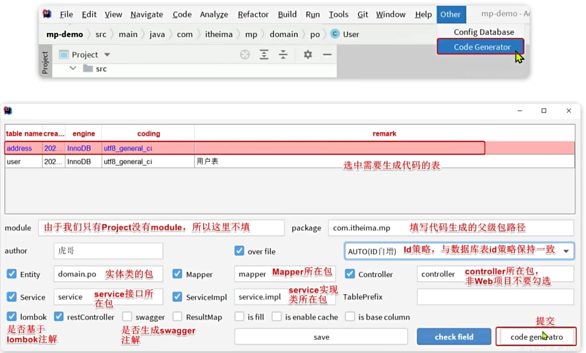

## MybatisPlus介绍

可以大大简化开发，减少基础的增删改查语句的书写

## 快速入门

1. 引入依赖

   引入plus的依赖后需要去掉mybatis的依赖

   ```xml
   <dependency>
       <groupId>com.baomidou</groupId>
       <artifactId>mybatis-plus</artifactId>
       <version>3.5.2</version>
   </dependency>
   ```

   

2. 自己的Mapper继承BaseMapper

   ```java
   public interface UserMapper extends BaseMapper<User> {
   
   }
   ```

3. 相关配置

   ```yaml
   spring:
     datasource:
       url: jdbc:mysql://localhost:3306/oj?useUnicode=true&characterEncoding=utf-8&useSSL=false&serverTimezone=Asia/Shanghai
       username: root
       password: 密码
   
   mybatis-plus:
     type-aliases-package: xyz.jzab.mp.pojo.entity # 别名扫描包
     mapper-locations: "classpath*:/mapper/**/*.xml" # xml文件目录
     configuration:
       default-enum-type-handler: com.baomidou.mybatisplus.core.handlers.MybatisEnumTypeHandler # 默认枚举处理器
       map-underscore-to-camel-case: true # 是否开启下划线转驼峰
       cache-enabled: false # 是否开启二级缓存
       log-impl: org.apache.ibatis.logging.stdout.StdOutImpl # 日志实现
     global-config:
       db-config:
         logic-delete-field: isDelete # 逻辑删除字段和逻辑删除值
         logic-delete-value: 1
         logic-not-delete-value: 0
         update-strategy: not_null # 默认的更新策略(非空字段才更新)
         id-type: assign_id # 默认的主键策略: 雪花算法
   ```

4. 实现service接口

   Service接口继承IService类，泛型传入实体类

   ```java
   public interface UserService extends IService<User> {
   
   }
   ```

   

   实现类继承ServiceImpl，泛型传入Mapper接口和实体类，实现UserService接口

   ```java
   @Service
   public class UserServiceImpl extends ServiceImpl<UserMapper, User>
       implements UserService{
   
   }
   
   ```

   

### 常用注解

mybatisPlus通过扫描实体类，通过反射获取类的信息作为数据库表的信息。

- 类名驼峰转下划线作为表名
- 名字为id的字段作为主键
- 变量名驼峰转下划线作为字段名

@TableName指定表名

```java
@TableName(value ="user")
class User{
    
}
```

@TableId指定主键

```java
// 传入的type可以指定类型，AUTO为数据库自增，INPUT为通过set方法自行传入，ASSIGN_ID为通过IdentifierGenerator接口的nextId来生成Id，默认实现是雪花算法
// 如果不指定type,默认是ASSIGN_ID
@TableId(value="主键名", type=IdType.类型)
private int id;

```

@TableField指定字段名

is开头的字段需要用TableField指定字段名否则可能出错

属性名和数据库关键字冲突时要指定

```java
@TableField(value="`字段名`")
private Long result;

// 成员变量不是数据库字段时
@TableFiele(exist = false)
```

### 常用配置

```yaml
mybatis-plus:
  type-aliases-package: xyz.jzab.mp.pojo.entity # 别名扫描包
  mapper-locations: "classpath*:/mapper/**/*.xml" # xml文件目录
  configuration:
    map-underscore-to-camel-case: true # 是否开启下划线转驼峰
    cache-enabled: false # 是否开启二级缓存
  global-config:
    db-config:
      update-strategy: not_null # 默认的更新策略(非空字段才更新)
      id-type: assign_id # 默认的主键策略: 雪花算法
```


## 条件构造器

QueryWrapper用来构造Select,Update,Delete的条件部分

UpdateWrapper一般在需要定制更新的set部分时使用

建议使用Lambda开头的Wrapper

## 自定义Sql

使用mp生成where部分，其他部分自定义

1. 基于mp生成where条件

   ```java
   QueryWrapper<User> idWrapper = new QueryWrapper<User>( ).le("id", 2);
   ```

2. 将wrapper传递给mapper层的自定义方法

   注意: 传的名字一定要是ew

   ```java
   List<User> getByWrapper(@Param("ew")QueryWrapper<User> wrapper);
   
   System.out.println(userMapper.getByWrapper(idWrapper));
   ```

3. 在mapper.xml中使用传递的条件

   ```xml
   <select id="getByWrapper" resultType="xyz.jzab.mp.pojo.entity.User">
       select * from user ${ew.customSqlSegment}
   </select>
   ```

## Service层接口

deleteByIds和deleteBatchByIds区别:

- 前者使用IN语法
- 后者使用=语法,大数据量时更快

update(),query()等方法返回的是链式调用,更加方便

在jdbcUrl后拼接 ```&rewriterBatchedStatements=true``` 可以实现真正的批量插入

## 代码生成

插件商城搜索MyBatisX或MyBatisPlus



## 静态工具类

Db 里面函数实现的功能和IService类似

为了防止多个Service相互调用出现循环依赖

## 逻辑删除

用一个字段标记数据行是否被删除，查询时判断标记

逻辑删除存在的问题:

1. 产生太多垃圾数据
2. 查询时多一个条件,影响查询性能

可以的替代方案: 删除之前把数据存入其他库

## 枚举处理器

1. 在枚举类上配置注解

   ```java
   public enum UserRole {
       ADMIN("admin",3),
       TEACHER("teacher",2),
       STUDENT("student",1),
       USER("loginUser",0);
   
       @EnumValue // 标记数据库值
       @JsonValue // 标记返回给前端的值
       private final String desc;
       private final int code;
   
       UserRole(String desc, int code){
           this.desc = desc;
           this.code = code;
       }
   
       public String getDesc() {
           return desc;
       }
   
       public int getCode() {
           return code;
       }
   }
   ```

2. 在yaml中配置

   ```yml
   mybatis-plus:
     configuration:
       default-enum-type-handler: com.baomidou.mybatisplus.core.handlers.MybatisEnumTypeHandler
   ```

## Json处理器

1. 实体类上配置开启自动结果映射

   ```java
   @TableName(value ="paper",autoResultMap = true)
   ```

2. 属性上配置Json处理器类型

   ```java
   @TableField(typeHandler = JacksonTypeHandler.class)
   private List<Integer> questionList;
   ```

## 分页插件

1. 将MybatisPlus的插件注册到Bean

   ```java
   /**
    * MyBatis Plus 配置
    *
    */
   @Configuration
   public class MyBatisPlusConfig {
   
       /**
        * 拦截器配置
        *
        * @return
        */
       @Bean
       public MybatisPlusInterceptor mybatisPlusInterceptor() {
           MybatisPlusInterceptor interceptor = new MybatisPlusInterceptor();
           // 分页插件
           PaginationInnerInterceptor page = new PaginationInnerInterceptor(DbType.MYSQL);
           // 可以设置大小限制
           page.setMaxLimit(1000L);
           interceptor.addInnerInterceptor(page);
           return interceptor;
       }
   }
   ```

2. 使用Page对象来进行分页查询

   ```java
   // 获取page对象
   Page.of(页码,页大小);
   ```

## 通用分页实体类转换

