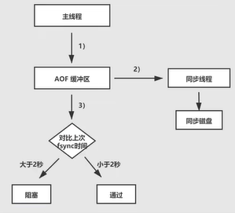
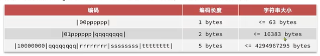

## 面试题

### 数据类型

- string：bitMap
- hash
- set
- sortedSet：geo
- stream

### 缓存穿透，雪崩，击穿的原因和应对策略

1. 缓存穿透

   原因：用户大量访问在缓存和数据库都不存在的key，导致一直向数据库发送请求

   策略：

   - 对不存在的key，在redis中存储空值
   - 增加key的复杂性，防止恶意猜测，在查询前对key的格式做校验，拦截不符合格式的key
   - 布隆过滤器，优点：响应速度快，缺点：不是百分之百准确，实现相对复杂
   - 限制用户的权限，对用户进行限流

2. 缓存雪崩

   原因：大量key同时失效，或者redis直接宕机导致请求直接打到数据库

   策略：

   - 对TTL增加随机值，防止同时过期
   - redis采用集群模式，增加可用性
   - 采用多级缓存
   - 对业务进行降级，限流

3. 缓存击穿

   原因：热点key失效导致大量请求到达数据库，热点key一般是会存在高并发访问，或者重建失效的特点

   策略：

   - 逻辑过期，优点：没有等待时间，缺点：一致性较低，实现困难
   - 互斥锁，优点：一致性高，实现简单，缺点：需要阻塞等待

### Redis 如何保证数据一致性

共有大约三种方式保证数据一致性

1. 数据变动时，主动更新缓存
2. 利用TTL过期机制，过期后再刷新

低命中率时: 延迟双删,先删除缓存,再操作数据库,最后再次删除缓存

高命中率: 先操作数据库,再更新缓存
这时候可以用分布式锁或者给缓存设置较短过期时间
也可以用消息队列异步更新
或者订阅 MySQL 的 binlog，再操作缓存

Redis 底层数据结构和 IO 模型
Redis 为什么快？只是因为在内存中操作吗？
Redis 的有序集合为什么用跳表？
Redis 大 Key 的危害以及如何避免和解决
Redis 内存淘汰策略
Redis 持久化机制

## Redis入门

redis是一个key-value结构的NoSql(非关系型数据库)数据库

- k-v型，value支持多种数据类型
- 单线程(6.0引入了多线程的网络请求，但核心命令处理仍是单线程)
- 低延迟、速度快（基于内存，IO多路复用）
- 支持数据持久化
- 支持主从、分片集群
- 支持多语言客户端

### SQL和NoSQl区别

SQL:

- 结构化
- 有关联
- SQL语法
- ACID事务
- 磁盘存储
- 垂直扩展(提升性能大部分时候只能提升本机性能,分库麻烦)

NoSQL:

- 非结构化
- 无关联
- 语法不同
- 不一定保证ACID
- 内存存储
- 水平扩展(多节点,分布式,天然支持分库)

### Redis配置文件

```conf
# 绑定地址 默认127.0.0.1 ::1
bind 0.0.0.0
# 保护模式,禁止远程连接,默认为yes
protected-mode no
# 是否启用后台模式
daemonize yes

# 进程号地址
pidfile /var/run/redis/redis-server.pid
# 日志级别
loglevel notice
# 日志文件地址
logfile /var/log/redis/redis-server.log
# 数据库数量,按数字编号0-15
databases 16

# 持久化文件存储路径
dbfilename dump.rdb
# 工作目录
dir /var/lib/redis
```

### Redis命令行客户端

```shell
redis-cli [options] [command]
```

常用的options有：

-h: 指定主机

-p: 指定端口

-a: 指定密码

command为连接上之后执行的指令

### redis图形化客户端

https://github.com/qishibo/AnotherRedisDesktopManager/

### 值的数据类型

常见的八种:

| 类型      | 含义           | 示例                    |
| --------- | -------------- | ----------------------- |
| String    | 字符串         | "hello world"           |
| Hash      | 哈希表         | {name: "JZAB", age: 21} |
| List      | 列表           | [A -> B -> C -> C]      |
| Set       | 集合(值不重复) | {A,B,C}                 |
| SortedSet | 排序集合       | {A: 1, B: 2, C: 3}      |
| GEO       | 地理坐标       | {A: (120.3, 30.5)}      |
| BitMap    | 二进制数据     | 011011011011011         |
| HyperLog  | 二进制数据     | 011011011011011         |

### key的层级化

在设置key时，允许将key用冒号分层

> xyz:jzab:www
>
> xyz:jzab:vip

### 命令

#### 通用命令

> help @generic

- keys: 查看所有符合模板的key，模板中可以使用*?通配符进行模糊查询，格式：``` keys 模板```
- del: 删除一个或多个指定的key，返回值代表删除成功的数量，格式：```del key0 [key1 key2]```
- exists：查看一个或多个key是否存在，返回值代表存在的个数，格式：```exists key0 [key1 key2]```
- expire：设置一个key的有效期，以秒为单位，格式：```expire key second```
- ttl：查看一个key的有效期，返回-1代表永久，返回-2代笔key不存在，返回其他数字代表key剩余多少秒过期，格式：```ttl key```

#### string类型命令

> help @string
>
> string类型底层都是字节数组，可以存放string，int，float，最大空间不超过512MB

- set：添加或修改键值对
  - ```SET key value [EX seconds|PX milliseconds|KEEPTTL] [NX|XX]```
  - NX为不存在则添加，XX为存在则修改
- get：根据key获取string类型的value
- mset：批量添加修改
- mget：批量获取
- incr：让一个int类型的值自增
- incrby：让一个int类型的值自增指定的步长
- incrbyfloat：让一个float类型的数自增指定的步长
- setnx：如果key不存在则添加，否则无操作
- setex：添加一个string类型的键值对，并指定有效期

#### Hash类型命令

> help @hash
>
> value部分是一个hash表，hash表的键叫做field，值叫做value

- hset：添加或修改hash类型的key的field的值（可批量）
- hget：获取一个hash类型key的field的值
- hmset：同hset
- hmget：批量获取一个hash类型的多个field的值
- hgetall：获取一个hash类型的所有的field和value，奇数行field，偶数行value
- hkeys：获取一个hash类型的field
- hvals：获取一个hash类型的所有value
- hincrby：让一个hash类型某个field的value自增并指定步长
- hsetnx：若某个field不存在则添加，否则不执行

#### List类型

> help @list
>
> 底层类似LinkedList，双向链表，有序，可重复，插入删除快，查询慢

- lpush：左侧插入元素，可以插入多个
- lpop：左侧返回元素，没有返回nil
- rpush：右侧插入元素，可以插入多个
- rpop：右侧返回元素，没有返回nil
- lrange：返回某个下标范围内的元素，（下标从0开始，闭区间）
- blpop：同lpop，没有元素时等待
- brpop：同rpop，没有元素时等待

#### Set类型

> help @set
>
> 类似java中的HashSet，可以看作值为null的hash表，无序、元素不可重复、查找快、支持交集、并集、差集等操作

- sadd: 向set中添加一个或多个元素
- srem：移除set中的指定元素，可以移除多个
- scard：返回set中元素的个数
- sIsMember: 判断一个元素是否在set中，是返回1，不是返回0
- smembers：获取set中所有的元素

多个集合间的操作：

- sinter：求多个集合的交集
- sdiff：求多个集合的差集，在a中不在b中的 
- sunion: 求多个集合的并集

#### SortedSet

>help @sorted_set
>
>可排序的set集合（根据分值排序），类似TreeSet，底层数据结构为跳表加哈希表，可排序，查询快，不可重复，可以用来实现排行榜

- zadd:添加一个或多个元素到sorted set,如果存在则更新score值

- zrem: 删除指定元素

- zscore: 获取指定元素的分数

- zrank: 获取指定元素的排名

- zcard: 获取元素个数

- zcount: 统计分值在区间范围内的元素个数

- zincrby: 按照指定的步长更新某个元素的分值

- zrange: 返回排名在指定范围内的元素

- zrangebyscore: 返回分数在指定范围内的元素

- zinter：求多个集合的交集
- zdiff：求多个集合的差集，在a中不在b中的
- zunion: 求多个集合的并集

涉及排序相关的命令,可以在z后面加rev来进行降序操作

## Redis客户端

### 对比

Jedis: 方法名和redis命令名称相同，学习成本低，但线程不安全

lettuce：基于Nutty，支持响应式和异步编程，支持Redis哨兵、集群、管道

Redisson：基于Redis实现的分布式、可伸缩的Java数据结构集合。包含Map、Queue、Lock、Semaphore、AtomicLong等强大的功能

Spring Data Redis：集成Jedis和lettuce 

### Jedis

引入依赖

```xml
<dependency>
    <groupId>redis.clients</groupId>
    <artifactId>jedis</artifactId>
    <version>3.8.0</version>
</dependency>
```

基本用法

```java
// 建立连接
Jedis jedis = new Jedis("vip.jzab.xyz", 6379);
// 密码认证
jedis.auth("102099");
// 选择数据库
jedis.select(0);
// 命令
Set<String> s = jedis.smembers("lisi");
// 释放资源
jedis.close();
```

 线程池

```java
public class JedisFactory {
    private static final JedisPool jedisPool;

    static{
        JedisPoolConfig config = new JedisPoolConfig();
        // 最大连接
        config.setMaxTotal(8);
        // 最大空闲连接
        config.setMaxIdle(8);
        // 最小空闲连接
        config.setMinIdle(0);
        // 最长等待时间
        config.setMaxWaitMillis(200);
        jedisPool = new JedisPool(config,"vip.jzab.xyz",6379,1000,"102099");
    }

    public static Jedis getJedis(){
        return jedisPool.getResource();
    }
}
```

### SpringDataRedis

https://spring.io/projects/spring-data-redis

- 封装了不同的Redis客户端
- 提供统一API来操作
- 支持发布订阅模式
- 支持哨兵和集群
- 支持基于Lettuce的响应式编程
- 支持基于JDK、JSON、字符串、Spring对象的数据序列化和反序列化
- 支持基于Redis的JDKCollection实现

#### 1.引入依赖

```xml
<!--        spring data redis-->
<dependency>
    <groupId>org.springframework.boot</groupId>
    <artifactId>spring-boot-starter-data-redis</artifactId>
</dependency>
<!--        连接池-->
<dependency>
    <groupId>org.apache.commons</groupId>
    <artifactId>commons-pool2</artifactId>
</dependency>
```

####  2.配置连接

```yaml
spring:
  redis:
    host: vip.jzab.xyz
    port: 6379
    password: 102099
    lettuce: # 默认为lettuce,想使用Jedis需要单独引入
      pool:
        max-active: 8 # 最大连接
        max-idle: 8 # 最大空闲连接
        min-idle: 0 # 最小空闲连接
        max-wait: 100 # 连接等待时间
```

#### 3.注入并使用RedisTemplate

```java
@Resource
RedisTemplate<String,String> redisTemplate;

@Test
void redisTemplateTest(){
    redisTemplate.opsForValue().set("new:key","李四");
    redisTemplate.opsForValue( ).get("new:key");
    // 两种带过期时间的设置方式
    template.opsForValue().set(k,v,Duration.ofMinutes(过期时间-分钟数));
    template.opsForValue().set("k","v",过期时间-分钟数, TimeUnit.MINUTES);
    // 哈希类型的设置方式
    // 哈希类型一次性存入一个map,其中BeanUtil是HUtool包下的
    template.opsForHash().putAll(key,BeanUtil.beanToMap(bean对象));
    template.expire(key,过期时间,TimeUnit.SECONDS);
}
```

#### 序列化

若要使用json序列化，需要先引入依赖

```xml
<!--        Jackson依赖-->
<dependency>
    <groupId>com.fasterxml.jackson.core</groupId>
    <artifactId>jackson-databind</artifactId>
</dependency>
```

自定义redistemplate的bean，方便使用

```java
@Configuration
public class RedisConfiguration {
    @Bean
    public RedisTemplate<String,Object> redisTemplate(RedisConnectionFactory connectionFactory){
        RedisTemplate<String, Object> template = new RedisTemplate<>( );
        // 设置连接工厂
        template.setConnectionFactory(connectionFactory);
        // UTF_8的序列化器常量
        template.setKeySerializer(RedisSerializer.string());
        template.setHashKeySerializer(RedisSerializer.string());
        // json序列化器
        RedisSerializer<Object> json = RedisSerializer.json( );
        template.setValueSerializer(json);
        template.setHashValueSerializer(json);
        return template;
    }
}

```

存储时会带上类信息

```json
[
    "java.util.ArrayList",
    [
        1,
        "2",
        [
            "[Ljava.lang.String;",
            [
                "3"
            ]
        ]
    ] 
]
```

#### StringRedisTemplate

为了节省内存,key和value都是字符串类型,需要手动处理序列化和反序列化

```java
@Resource
StringRedisTemplate stringRedisTemplate;

// json序列化工具
ObjectMapper mapper = new ObjectMapper( );
// 手动序列化
String s = mapper.writeValueAsString(list);
// 手动反序列化
list = mapper.readValue(r, ArrayList.class);
```

## Redis实战

### Redis实现短信登录

传统的基于session登录的流程


 **session共享问题**: 多台tomcat无法共享session空间

**基于redis登录的思路**:

1. 使用手机号作为key，存储string类型的验证码
2. 使用随机token作为key，存储用户信息，用户信息的存储可以使用hash结构，也可以使用json格式化的string结构
3. 登录验证时，手动刷新用户key的过期时间

### redis实现缓存

缓存存储临时数据，读写速度快


作用：

- 价格低后端负载
- 提高读写效率，降低响应时间

成本：

- 数据一致性成本
- 代码维护成本
- 运维成本（避免雪崩，保证高可用）

#### 实现思路

1. 客户端查询数据
2. 缓存命中，直接返回，未命中，查询数据库
3. 数据库命中，刷新到缓存中，数据库未命中，返回404

#### 缓存更新策略

- 内存淘汰机制：利用redis自带的机制，一致性差，无维护成本
- 超时剔除：给数据设置过期时间，到期自动删除，一致性一般，维护成本低
- 主动更新：数据库写入修改时，手动修改缓存，一致性好，维护成本高

​	低一致性需求的场景，一般使用超时剔除+内存淘汰

​	高一致性需求的场景，一般使用主动更新+超时剔除

#### 缓存主动更新方式

- 手动编码：手动在更新数据库时手动修改缓存
- write through：缓存和数据库整合为一个服务，服务内部处理一致性，调用者只负责调用
- 写回：调用者只操作缓存，由其他线程异步同步数据

#### 手动编码方式更新缓存

1. 删除缓存还是更新缓存

   更新: 每次更新数据库时都更新缓存，如果期间没有读取，会存在过多的无效写操作（不建议使用）

   删除: 更新数据库时删除缓存，查询时再更新缓存 （建议使用）

2. 如何保证操作的原子性(同时成功、同时失败)

   单体系统：缓存和数据库操作在同一个事务内执行

   分布式系统：使用TCC（分布式事务解决方案）

3. 先操作缓存还是数据库

   先操作数据库：发生线程安全问题概率低

   先操作缓存：发生线程安全问题概率高

   

#### 缓存穿透

客户端请求的数据在缓存和数据库中都不存在，请求会一直提交到数据库

解决方案:

- 缓存空对象：优点：实现简单，缺点：可能存在短期不一致，会产生额外的内存消耗
- 布隆过滤器：查询缓存前先查询布隆过滤器看是否存在，优点：内存占用少，缺点：实现复杂，存在误判的可能
- 增加id复杂度，添加id格式校验
- 增加用户权限管理，用户限流，热点参数限流

 #### 缓存雪崩

大量缓存同时失效，或者redis直接宕机，导致大量请求到达数据库

解决方案：

- TTL添加随机值
- 利用redis集群提高可用性
- 给缓存业务添加降级限流策略
- 给业务添加多级缓存

#### 缓存击穿

热点key过期导致的问题，高并发访问，缓存重建复杂的key失效给数据库造成压力

解决方案:

- 互斥锁，在查询数据库重建缓存的时候设置锁
  - 优点：没有额外内存消耗，保证强一致性，实现简单
  - 缺点：需要等待，性能受影响，可能有死锁风险
- 逻辑过期，数据内部设置逻辑过期时间字段，读取到过期数据后获取锁同时开启新线程来重建缓存
  - 优点：无需等待，性能较好
  - 缺点：不保证一致性，有额外的内存消耗，实现复杂

#### 互斥锁解决缓存击穿

使用string类型的setnx命令实现互斥锁

setnx: 当key不存在时设置值否则失败 

```java
// redis互斥锁简单实现
public boolean lock(String key){
    // 设置互斥锁
    return BooleanUtil.isTrue(
        template.opsForValue().setIfAbsent(key,"1",10,TimeUnit.SECONDS)
    );
}

public void unLock(String key){
    // 释放锁
    template.delete(key);
}
```

查询未命中时，先获取锁，锁成功了再次判断是否命中，若还是未命中则查询数据库更新缓存

若未获取到锁，则循环等待，直到获取到锁或者名字缓存为止

#### 逻辑过期解决缓存击穿

假设是热点数据的场景：提前将数据放入缓存，不考虑数据未命中的情况，只考虑数据逻辑过期

使用线程池实现开启新线程调用

```java
private static final ExecutorService CACHE_REBUILD_EXECUTOR = Executors.newFixedThreadPool(10);
```

#### 工具类

redis工具类:

```java
@Component
public class RedisUtil {
    @Resource
    private StringRedisTemplate template;

    // 设置json对象
    public void setObject(String key,Object value){
        template.opsForValue().set(key, JSONUtil.toJsonStr(value));
    }

    // 获取json对象
    public <Y> Y getObject(String key,Class<Y> claz){
        String s = template.opsForValue( ).get(key);
        if(StringUtils.isBlank(s)) return null;
        return (Y)JSONUtil.toBean(s,claz);
    }

    public String getRawValue(String key){
        return template.opsForValue().get(key);
    }

    // 添加到排序集合中
    public void addZset(String key, Object value, double vl){
        //
        template.opsForZSet().add(key,JSONUtil.toJsonStr(value),vl);
    }

    // 获取排序集合
    public <T> List<T> getZset(String key, Class<T> claz){
        Long length = template.opsForZSet().zCard(key);
        Set<String> range = template.opsForZSet( ).range(key, 0, length);
        List<T> res = new ArrayList<>(  );
        if(range==null) return res;
        for (String s : range) {
            res.add(JSONUtil.toBean(s,claz));
        }
        return res;
    }

    public void expire(String key,long minutes){
        template.expire(key,minutes, TimeUnit.MINUTES);
    }

    public void expire(String key,long time,TimeUnit unit){
        template.expire(key,time, unit);
    }


    public void remove(String key){
        template.delete(key);
    }

    public boolean lock(String key){
        // 设置互斥锁
        return BooleanUtil.isTrue(
            template.opsForValue().setIfAbsent(key,"1",10,TimeUnit.SECONDS)
        );
    }

    public void unLock(String key){
        // 释放锁
        template.delete(key);
    }
}
```


缓存工具类:

```java
@Component
public class CacheUtils {
    @Resource
    private RedisUtil redisUtil;

    //1.将任意java对象序列化成json并设置ttl
    public void saveWithTTL(String key, Object value, Long time, TimeUnit timeUnit){
        redisUtil.setObject(key,value);
        redisUtil.expire(key,time,timeUnit);
    }
    //2.将任意java对象序列化成json并设置ttl并设置逻辑过期
    public void saveWithLogic(String key, Object value, Long time,TimeUnit unit){
        RedisData redisData = new RedisData( );
        redisData.setData(value);
        redisData.setExpireTime(LocalDateTime.now().plusSeconds(unit.toSeconds(time)));
        redisUtil.setObject(key,redisData);
    }
    //3.根据key返回并反序列化,利用空值解决缓存穿透
    public <T,ID> T getWithThrough(
        String keyPrefix, ID id, Class<T> clazz, Function<ID,T> func,
        Long time,TimeUnit unit
    ){
        String key = keyPrefix+id;
        // 1.查缓存
        T object = redisUtil.getObject(key, clazz);
        // 2.不为空返回
        if(object!=null) return object;
        // 3.为空看是null还是空字符串,是空字符串则返回
        String rawValue = redisUtil.getRawValue(key);
        boolean a = rawValue !=null;
        if(a) return null;
        // 4.是null则更新数据库
        T result = func.apply(id);
        if(result==null){
            this.saveWithTTL(key,"",time,unit);
        }else{
            this.saveWithTTL(key,result,time,unit);
        }
        return result;
    }

    private static final ExecutorService CACHE_REBUILD_EXECUTOR = Executors.newFixedThreadPool(10);

    //4.根据key返回并反序列化,利用逻辑过期解决缓存击穿

    public <T,ID> T getWithLogicExpire(
            String keyExpire, ID id, Class<T> clazz, Function<ID,T> func,Long time,TimeUnit unit){
        String key = keyExpire+id;
        // 1.查询缓存
        RedisData object = redisUtil.getObject(key, RedisData.class);
        // 2.未命中直接返回null
        if(object==null){
            return null;
        }else{
            // 3.命中后判断逻辑是否过期,逻辑未过期直接返回
            JSONObject data = (JSONObject)object.getData( );
            T shop = JSONUtil.toBean(data, clazz);
            // 4.逻辑过期则获取锁开启新线程同步数据,自己则返回过期数据
            if(object.getExpireTime().isBefore(LocalDateTime.now())){
                String lockKey = RedisConstants.LOCK_SHOP_KEY+id;
                boolean lock = redisUtil.lock(lockKey);
                // 获取锁成功,则开线程
                if(lock){
                    // 二次判断,防止线程安全问题
                    object = redisUtil.getObject(key, RedisData.class);
                    // 真的过期了再更新
                    if(object.getExpireTime().isBefore(LocalDateTime.now())){
                        // 开启一个线程单独处理
                        CACHE_REBUILD_EXECUTOR.submit(()->{
                            try{
                                T obj = func.apply(id);
                                if(obj!=null){
                                    this.saveWithLogic(key,obj,time,unit);
                                }
                            }catch (Exception e){
                                throw new RuntimeException( e );
                            }finally {
                                redisUtil.unLock(lockKey);
                            }
                        });
                    }
                }
            }
            // 过期未过期的,都直接返回
            return shop;
        }
    }
}
```

### Redis秒杀

#### 全局唯一ID

不建议使用数据库自增ID，缺点：

- 规律性过于明显
- 受单表数据量限制

全局唯一ID要符合：

- 唯一性
- 高可用
- 高性能
- 递增性
- 安全性

ID组成(类似雪花算法):

- 符号位：1bit，永远为0
- 时间戳：31bit，秒为单位，可以使用69年
- 序列号：32bit，秒内计数器，每秒产生2^32个不同的ID

```java
@Component
public class RedisIDWorker {

    /*
    开始时间戳
     */
    LocalDateTime startTime = LocalDateTime.of(2024,8,20,0,0);
    /*
    序列号占位
     */
    int move = 32;

    @Resource
    StringRedisTemplate stringRedisTemplate;

    public long generate(String keyPrefix){
        // 获取当前时间
        LocalDateTime now = LocalDateTime.now( );
        // 当前时间减去开始时间,得到时间戳
        long time = now.toEpochSecond(ZoneOffset.UTC)-startTime.toEpochSecond(ZoneOffset.UTC);
        // 时间左移32位
        time<<=move;
        // key的一部分
        String format = now.format(DateTimeFormatter.ofPattern(":yyyy:MM:dd"));
        // 拼接key
        String key = "icr:"+keyPrefix+format;
        // 获取自增序列号
        long increment = stringRedisTemplate.opsForValue( ).increment(key);
        // 拼接两部分
        return time | increment;
    }
}
```

#### 设计实现

- 优惠券表：包含优惠券的一些基本信息
- 秒杀券表：包含优惠券的ID，秒杀开始时间，秒杀结束时间，库存量

#### 库存超卖问题

- 悲观锁：认为线程安全问题一定发生，操作数据库时先获取锁，保证所有线程串行执行，java的Synchronize，Lock，数据库互斥锁都属于悲观锁
- 乐观锁：认为线程安全问题不一定发生，因此不加锁，只在更新数据库时判断有没有其他线程对数据做了修改
  - 若没有修改认为安全，自己才更新数据
  - 若修改了说明发生了安全问题，此时可以重试或异常

乐观锁的两种实现方式：

- 版本号法：为数据添加版本号标识，查询时查询版本号，更新前判断版本号是否和自己获取的一致
- CAS法（比较并交换）：业务数据本身带有类似版本号的性质如库存

乐观锁的问题：失败率太高

改进：更新时只判断库存是否大于0即可

#### 一人一单实现

通过加锁实现，synchronize关键字会锁住整个this对象，不建议使用，建议使用用户ID去加锁

在实现扣减库存和增加订单的时候，采用注解事务，但是要想让锁对事务生效，需要获取到spring的代理对象，代码如下

```java
@Override
public Result create(Long id) {
    SeckillVoucher voucher = seckillVoucherService.getById(id);
    if(voucher==null) return Result.fail("优惠券不存在");
    // 1.判断时间是否在开始时间和结束时间中
    if (voucher.getBeginTime().isAfter(LocalDateTime.now())) {
        return Result.fail("秒杀未开始");
    }

    if (voucher.getEndTime().isBefore(LocalDateTime.now())) {
        return Result.fail("秒杀已经结束");
    }
    // 2.判断是否有库存
    if(voucher.getStock()<=0) return Result.fail("库存不足!!");

    Long userId = UserHolder.getUser( ).getId( );
    // 锁住用户ID,先上锁再开启事务
    synchronized (userId.toString().intern()){
        // 获取代理对象
        IVoucherOrderService service =  (IVoucherOrderService) AopContext.currentProxy();
        // 用代理对象去调用,否则事务不生效
        return service.createOrder(id);

    }
}

@Transactional
public Result createOrder(Long id){
    Long userId = UserHolder.getUser( ).getId( );
    // 额外判断,一人一单
    Integer count = this.query( )
        .eq("user_id", userId)
        .eq("voucher_id", id).count( );
    if(count>0) return Result.fail("请勿重复购买!!");
    // 3.扣减库存
    boolean success = seckillVoucherService.update( )
        .setSql("stock = stock-1")
        .eq("voucher_id", id)
        .gt("stock",0)
        // 这里是画蛇添足,其实不需要再次判断
        // .notExists("select 1 from tb_voucher_order where voucher_id='"+id+"' and user_id='"+ userId +"'")
        .update( );
    if(!success) return Result.fail("库存不足");

    // 4.创建订单
    VoucherOrder order = new VoucherOrder( );
    long orderId = idWorker.generate("voucher");
    order.setId(orderId);
    order.setVoucherId(id);
    order.setUserId(userId);
    this.save(order);
    return Result.ok(orderId);
}
```

同时需要引入aop相关依赖和在启动类上使用注解声明暴露代理对象

```java
@EnableAspectJAutoProxy(exposeProxy = true)
```

```xml
<dependency>
    <groupId>org.aspectj</groupId>
    <artifactId>aspectjweaver</artifactId>
</dependency>
```

#### 集群环境下的线程安全问题

> 首先创建集群环境，在idea启动配置项中使用Ctrl+D可以快速复制启动配置，然后修改复制出来的配置项
>
> 设置jvm参数 -Dserver.port=8082 覆盖端口

> 然后修改ngin配置，实现负载均衡

```conf

worker_processes  1;

events {
    worker_connections  1024;
}

http {
    include       mime.types;
    default_type  application/json;

    sendfile        on;
    
    keepalive_timeout  65;

    server {
        listen       8080;
        server_name  localhost;
        # 指定前端项目所在的位置
        location / {
            root   html/hmdp;
            index  index.html index.htm;
        }

        error_page   500 502 503 504  /50x.html;
        location = /50x.html {
            root   html;
        }


        location /api {  
            default_type  application/json;
            #internal;  
            keepalive_timeout   30s;  
            keepalive_requests  1000;  
            #支持keep-alive  
            proxy_http_version 1.1;  
            rewrite /api(/.*) $1 break;  
            proxy_pass_request_headers on;
            #more_clear_input_headers Accept-Encoding;  
            proxy_next_upstream error timeout;  
            #proxy_pass http://127.0.0.1:8081;
            proxy_pass http://backend;
        }
    }

    upstream backend {
        server 127.0.0.1:8081 max_fails=5 fail_timeout=10s weight=1;
        server 127.0.0.1:8082 max_fails=5 fail_timeout=10s weight=1;
    }
}
```

发现，在集群模式下，JVM的锁无法生效，因为每个JVM使用的是自己的锁，不同JVM的锁不共享

### 分布式锁

> 分布式锁：满足分布式系统或集群模式下，多线程可见并且互斥的锁
>
> 且要做到，高可用，高性能，高安全性

|        | Mysql                     | Redis                       | Zookeeper                        |
| ------ | ------------------------- | --------------------------- | -------------------------------- |
| 互斥   | 利用Mysql本身的互斥锁机制 | 使用setnx指令实现互斥       | 利用节点的唯一性和有序性实现互斥 |
| 高可用 | 好                        | 好                          | 好                               |
| 高性能 | 一般                      | 好                          | 一般                             |
| 安全性 | 断开连接，自动释放锁      | 利用key的过期机制，到期释放 | 临时节点，断开连接自动释放       |

#### 基于redis的分布式锁

实现分布式锁首先需要实现两个方法

- 获取锁: 
  - 二者同时操作保证原子性: set key 值 EX 时间 NX
  - 非阻塞模式：获取成功返回true，失败返回false

- 释放锁: 
  - del key
  - 超时释放

```java
public class SimpleRedisLock implements ILock{
    private final StringRedisTemplate template;
    private final String name;
    private static final String PRE_FIX="lock:";

    public SimpleRedisLock(StringRedisTemplate template, String name) {
        this.template = template;
        this.name = name;
    }

    @Override
    public boolean tryLock(long second) {
        long id = Thread.currentThread( ).getId( );

        Boolean result = template.opsForValue( ).setIfAbsent(PRE_FIX + name, id + "", second, TimeUnit.SECONDS);
        return BooleanUtil.isTrue(result);
    }

    @Override
    public void unLock() {
        template.delete(PRE_FIX+name);
    }
}
```

#### 锁误删除问题1


线程释放锁时，锁已经自动失效，而导致删除了其他线程创建的锁

解决思路：释放锁之前判断标识是否是自己的

```java
public class SimpleRedisLock implements ILock{
    private final StringRedisTemplate template;
    private final String name;
    private static final String PRE_FIX="lock:";
    private static final String ID_PREFIX = UUID.randomUUID( ).toString(true )+"_";

    public SimpleRedisLock(StringRedisTemplate template, String name) {
        this.template = template;
        this.name = name;
    }

    @Override
    public boolean tryLock(long second) {
        String id = ID_PREFIX+Thread.currentThread( ).getId( );

        Boolean result = template.opsForValue( ).setIfAbsent(PRE_FIX + name, id, second, TimeUnit.SECONDS);
        return BooleanUtil.isTrue(result);
    }

    @Override
    public void unLock() {
        String id = ID_PREFIX+Thread.currentThread( ).getId( );
        String val = template.opsForValue( ).get(PRE_FIX + name);
        if(id.equals(val)){
            template.delete(PRE_FIX+name);
        }
    }
}

```


#### 锁误删除问题2


在判断完成之后准备删除时，线程阻塞了，之后锁自动超时，其他线程创建了自己的锁导致出现问题

解决思路：保证判断和删除操作的原子性，使用Lua脚本保证操作的原子性 

##### LUA脚本

基础语法

```redis
eval "LUA脚本内容" key参数长度 KEY参数... 其他参数...
取KEY参数时: KEYS[位置]
取其他参数时: ARGV[位置]
例如:
eval "redis.call('set',KEYS[1],ARGV[1])" 1 test2 vvv
```

在java中使用lua脚本

```java
@Resource
StringRedisTemplate template;
 
// 脚本只需要加载一次
private static final DefaultRedisScript<Long> sc;

static {
    sc = new DefaultRedisScript<>(  );
    // 指定脚本的位置(resources目录下)
    sc.setLocation(new ClassPathResource("unlock.lua"));
    // 设置返回值类型
    sc.setResultType(Long.class);
}

@Test
public void luT(){
    System.out.println(sc.getScriptAsString() );
    // 设置键
    ArrayList<String> keys = new ArrayList<>( );
    keys.add("test");
    // 调用获取返回结果
    Object result = template.execute(sc, keys, "2");
    System.out.println(result );
}
```

删除键的脚本内容

```lua
if (ARGV[1] == redis.call('get',KEYS[1])) then
    return redis.call('del',KEYS[1])
end
return 0
```

#### 基于Redis的分布式锁问题

之前实现的锁存在一些问题

1. 不可重入，同一个线程无法同时获取同一个锁
2. 不可重试，获取锁就立即失败，没有重试机制
3. 超时释放，若业务执行时间过长，会导致锁释放，存在安全隐患
4. 主从一致性问题，主写从读，若主宕机，从没有同步到数据，会导致锁失效

#### Redisson

基于redis实现的分布式的工具

提供了分布式对象，分布式集合，分布式锁等功能。

> 1.导入依赖

```xml
<dependency>
    <groupId>org.redisson</groupId>
    <artifactId>redisson</artifactId>
    <version>3.13.6</version>
</dependency>
```

> 2.配置Redisson客户端

```java
@Configuration
public class RedissonConfig {
    @Bean
    public RedissonClient redissonClient(){
        Config config = new Config(  );
        config.useSingleServer()
                .setAddress("redis://ip:6379").setPassword("password");
        return Redisson.create(config);
    }
}
```

> 3.互斥锁使用

```java
@Resource
private RedissonClient redissonClientl;

public void testRedisson() throws InterruptedException {
    RLock lock = redissonClientl.getLock("key");
    // 获取锁,超时时间,过期时间,时间单位
    boolean isLock = lock.tryLock(1,10, TimeUnit.SECONDS);
    if(isLock){
        try {
            System.out.println("执行" );
        }finally {
            lock.unlock();
        }
    }
}
```

#### Redisson可重入锁原理

使用hash结构存储锁，field为线程标识，value为重入次数

获取锁时重入次数+1，重置有效期

删除锁时重入次数-1，次数为0了才删除

获取锁和释放锁都使用lua脚本保证原子性

#### Redisson锁重试原理

获取锁失败后订阅(subscribe)通知

释放锁时发布(publish)通知

#### Redisson看门狗原理

创建锁时先将存有线程id的entry放入一个ConcurrentHashMap中

然后设置定时任务，过了锁过期时间的1/3后，执行续期操作

任务内部递归调用自己

在释放锁时删除entry，取消任务


#### Redisson解决主从一致性问题

Redisson内部不区分主从，将所有的节点一视同仁，同时存入锁

使用MultiLock实现

### 秒杀优化

首先把业务分成两部分，分别是秒杀资格的判断，和秒杀订单的生成

秒杀资格的判断在redis中进行,耗时短

秒杀订单的生成在数据库中进行，用独立的线程执行


完整代码:

```java
@Slf4j
@Service
public class VoucherOrderServiceImpl extends ServiceImpl<VoucherOrderMapper, VoucherOrder> implements IVoucherOrderService {

    @Resource
    ISeckillVoucherService seckillVoucherService;

    @Resource
    RedisIDWorker idWorker;

    @Resource
    RedisUtil redisUtil;

    @Resource
    StringRedisTemplate template;

    @Autowired
    RedissonClient redissonClient;

    @Autowired
    RedissonClient redissonClient2;

    // 阻塞队列
    private BlockingQueue<VoucherOrder> orders = new ArrayBlockingQueue<VoucherOrder>(1024*1024);
    // 新建单线程线程池
    private static final ExecutorService SECKILL_ORDER_EXECUTOR = Executors.newSingleThreadExecutor();
    // 异步处理类
    private IVoucherOrderService proxyService;

    private class OrderHandler implements Runnable{
        @Override
        public void run() {
            while (true){
                try {
                    // 取出并创建订单
                    VoucherOrder order = null;
                    order = orders.take( );
                    RLock lock = redissonClient.getLock("order:"+order.getUserId());
                    boolean isLock = lock.tryLock();
                    if(!isLock) {
                        log.error("创建订单失败");
                    }
                    try {
                        // 获取代理对象 用代理对象去调用,否则事务不生效
                        proxyService.createOrderAsync(order);
                    }finally {
                        lock.unlock();
                    }
                } catch (InterruptedException e) {
                    log.error("处理订单异常"+e.getMessage());
                }
            }
        }
    }

    @PostConstruct
    private void init(){
        // 提交任务执行
        SECKILL_ORDER_EXECUTOR.submit(new OrderHandler());
    }


    @Override
    // 创建订单
    public Result create(Long id) throws InterruptedException {
        return createNew(id);
        //return createOld(id);
    }


    // 用新的方法创建
    public Result createNew(Long id) throws InterruptedException {
        SecKillUtils secKillUtils = new SecKillUtils(template);
        if(secKillUtils.canBuy(id,UserHolder.getUser( ).getId( ))){
            // 创建订单对象,
            VoucherOrder voucherOrder = new VoucherOrder( );
            long orderId = idWorker.generate("voucher");
            voucherOrder.setId(orderId);
            voucherOrder.setVoucherId(id);
            voucherOrder.setUserId(UserHolder.getUser( ).getId( ));
            // 存入阻塞队列
            orders.add(voucherOrder);

            // 获取代理对象 用代理对象去调用,否则事务不生效
            proxyService =  (IVoucherOrderService) AopContext.currentProxy();

            return Result.ok(orderId);
        }else{
            return Result.fail("订单创建失败");
        }
    }

    public Result createOld(Long id) throws InterruptedException{
        SeckillVoucher voucher = seckillVoucherService.getById(id);
        if(voucher==null) return Result.fail("优惠券不存在");
        // 1.判断时间是否在开始时间和结束时间中
        if (voucher.getBeginTime().isAfter(LocalDateTime.now())) {
            return Result.fail("秒杀未开始");
        }

        if (voucher.getEndTime().isBefore(LocalDateTime.now())) {
            return Result.fail("秒杀已经结束");
        }
        // 2.判断是否有库存
        if(voucher.getStock()<=0) return Result.fail("库存不足!!");

        Long userId = UserHolder.getUser( ).getId( );
//        // 锁住用户ID,先上锁再开启事务
//        synchronized (userId.toString().intern()){
//            // 获取代理对象
//            IVoucherOrderService service =  (IVoucherOrderService) AopContext.currentProxy();
//            // 用代理对象去调用,否则事务不生效
//            return service.createOrder(id);
//        }

//        ILock lock = new SimpleRedisLock(template,"order:"+userId);
//        boolean isLock = lock.tryLock(1200);
//        if(!isLock) return Result.fail("不允许重复下单,请重试!");
//        try{
//            // 获取代理对象
//            IVoucherOrderService service =  (IVoucherOrderService) AopContext.currentProxy();
//            // 用代理对象去调用,否则事务不生效
//            return service.createOrder(id);
//        }finally {
//            lock.unLock();
//        }

        RLock lock = redissonClient.getLock("order:"+userId);
        boolean isLock = lock.tryLock();
        if(!isLock) return Result.fail("不允许重复下单,请重试!");
        try {
            // 获取代理对象
            IVoucherOrderService service =  (IVoucherOrderService) AopContext.currentProxy();
            // 用代理对象去调用,否则事务不生效
            return service.createOrder(id);
        }finally {
            lock.unlock();
        }
    }

    @Transactional
    public Result createOrder(Long id){
        Long userId = UserHolder.getUser( ).getId( );
        // 额外判断,一人一单
        Integer count = this.query( )
                .eq("user_id", userId)
                .eq("voucher_id", id).count( );
        if(count>0) return Result.fail("请勿重复购买!!");
        // 3.扣减库存
        boolean success = seckillVoucherService.update( )
                .setSql("stock = stock-1")
                .eq("voucher_id", id)
                .gt("stock",0)
                //.notExists("select 1 from tb_voucher_order where voucher_id='"+id+"' and user_id='"+ userId +"'")
                .update( );
        if(!success) return Result.fail("库存不足");

        // 4.创建订单
        VoucherOrder order = new VoucherOrder( );
        long orderId = idWorker.generate("voucher");
        order.setId(orderId);
        order.setVoucherId(id);
        order.setUserId(userId);
        this.save(order);
        return Result.ok(orderId);
    }

    @Transactional
    @Override
    public void createOrderAsync(VoucherOrder order){
        Long userId = order.getUserId();
        // 额外判断,一人一单
        Integer count = this.query( )
                .eq("user_id", userId)
                .eq("voucher_id", order.getVoucherId()).count( );
        if(count>0) log.error("请勿重复购买");
        // 3.扣减库存
        boolean success = seckillVoucherService.update( )
                .setSql("stock = stock-1")
                .eq("voucher_id", order.getVoucherId())
                .gt("stock",0)
                //.notExists("select 1 from tb_voucher_order where voucher_id='"+id+"' and user_id='"+ userId +"'")
                .update( );
        if(!success) log.error("库存不足");

        // 4.创建订单
        this.save(order);
    }
}
```

依然存在问题: 

1. 数据存放在JVM内存中,有溢出风险
2. 若JVM发生异常,有安全问题

### 消息队列

简单的消息队列包含三种角色

- 生产者：发送消息到消息队列
- 消费者：从消息队列获取消息并进行处理，消费者收到消息后要返回确认信息
- 消息队列：存储和管理消息，也可以称为消息代理

redis实现消息队列的方式：

1. list结构模拟
2. PubSub（发布订阅）：基本的点对点消息模型
3. Stream：比较完善的消息队列模型（5.0推出）

#### List模式

优点：

- 利用redis存储，不受限于JVM内存上限
- 基于Redis持久化机制，保证数据安全性
- 可以满足消息有序

缺点：

- 无法避免消息丢失
- 只支持但消费者

#### PubSub模式

> subscribe 频道1 [频道2...] 订阅一个或多个频道
>
> publish 频道 消息 向一个频道发送消息
>
> psubscribe 通配符1 [通配符2...] 订阅符合通配符的所有频道

通配符:

- \* 任意个字符
- ? 单个字符
- [ae] 字符a或者e

优点:

- 支持多生产者,多消费者

缺点:

- 不支持数据持久化
- 无法避免消息丢失
- 消息堆积有上限，超出时数据丢失

#### Stream类型

redis5.0新引入的**数据类型**，可以实现功能非常完善的消息队列


接受消息：

> XREAD  COUNT 4 BLOCK 0  STREAMS test $


阻塞处传0代表永久等待

优点：

- 消息可回溯
- 一个消息可以被多个消费者读取
- 可以阻塞读取

缺点:

- 消息有漏读的风险

**消费者组**：将多个消费者划分到一个组中，监听同一个队列，具备下列特点：

1. 消息分流：组内竞争关系，一条消息只会给组内一个消费者消费
2. 消息标识：维护一个标识，记录最后一个被处理的消息，确保消息被消费
3. 消息确认，消费者获取消息后，消息处于pending状态，并存入pending-list列表，处理完成后需要通过XACK确认消息，标记为已处理，才会从列表中移除

创建消费者组:

> XGROUP CREATE key groupName ID [MKSTREAM]

- key: 队列名称

- groupName: 消费者组名称

- ID: 从哪条消息开始消费，$代表最后一条，0代表第一条

- MKSTREAM: 消息队列不存在时是否创建

删除消费者组

> XGROUP DESTORY key groupName

给指定的消费者组添加消费者

> XGROUP CREATECONSUMER key groupname consumername

删除消费者组中的消费者

> XGROUP DELCONSUMER key groupname consumername

从消费者组读取消息

> XREADGROUP GROUP group consumer [COUNT count] [BLOCK milliseconds] [NOACK] STREAMS key [key ...] ID [ID ...]

- group: 消费者组名称

- consumer: 消费者名称,组内不存在自动创建

- count: 本次查询的最大数量

- BLOCK milliseconds: 最长等待时间

- NOACK: 无需手动确认，收到消息自动确认

- STREAMS key: 指定队列名称

- ID: 获取消息的起始ID

- ">": 从第一个未消费的消息开始

- 其他: 根据ID从pending-list中读取已经消费但未确认的消息，0是从pending-list中的第一个消息开始

确认消息:

> XACK key group ID [ID ...]

- 传入的ID为redis生产的那个ID

查看未确认的消息

> XPENDING key group [[IDLE min-idle-time] start end count [consumer]]

- min-idle-time: 从获取消息后未被确认的时间

- start: 最小ID 传 - 代表从开头开始

- end: 最大ID 传 + 代表从最后结束

- count: 获取的数量

- 例如: XPENDING test g1 IDLE - + 100

#### java实现消费者伪代码

```java
while(true){
    // 从队列中获取消息,阻塞2000ms
    if(获取为空){
        // 没消息了,阻塞等待
        continue;
    }
    try{
        // 处理消息
    }catch(){
        while(true){
            // 从pending-list获取消息
            if(获取为空){
                // 未处理的处理完了,跳出循环
                break;
            }
            try{
                // 处理消息
            }catch(){
                // 再次出现异常,记录日志,继续循环
                continue;
            }
        }
    }
}
```

#### 三种方式对比

|              | List                                   | PubSsub          | Stream                                |
| ------------ | -------------------------------------- | ---------------- | ------------------------------------- |
| 消息持久化   | 支持                                   | 不支持           | 支持                                  |
| 阻塞读取     | 支持                                   | 支持             | 支持                                  |
| 消息堆积处理 | 受内存空间限制，可以用多消费者加快处理 | 受限于消息缓冲区 | 受限于队列长度,可以用消费者组减少堆积 |
| 消息确认机制 | 不支持                                 | 不支持           | 支持                                  |
| 消息回溯     | 不支持                                 | 不支持           | 支持                                  |

#### 代码实现

> 处理队列内容

```java
while(true){
    try {
        // 从队列中读取
        List<MapRecord<String, Object, Object>> result = template.opsForStream( ).read(
            Consumer.from("g1", "c1"),
            StreamReadOptions.empty( )
            .count(1)
            .block(Duration.ofSeconds(2)),
            StreamOffset.create("stream.orders", ReadOffset.lastConsumed( ))
        );
        if(result==null || result.isEmpty()) continue;
        // 读取消息并转换成订单对象
        MapRecord<String, Object, Object> record = result.get(0);
        Map<Object, Object> value = record.getValue( );
        VoucherOrder voucherOrder = BeanUtil.toBean(value, VoucherOrder.class);
        // 订单信息写入数据库
        proxyService.createOrderAsync(voucherOrder);
        template.opsForStream().acknowledge("stream.orders","g1", record.getId());
    }catch (Exception e){
        log.error("创建订单时发生错误"+e.getMessage());
        e.printStackTrace();
        processPendingList();
    }
}
```

> 发生异常时的处理逻辑

```java
while(true){
    try{
        // 取出未确认的
        List<MapRecord<String, Object, Object>> result = template.opsForStream( ).read(
            Consumer.from("g1", "c1"),
            StreamReadOptions.empty( )
            .count(1)
            .block(Duration.ofSeconds(2)),
            StreamOffset.create("stream.orders", ReadOffset.from("0"))
        );
        // 取不到了直接返回
        if(result==null || result.isEmpty()) return;
        // 读取消息并转换成订单对象
        MapRecord<String, Object, Object> record = result.get(0);
        Map<Object, Object> value = record.getValue( );
        VoucherOrder voucherOrder = BeanUtil.toBean(value, VoucherOrder.class);
        // 订单信息写入数据库
        createOrderAsync(voucherOrder);
        // 成功了要确认
        template.opsForStream().acknowledge("stream.orders","g1", record.getId());
    }catch (Exception e){
        log.error("创建订单时发生错误"+e.getMessage());
        // 出异常先休眠
        try {
            Thread.sleep(20);
        } catch (InterruptedException interruptedException) {
            interruptedException.printStackTrace( );
        }
    }
}
```

> 判断秒杀资格和写入队列的脚本

```lua
local USER_ID = ARGV[1];
local VOUCHER_ID = ARGV[2];
local STOCK_KEY = 'seckill:stock:'..VOUCHER_ID;
local BUY_KEY = 'seckill:buy:'..VOUCHER_ID;
local ORDER_ID = ARGV[3];

-- 1.查看库存是否超卖
if (tonumber(redis.call('get',STOCK_KEY))<=0) then
    -- 没有库存返回1
    return 1
end
-- 2.查看是否已经购买
if (tonumber(redis.call('sIsMember',BUY_KEY,USER_ID)) == 1) then
    return 2
end
-- 有资格,扣库存并下单
redis.call('incrby',STOCK_KEY,-1)
redis.call('sadd',BUY_KEY,USER_ID)
-- 向队列中添加消息
redis.call('xadd','stream.orders','*',
    'voucherId',VOUCHER_ID,
    'userId',USER_ID,
    'id',ORDER_ID)
-- 返回0
return 0
```

### 点赞功能

使用Sortedset记录点赞记录，判断是否已经点赞使用score指令

查询排名使用rank指令

>  mysql保证查出的数据按照指定的顺序

```mysql
SELECT 字段
FROM 表
WHERE 排序字段 in (1,2,3)
ORDER BY FIELD(排序字段,1,2,3)
```

### 好友关注

#### 共同关注

使用set结构存储数据，使用sinter指令求交集，结果就是共同关注

####　关注推送

Feed流常见模式:

- TimeLine: 不做内容筛选，按照时间排序，常用于好友或关注，例如朋友圈
  - 优点: 信息全面,不会缺失,实现简单
  - 缺点:信息噪音多,用户不一定感兴趣,内容获取效率低下

- 智能推荐: 利用算法智能推荐用户感兴趣的信息吸引用户点击
  - 优点: 投喂用户感兴趣的信息，用户粘度高,容易沉迷
  - 缺点: 如果算法不精准,可能起到反作用

推送模式:

- 拉(读扩散): 数据保存在发件人的发件箱中,用户读取时从发件箱读取并排序
- 推(写扩散):数据保存在收件人的收件箱中,并提前排序好,用户读取时直接从收件箱获取
- 推拉结合: 普通人直接采用推模式,大v设置发件箱,对一般粉丝采用拉模式,活跃粉丝采用推模式


#### 滚动分页

> 记录上次查询的分数，下次根据分数查询而不是角标


```redis
ZRevRangeByScore key 最大值 最小值 [WITHSCORES] [LIMIT 偏移量 数据个数]
```

最大值处: 第一次取当前时间戳,第二次取上一次查出的最小值

最小值处: 永远是0

偏移量处: 第一次是0 ,后面为上一次查出数据的最小值在集合中的个数

数据个数; 固定每页大小 

### 附近商户

#### GEO数据结构

> GEOADD key 经度 纬度 值 :添加经纬度坐标
>
> GEODIST key 值1 值2: 计算两个点之间的距离
>
> GEOHASH key 值: 将指定点的坐标转换为hash字符串并返回
>
> GEOPOS key 值: 返回指定点的坐标
>
> GEORADIUS: 给出圆心，半径，计算在这个距离内的点并按距离排序 6.2之后舍弃
>
> GEOSEARCH：范围内搜索，可以是圆形或者矩形 6.2新功能
>
> GEOSEARCHSTORE： 搜索并存储到指定的key 6.2新功能

#### 分页实现

```java
// 计算分页的起始记录数和结束记录数
int start=(current-1)*SystemConstants.DEFAULT_PAGE_SIZE;
int end=current*SystemConstants.DEFAULT_PAGE_SIZE;

// 按照geo距离查询分页好的数据
GeoResults<RedisGeoCommands.GeoLocation<String>> radius = template.opsForGeo( ).radius(
    // key
    RedisConstants.SHOP_GEO_KEY + typeId,
    // 定位圆心和距离
    new Circle(new Point(x, y), new Distance(2.6, Metrics.KILOMETERS)),
    // 包含距离,限制返回结果数
    RedisGeoCommands.GeoRadiusCommandArgs.newGeoRadiusArgs().includeDistance().limit(end)
);
if(radius==null) return new Page<>(  );
// 跳过前面的结果,达成分页的效果
List<GeoResult<RedisGeoCommands.GeoLocation<String>>> list = radius.getContent( ).stream( ).skip(start).collect(Collectors.toList( ));
// 记录id和对应的距离
List<String> ids = new ArrayList<>(  );
HashMap<String,Distance> distanceHashMap = new HashMap<>(  );
for (GeoResult<RedisGeoCommands.GeoLocation<String>> geoLocationGeoResult : list) {
    String id = geoLocationGeoResult.getContent( ).getName( );
    ids.add(id);
    distanceHashMap.put(id,geoLocationGeoResult.getDistance());
}
if(ids.isEmpty()) return new Page<>(  );
// 根据id顺序查询商铺
List<Shop> record = this.query( )
    .in("id", ids)
    .last("ORDER BY FIELD(id,"+StrUtil.join(",",ids)+")").list();
// 商铺设置距离
record.forEach(shop->{
    shop.setDistance(distanceHashMap.get(shop.getId().toString()).getValue());
});
Page<Shop> page = new Page<>( );
page.setRecords(record);
return page;
```

### 用户签到

签到数据用数据库行储存过于耗费空间，可以用二进制比特位01来表示是否签到，这种思路就是位图，bitMap

redis用String数据类型实现bitMap

#### bitMap指令

- SETBIT：指定某个二进制位的值

- GETBIT：获取某个二进制位的值

- BITCOUNT：统计值为1的bit位的数量

- BITFIELD：操作（查询，修改，自增）bitMap中bit数据中的指定位置的值

  - ```java
    bitFIELD testBit GET u3 0
    ```

- BITFIELD_RO：获取BitMap中bit数组，只读

- BITOP：将多个BitMap的结果进行位运算

- BITPOS：查找bit数组中指定范围内第一个0或者1出现的位置

### UV统计

概念:

- UV: 全称Unique Vistor，独立访客量，一个用户多次访问一天只记录一次
- PV: 全称PageView，也叫页面访问量，用户每次访问都记录，记录总流量

HyperLogLog：一种概率算法，用于确定非常大的集合的基数，不需要存储所有值

基于string类型实现，单个内存小于16kb，测量结果有小于0.81%的误差。

- PFADD：添加元素
- PFCOUNT：统计结果
- PFMERGE：两个集合合并

## Redis高级-分布式缓存

单节点redis存在的问题:

1. 数据丢失

   ​	解决: 数据持久化

2. 并发性能不足

   ​	解决: 主从集群，读写分离，负载均衡

3. 故障恢复能力不足

   ​	解决：哨兵机制

4. 存储能力不足

   ​	解决：数据分片

### 数据持久化

#### RDB

RDB: Redis Data Backup File(redis数据备份文件) 也叫Redis数据快照，内存所有数据写入磁盘。默认位置在redis的运行目录

服务停机时，自动执行rdb

- save指令：主线程执行会占用
- bgsave指令：后台执行，不影响主进程

配置：

```conf
# 900秒内修至少改了一条,执行bgsave
save 900 1
# 300秒内至少修改了10次,执行bgsave
save 300 10
save 60 10000

# 是否压缩
rdbcompression yes
# 存储文件名称
dbfilename dump.rdb
# 备份文件存储位置
dir /var/lib/redis
```

实现方式: 主进程fork得到子进程，共享主进程的内存空间，子进程读取数据到新的RDB文件，然后新的RDB文件替换旧的RDB文件

操作过程中，主进程的写操作会使用copy-on-write模式实现,不直接修改内存,而是将要修改的内存数据复制一份并修改

 

缺点：

​	两次持久化间隔中，数据有概率丢失

​	各种操作时间长、耗时

#### AOF

全称Append Only File(追加文件)，Redis处理的每一个写指令都会存入AOF文件，可以当成命令的日志文件。


配置：

```conf
# 是否开启AOF,默认no不开启
appendonly yes
# 文件名
appendfilename "appendonly.aof"

# 同步立即写入
appendfsync always
# 先写入缓冲区,每秒写入磁盘一次,默认开启
appendfsync everysec
# 先写入缓冲区,然后由操作系统取写入磁盘
appendfsync no

# 文件体积比上次增长百分之多少则重写aof文件
auto-aof-rewrite-percentage 100
# 文件体积达到什么值则触发重写aof文件
auto-aof-rewrite-min-size 64mb

```

> 命令: bgrewriteaof重写aof文件，减少空间

#### 对照

|                | RDB                                  | AOF                                                |
| -------------- | ------------------------------------ | -------------------------------------------------- |
| 持久化方式     | 定时全量备份                         | 记录每一条命令                                     |
| 数据完整性     | 不完整,两次备份间隔的数据会丢失      | 相对完整,取决于刷盘策略                            |
| 文件大小       | 数据压缩，且只记录内容，体积小       | 记录所有执行过的命令，体积大                       |
| 宕机恢复速度   | 快                                   | 慢                                                 |
| 数据恢复优先级 | 低，因为完整性差                     | 高                                                 |
| 系统资源占用   | 高，foik进程和压缩耗费CPU和内存      | 低，主要占用磁盘IO，但AOF重写的时候会占用CPU和内存 |
| 使用场景       | 可以容忍分钟内的数据丢失，追求快启动 | 需求高安全性的场景                                 |

### 主从

#### 主从搭建

主节点(master):负责写操作，只有一台

从节点(slave/replica): 负责读操作，可以有多台

配置主从关系: 在从节点的配置文件里添加

```conf
replicaof ip 端口
slaveof ip 端口

masterauth 主节点密码
```

#### 数据同步原理

 

Replication ID:  节点ID，每个主节点都有自己的唯一ID，从节点继承主节点的ID

offset：偏移量,代表同步了多少数据

全量同步流程:

- 从节点请求增量同步
- 主节点判断replid是否一致,不一致拒绝增量同步,实行全量同步
- 主节点生成完整的RDB文件,发送到从节点
- 从节点清空本地数据,加载主节点的RDB
- 主节点将RDB备份期间发生的命令记录在repl_baklog中,持续将log的命令发给从节点
- 从节点执行收到的命令,完成主从同步


增量同步流程:

- 从节点请求增量同步
- 主节点判断replid是否一致,一致则执行增量同步
- 主节点根据offset获取未被同步的数据
- 发送这部分数据给从节点
- 从节点执行

数据同步优化：

- 主节点配置 repl-diskless-sync year 启用无磁盘复杂,避免全量复制时过多的IO
- 单节点内存不易太大,减少RDB复制时的磁盘IO
- 适当提高repl_baklog的大小,发现从节点宕机时尽快恢复,避免全量同步
- 限制一个主上的从节点数量,如果有太多从,可以使用链式接口,从节点的主节点是另一个从节点


### 哨兵(Sentinel)

#### 哨兵原理

哨兵的作用:

- 监控: 实事检查主从节点是否正常工作

- 故障恢复: 主节点宕机之后选举出新的从节点来当主节点,故障节点恢复后,夜以新的主节点为主
- 通知: 哨兵充当客户端的服务发现来源,当集群发生故障转移时,哨兵会通知客户端

下线判断:

​	哨兵基于心跳机制检测服务的状态，每隔1s向集群所有节点发送PING命令

- 主观下线: 哨兵节点发现实例未在规定时间内响应,则认为主观下线
- 客观下线: 超过指定数量(quorum)的哨兵都认为一个实例主管下线,则这个实例客观下线,这个值最好超过实例数量的一半

选举:

​	一旦发现主节点下线,哨兵要从从节点里面选择一个座位新的主节点

- 首先判断从节点和哨兵断开的时间长度,超过(down-afer-milliseconds*10)则会排除该节点
- 判断从节点的slaver-priority值,越小的优先级越高,为0则不参与选举
- 如果slave-prority一样,则判断从节点的offset值,越大则数据越新,优先级越高
- 判断从节点的运行ID大小(随机值),越小优先级越高

故障转移: 当选择了新的主节点之后:

- 给新的主节点发送slaveof no one 命令 该节点变为master
- 哨兵给其他从节点发送 slaveof 新的主节点 的命令,让其他从节点从新的主节点同步数据
- 哨兵将故障节点标记成slave,并且强制修改配置文件,恢复后自动成为新的主节点的从节点


#### 哨兵搭建

哨兵需要单独下载,单独配置

```java
# 端口
port 27001
# 哨兵绑定的地址
sentinel announce-ip 绑定地址
# 主节点的名称地址和端口,以及超过几个哨兵主观下线了,则客观下线
sentinel monitor mymaster 主节点地址 6379 2
# 主从断开超时时间
sentinel down-after-milliseconds mymaster 5000
# 从节点故障恢复超时时间
sentinel failover-timeout mymaster 60000
dir "/root/redis-work/sentinel/s1"
# 配置主节点的认证
sentinel auth-pass mymaster 主节点密码
```

踩坑: 当从节点需要认证时,需要在主节点加上masterauth配置,否则主节点故障恢复后,会无法连接上从节点

```java
masterauth 密码
```

#### SpringBoot整合哨兵模式

```
redis:
  # 配置哨兵
  sentinel:
  	# 配置节点
    nodes:
      - IP:27001
      - IP:27002
      - IP:27003
    # 指定主节点名称
    master: mymaster
  # 配置密码(连接各个节点机器而不是哨兵的密码)
  password: 密码
```

读写分离配置

```java
@Bean
public LettuceClientConfigurationBuilderCustomizer clientConfigurationBuilderCustomizer(){
    // 读写分离配置
    return clientConfigurationBuilder -> clientConfigurationBuilder
        // 优先从从节点读取,若从节点不可用,则使用主节点读取
        .readFrom(ReadFrom.REPLICA_PREFERRED);
}
```

###  分片集群

该模式下存在多个主节点，每个主节点保存不同的数据，每个主节点都可以有多个从节点

主节点之间互相监测，取代哨兵机制

#### 配置

先书写六份配置文件

```conf
port 7001
# 开启集群
cluster-enabled yes
# 集群配置文件,自动生成
cluster-config-file /root/redis-work/clust1-7001/nodes.conf
# 节点心跳失败时间
cluster-node-timeout 5000
# 持久化文件存放目录
dir /root/redis-work/clust1-7001/
# 绑定地址
bind 0.0.0.0
# 让redis后台运行
daemonize yes
# 集群内部通信的IP
replica-announce-ip 39.106.58.236
# 关闭密码
protected-mode no
# 数据库数量
databases 1
# 日志文件地址
logfile /root/redis-work/clust1-7001/redis.log
```

然后将redis服务全部启动

```shell
// 一键启动快捷指令
printf '%s\n' clust1-7001 clust2-7002 clust3-7003 cs1-8001 cs2-8002 cs3-8003 | xargs -I{} -t redis-server {}/redis.conf
// 查看redis进程
ps -ef | grep redis
// 杀死redis进程
printf '%s\n' 7001 7002 7003 8001 8002 8003 | xargs -I{} -t redis-cli -p {} shutdown
```

创建集群

```shell
redis-cli --cluster create --cluster-replicas 1 39.106.58.236:7001 39.106.58.236:7002 39.106.58.236:7003 39.106.58.236:8001 39.106.58.236:8002 39.106.58.236:8003

// 数字1代表每个主节点有几个从节点 ,然后按照先主后从的方式,把所有节点列出来
// 回车后会询问是否确认 输入yes确认
// 查看节点
redis-cli -p 8003 cluster nodes
```

踩坑: 需要同时开放主从节点端口和主从节点+10000端口(总线端口) 如 7001 和 17001 否则会导致创建集群时一直等待

#### 插槽(slot)

redis会把每一个主节点映射到0-16383共16384个插槽上，数据的key不和master节点绑定而是和插槽绑定

redis会根据key的有效部分计算放入哪个插槽

- 若key不带{}则整体式是效部分
- 若key带{}且{}内有内容,则{}内的字符为有效部分

计算时采用CRC16算法得到hash值再对16384取余，得到插槽值

控制一类数据放在同一个实例上时，使用{}指定共同的有效部分即可

#### 集群伸缩

动态扩容

```shell
redis-cli --cluster add-node 新节点IP:端口 旧节点IP:端口 [--cluster-slave] [--cluster-master-id <arg>]
```

通过指定旧的节点IP将新节点加入到集群中,

分配插槽

```shell
redis-cli --cluster reshard 任意节点IP:端口
根据提示依次输入 要移动的插槽数 目标节点 源头节点
```

删除节点

```shell
// 需要先将要删除的节点的所有插槽分配走,再删除
redis-cli --cluster del-node 节点IP:端口 节点ID
```

#### 故障转移

当master节点宕机时，集群会自动将它的slave切换为master

**手动数据迁移**

可以通过执行cluster failover命令可以手动让集群中的主节点宕机，数据切换到执行这个指令的从节点上,实现无感知的数据迁移


手动实现数据迁移有三种模式:

- 参数缺省: 执行全流程
- force: 省略了对offset一致性的校验
- takeover: 直接执行5,忽略一致性和其他节点意见

## Redis高级-多级缓存

传统缓存: 请求先到达tomcat，tomcat性能存在评价，redis缓存会过期，给数据库造成压力

多级缓存: 充分利用请求处理的每个环节，分别添加缓存，减轻tomcat的压力，提升性能


### JVM进程缓存

分布式缓存和进程缓存的对比：

分布式缓存：

- 优点：容量大、可靠性好，可以集群共享
- 缺点：访问时存在网络开销
- 场景：缓存数据量大、可靠性要求高、需要集群共享

进程本地缓存，例如HashMap，GuavaCache：

- 优点：读取本地内存，无网络开销，速度快
- 缺点：容量有限，可靠性低，无法共享
- 场景：性能要求高，缓存数据量小

Caffeine: 一个基于java8开发的，高性能高命中率的本地缓存库

```xml
<dependency>
    <groupId>com.github.ben-manes.caffeine</groupId>
    <artifactId>caffeine</artifactId>
</dependency>
```

基础用法

```java
// 创建缓存对象
Cache<String, String> cache = Caffeine.newBuilder().build();
// 存数据
cache.put("gf", "迪丽热巴");

// 取数据，不存在则返回null
String gf = cache.getIfPresent("gf");
System.out.println("gf = " + gf);

// 取数据，不存在则去数据库查询
String defaultGF = cache.get("defaultGF", key -> {
    // 这里可以去数据库根据 key查询value
    return "柳岩";
});
System.out.println("defaultGF = " + defaultGF);
```

设置驱逐策略

```java
Caffeine.newBuilder()
                .maximumSize(1) // 设置缓存大小上限
                .expireAfterWrite(Duration.ofSeconds(1)) // 设置缓存有效期为 10 秒
                .build();
```

### LUA

下载并解压安装同时建立链接

```shell
curl -R -O https://www.lua.org/ftp/lua-5.4.7.tar.gz
tar -zxvf lua-5.4.7.tar.gz
make all test
ln ./lua-5.4.7/src/lua /bin/lua
```

LUA数据类型


可以用type函数来判断变量的类型，下面是变量的定义和table的用法

```lua
-- 定义key为下标的table
local a = {1,2,3,'4'}
-- 定义key为字段名的table
local b = {name="java",age=13}
-- 通过下标索引取值,索引从1开始
print(a[1])
-- 通过字段名取值两种方式
print(b["name"])
print(b.name)
```

字符串使用..进行拼接

```lua
local c = 'Hello'..'World'
```

table的循环遍历，pairs用于所有的table，ipairs只适用于以下标为索引的table

```lua
for k,v in pairs(b) do
    print('BBB:',k,v)
end

for k,v in ipairs(a) do
    print('AAA:',k,v)
end
```

函数的定义和使用

```lua
function 函数名(参数列表)
	函数体
    return 返回值
end

printArr({1,2,3})
```

分支结构，逻辑运算符号为 and，or，not

```lua
if(条件1) then
    分支1
elseif(条件2) then
    分支2
else
    分支3
end
```

### OpenResty

基于nginx的高性能web平台，方便搭建支持高并发和高扩展性的web应用、web服务、网关等

https://openresty.org/cn/

[docker版本安装](https://blog.csdn.net/m0_46606920/article/details/142036208)

```yml
# 版本信息
version: "3.8"

# 所有的容器
services:
  mysql:
    image: mysql:5.7.25
    container_name: mysql
    ports:
      - "3306:3306"
    environment:
      TZ: Asia/Shanghai
      MYSQL_ROOT_PASSWORD: 123
    volumes:
      - "./mysql/conf:/etc/mysql/conf.d"
      - "./mysql/data:/var/lib/mysql"
    networks:
      - jzab
  openresty:
    image: openresty/openresty
    container_name: openresty
    ports:
      - "80:80"
    volumes:
      - "./openresty/conf:/user/local/openresty/nginx/conf/"
      - "./openresty/conf.d:/etc/nginx/conf.d/"
      - "./openresty/html:/usr/local/openresty/nginx/html/"
      - "./openresty/logs:/usr/local/openresty/nginx/logs/"
      - "./openresty/lua:/usr/local/openresty/nginx/lua/"
    depends_on:
      - mysql
    networks:
      - jzab
# 声明网络的标识和名称
networks:
  jzab:
    name: jzab
```

#### 快速入门

首先在nginx的配置中导入lua文件和配置接口代理

```conf
http{
    # 导入lua和c文件
    lua_package_path "/usr/local/openresty/lualib/?.lua;;";
    lua_package_cpath "/usr/local/openresty/lualib/?.so;;";
}
server{
    # 拦截地址
    location /api/item {
        # 设置返回值类型
        default_type application/json;
        # 将请求交给lua脚本处理
        content_by_lua_file lua/item.lua;
    }
}
```

在lua文件中写业务逻辑

ngx.say就是返回json数据

```lua
ngx.say('{"name":1}')
```

#### 接收请求参数

location后面跟 ~ 代表正则匹配


#### 发送请求

请求不包含ip和端口，会被转发到nginx内部，需要在nginx配置反向代理
示例:

```lua
local resp = ngx.location.capture("/path",{
	method=ngx.HTTP_GET, -- 请求方式
    args = {a=1,b=2}, -- get请求的时候传参
    body = "c=3&d=4" -- post请求传参
})

resp.status -- 响应状态码
resp.header -- 响应头
resp.body -- 响应体
```

首先书写工具类 common.lua

```java
-- 封装请求函数
local function read_http(path,params)
    local resp = ngx.location.capture(path,{
        method = ngx.HTTP_GET,
        args = params
    })
    if not resp then
        -- 没拿到响应,返回错误信息
        ngx.log(ngx.ERR,"未找到地址:",path,"参数:",args)
        ngx.exit(404)
    end
    return resp.body
end
-- 将方法导出
local _M = {
    read_http = read_http
}

return _M
```

然后将它也引入到openresty中,放入lualib目录

在item.lua中进行调用

```lua
-- 导入要使用的模块
local common = require('common')
local cjson = require('cjson')
-- 将函数取出
local read_http = common.read_http
-- 获取请求的id
local id = ngx.var[1]
-- 调用工具类,发送请求
local itemJson = read_http("/item/"..id,nil)
local stockJson = read_http("/item/stock/"..id,nil)
-- 解析json
local item = cjson.decode(itemJson)
local stock = cjson.decode(stockJson)
-- 添加库存
item.stock = stock.stock
item.sold = stock.sold
-- 返回结果
ngx.say(cjson.encode(item))
```

最后配置对应接口的转发

```conf
location ^~ /item {
	proxy_pass http://items:8081/api/item;
}
```

#### 负载均衡

```conf
# 负载均衡配置集群
upstream items{
    # 根据url去做哈希
    hash $request_uri;
    # 转发到两台docker容器
    server item1:8081;
    server item2:8081;
}
# 转发到集群
proxy_pass http://items/api/item;
```

### Redis缓存预热

冷启动: 服务刚启动时无缓存，所有信息第一次查询时添加缓存，可能给数据库带来大的压力

缓存预热：统计热点数据提前放入缓存中

```java
@Component
public class RedisHandler implements InitializingBean {
    @Resource
    StringRedisTemplate template;

    @Resource
    ItemService service;

    @Resource
    ItemStockService stockService;

    private static final ObjectMapper mapper = new ObjectMapper();

    @Override
    // Bean初始化之后执行
    public void afterPropertiesSet() throws Exception {
        String ITEM_PREFIX = "item:";
        String STOCK_PREFIX = "stock:";
        // 刷新缓存
        for (Item item : service.list( )) {
            String s = mapper.writeValueAsString(item);
            template.opsForValue().set(ITEM_PREFIX+item.getId(),s);
        }

        for (ItemStock itemStock : stockService.list( )) {
            String s = mapper.writeValueAsString(itemStock);
            template.opsForValue().set(STOCK_PREFIX+itemStock.getId(),s);
        }

    }
}

```

### OpenResty操作Redis

```lua
-- 引入redis依赖
local redis = require("resty.redis")
-- 初始化redis对象
local red = redis:new()
-- 设置超时时间
red:set_timeouts(1000,1000,1000)

-- 封装关闭redis连接的函数,实际是放入连接池
local function close_redis(red)
    local pool_max_idle_time = 10000 -- 连接空闲时间,单位是毫秒
    local pool_size = 100 -- 连接池大小
    local ok,err = red:set_keepalive(pool_max_idle_time,pool_size)
    if not ok then
        ngx.log(ngx.ERR,"放入redis连接池失败: ",err)
    end
    
-- 查询redis的方法
local function read_redis(ip, port, key)
    local ok,err = red:connect(ip,port)
    if not ok then
        ngx.log(ngx.ERR,"连接redis失败:",err)
        return nil
    end

    local resp, err = red:get(key)
    if not resp then
        ngx.log(ngx.ERR,"查询redis失败:",err,",key=",key)
    end

    if resp==ngx.null then
        resp = nil
        ngx.log(ngx.ERR,"查询redis数据为空, key=",key)
    end
    close_redis(red)
    return resp
end
-- 先查询redis,在查询tomcat 
local function read_data(key,path,params)
    -- 先查询redis
    local resp =  read_redis('39.106.58.236','6379',key)
    if not resp then
        resp = read_http(path,params)
    end
    return resp
end
```

### nginx本地缓存

OpenResty提供了shard dict的功能，可以在nginx的多个woreker进程之间共享数据，实现缓存功能。

```conf
# http模块下配置 共享字典,本地缓存 大小150m
lua_shared_dict item_cache 150m;
```

lua里面操作本地缓存

```lua
-- 获取本地缓存对象
local item_cache = ngx.shared.item_cache
-- 存储,键值对和过期时间,单位为秒,0为永不过期
item_cache:set('key','value',1000)
-- 读取
item_cache:get('key')
```

业务中使用

```lua
local function read_data(key,path,params,expire)
    -- 先查询本地
    local resp = item_cache:get(key)
    if not resp then
        -- 本地缓存没有再查询redis
        ngx.log(ngx.ERR,"本地缓存查询失败,开始查询redis",key)
        resp =  read_redis('39.106.58.236','6379',key)
    end

    if not resp then
        ngx.log(ngx.ERR,"redis缓存查询失败,开始查询tomcat",key)
        resp = read_http(path,params)
    end

    -- 设置本地缓存并设置有效期
    item_cache:set(key,resp,expire)

    return resp
end
```

### 缓存同步

- 设置有效期：给缓存设置有效期，到期后自动删除，再次查询时更新。
  - 优点：简单
  - 缺点：时效性差，缓存过期之前可能不一致
  - 场景：更新频率低，时效性要求低的业务
- 同步双写：修改数据库时，直接修改缓存
  - 优点：一致性强，时效性强
  - 缺点：代码耦合，编码难度高
  - 场景：对一致性和时效性要求高的数据
- 异步通知：修改数据库时发送事件通知，相关服务监听到通知后修改缓存数据
  - 优点：低耦合，可以同时通知多个缓存服务
  - 缺点：时效性一般，可能存在短期不一致
  - 场景：时效性要求一般，有多个服务需要同步


canal监听Mysql的binlog，不会影响原有代码结构

具体安装教程看安装Canal文件

java依赖安装

```xml
<dependency>
    <groupId>top.javatool</groupId>
    <artifactId>canal-spring-boot-starter</artifactId>
    <version>1.2.1-RELEASE</version>
</dependency>
```

配置canal的地址

```yml
canal:
  destination: heima # 实例名称
  server: 39.106.58.236:11111
```

配置实体类

```java
@Id // Spring包下的ID注解,标识主键
private Long id;//商品id
@Column(name="name") // 列名不一致时标识列名
private String name;//商品名称
@TableField(exist = false) 
@Transient // 字段不存在时使用Spring包下的Transient标识
private Integer stock;
```

配置监听类

```java
@Component
@CanalTable("tb_item")
public class ItemHandler implements EntryHandler<Item> {
    @Resource
    RedisHandler handler;

    @Resource
    Cache<Serializable,Item> cache;

    @Override
    public void insert(Item item) {
        // 插入
        cache.put(item.getId(),item);
        handler.saveItem(item);
    }

    @Override
    public void update(Item before, Item after) {
        // 更新
        cache.put(after.getId(),after);
        handler.saveItem(after);
    }

    @Override
    public void delete(Item item) {
        // 删除
        cache.invalidate(item.getId());
        handler.deleteItem(item);
    }
}
```


## Redis高级-最佳实践

### key设计

- 遵循基本格式 [业务名称]:[数据名称]:[id]
  - 例如 login:user:10
  - 优点：可读性强，避免重复，方便管理
- 长度不超过44字节
  - 底层编码使用string类型，小于44字节时使用embstr这一连续内存空间的结构，大于44字节使用raw结构，空间不连续
  - redis4.0之前限制是39个字节
  - object encoding key 可以查看一个key对应的val的编码
- 不包含特殊字符

### BigKey问题

多大算作bigkey：

- 本身过大：stirng类型超过5M
- 成员过多：集合类型成员超过1w个
- 成员过大：hash类型只有1000个成员但总大小超过100M  

推荐：

- 单key小于10kb
- 集合类型少于1000个成员

```memory usage key``` 可以用于判断key占用空间大小

容易出现的问题:

- 网络阻塞：对bigkey进行读取时，会很容易占满代换，导致redis和物理机变慢
- 数据倾斜：因为数据按照插槽分配，bigkey所在的节点资源占用会比其他节点高，无法达到资源均衡
- Redis阻塞：元素较多的hash，list，zset等类型进行运算时耗时，主线程阻塞
- CPU压力：bigkey的序列化和反序列化占用cpu较多，影响redis和其他应用

发现bigkey：

- redis-cli --bigkeys指令查询，可以得到统计信息和每个类型最大的key
- scan指令扫描所有的key进行分析
  - scan 游标  MATCH 通配符 COUNT 一次返回的数量，返回值就是本次扫描到的key和下一次扫描的起始的游标

- 第三方工具如：Redis-Rdb-Tools，分析rdb文件
- 网络监控：自定义工具监控进入的网络数据（阿里云服务有提供好的工具）

bigkey删除：

- 3.0及之前，集合类型先遍历（HScan等）删除元素，再删除大key
- 4.0之后：unlink指令，异步删除

### 恰当的数据类型

案例1，存放User对象：

1. JSON字段：优点：实现简单，缺点：数据耦合，不够灵活
2. 字段打散：优点：访问灵活，缺点：占用总空间大，无法统一控制
3. hash结构：优点：底层使用ziplist，空间占用小，可以灵活访问，缺点：代码复杂

案例2，hash类型内有100万个id自增的field

1. entry超过500时会使用哈希表结构而不是ziplist
2. 可以通过hash-max-ziplist-entries来配置entry上限,但是会导致BigKey问题
3. 拆分: id/100 为key,id%100为field，这样100个元素为一个hash

### 批处理

一次命令的响应时间为往返网络的延时+命令的处理时间

N条命令依次执行时，会产生过多的网络传输耗时

mset和hmset等操作天然支持批量插入数据，但一次不宜设置过多，因为会导致网络阻塞

但内置的指令不够灵活

使用**pipelined**可以批量执行各种操作

m操作是原子性的，pipelined不是原子性的

### 集群下的批处理

m操作和pipeline等操作要求所有的key在同一个插槽上

jedis没有集成集群下的M操作 ，需要手动处理

SpringDataRedis集成了集群下的M操作，采用的是并行slot方式


### 持久化配置

1. 用于缓存的Redis不开启持久化，分布式锁和库存订单等功能的redia，开启持久化

2. 建议关闭RDB持久化，开启AOF持久化，因为要考虑数据安全性和性能

3. 利用脚本定期在slave做RDB

4. 设置合理的aof重写阈值，避免频繁的重写

5. 设置no-appendfsync-on-rewrite=yes，禁止在rewrite期间进行aof，避免AOF引起的阻塞

   

部署建议：

1. Redis物理机留足内存，应对fork和rewrite
2. 单个实例内存上限不要太大，可以加快fork速度，减少主从同步、数据迁移的压力
3. 不要和CPU密集型的应用一起部署（如ES）
4. 不要和高硬盘负载的应用一起部署。如：数据库，消息队列

### 慢查询

执行时间超过阈值的命令就是慢查询

执行慢查询导致主线程阻塞,其他命令排队等待而超时

- slowlog-log-slower-than 慢查询阈值，单位是微妙，默认是10000,建议1000
- slowlog-max-len 慢查询日志最大长度,默认128,建议1000
- slowlog len 查看慢查询日志长度
- slowlog get [n] 获取n条慢查询日志
- slowlog reset 清空慢查询列表

### 服务器安全

黑客可以通过修改rdb文件的路径和文件名来向服务器写入文件

通过save或bgsave指令会将redis的内容写入rdb文件

为了保证安全，要：

- 设置复杂度高的密码
- 将redis部署到不常用端口
- 通过```rename-command 指令名 ""``` 将敏感命令禁用或者重命名为复杂名字
  - flushdb，flushall，keys *，config set
- 不使用root用户启动redis
- bind绑定内网网卡，不向外网网卡开放
- 开启防火墙

### 内存配置

内存不足时可能导致key被频繁删除，响应时间变长，QPS不稳定。当内存使用率达到90%以上时就需要及时定位并处理。

- 数据内存：Redis的主要部分，存储键值数据，主要是BigKey和内存碎片问题
  - 解决：定期重启，可以清理碎片
- 进程内存：Redis主进程运行占用的内存，大概几M，在大多数环境中与Redis数据占用的内存相比很小。
- 缓冲区内存：一般包括客户端（输入和输出）缓冲区，AOF缓冲区，复制缓冲区等。

查看内存的命令：

- info memory
- memory stats

内存缓冲区有三种：

- 复制缓冲区：蛀虫复制的repl_backlog_buf，太小可能导致频繁的全量复制，通过repl-backlog-size来设置，默认1mb
- AOF缓冲区：AOF刷盘之前的缓冲区，AOF执行重写的缓冲区。无法设置上限
- 客户端缓冲区：所有和Redis建立连接的客户端使用的缓冲区,分为输入缓冲区和输出缓冲区，输入缓冲区最大1G不能设置。输出缓冲区可以设置。 
  - 输入缓冲区满了直接断开不接受连接
  - 输出缓冲区可以配置

```
client-output-buffer-limit 类型 强制上限 软上限 软上限时间
类型:
normal 普通客户端
replica 主从复制客户端
pubsub Pubsub客户端
```

达到强制上限后直接断开

达到软上限后一定实现再断开

```conf
# 普通客户默认端无上限
client-output-buffer-limit normal 0 0 0
client-output-buffer-limit replica 256mb 64mb 60
client-output-buffer-limit pubsub 32mb 8mb 60
```

使用info clients命令可以查看客户端信息

使用client list可以查看客户端的详细信息

### 集群最佳实践

#### 插槽全覆盖

一个插槽不可用了，整个集群都不可用了

为了保证集群整体的可用性，可以配置成no

```conf
cluster-require-full-coverage yes
```

#### 集群带宽问题

集群节点之间会不断的Ping来确认状态，每次Ping至少携带插槽信息和集群状态信息

集群中节点越多，状态信息越大，10个节点相关信息就能达到1Kb，此时每次Ping需要的带宽就会非常高

解决途径：

1. 避免大集群，集群节点小于1000，业务大时可以按照场景划分多个集群
2. 避免单个物理机运行多个实例
3. 配置合适的主观下线时间（因为Ping的频率是主观下线时间的一半）

#### 集群存在的其他问题

1. 集群完整性问题
2. 集群带宽问题
3. 数据倾斜问题
4. 客户端性能问题
5. 批量处理命令的集群兼容性问题
6. lua和事务问题

总结: 单体主从可以解决问题时，不需要上集群

## Redis原理篇-数据结构

### SDS-动态字符串

c语言的字符串:

- 获取长度需要运算
- 二进制不安全(无法存储'\0')
- 不可修改

```c
struct __attribute__ ((__packed__)) sdshdr8 {
    uint8_t len; /* 不包含结束符号的长度 */
    uint8_t alloc; /* 申请的总字节的数,不包含结束标识 */
    unsigned char flags; /* 不同的SDS头类型,控制SDS的头大小 */
    char buf[]; // 字符数组,存储数据
};


// flags的值对应 下面五种类型 
#define SDS_TYPE_5  0
#define SDS_TYPE_8  1
#define SDS_TYPE_16 2
#define SDS_TYPE_32 3
#define SDS_TYPE_64 4
```

扩容规则：

- 如果新字符串小于1M，则新空间为扩展后字符串长度的两倍+1
- 如果新字符串大于1M，则新空间为扩展后字符串的长度+1M+1。称为内存预分配

优点:

- 获取长度为O1
- 支出动态扩容
- 减少内存分配次数
- 二进制安全(可以存特殊字符\0)

### IntSet

是Redis中Set集合的一种实现方式，基于数组封装，具备长度可变，有序等特征。

```c
typedef struct intset {
    uint32_t encoding; // 编码方式,支持 16,32,64三种
    uint32_t length;   // 元素个数
    int8_t contents[]; // 内容,保存实际数据
} intset;

#define INTSET_ENC_INT16 (sizeof(int16_t)) // 2字节 类似short
#define INTSET_ENC_INT32 (sizeof(int32_t)) // 4字节 类似int
#define INTSET_ENC_INT64 (sizeof(int64_t)) // 8字节 类似long
```

**IntSet中的元素默认升序排列**

寻址: 地址 = 起始地址+(元素大小*角标)

**IntSet动态升级**

新添加的元素长度超过了原来的范围，会自动升级编码方式到合适的大小

1. 升级编码到新的大小，按照新的编码方式及元素个数，获得新的大小并扩容
2. 将元素倒序拷贝到新的的位置（防止元素重叠）
3. 将新加的元素放入数组末尾
4. 修改结构体的encoding字段和length

```c
/* 插入新元素 */
intset *intsetAdd(intset *is, int64_t value, uint8_t *success) {
    // 获取新元素的编码
    uint8_t valenc = _intsetValueEncoding(value);
    // 获取要插入的位置
    uint32_t pos;
    // 成功标志
    if (success) *success = 1;

    /* 如果新的编码大于旧的编码 */
    if (valenc > intrev32ifbe(is->encoding)) {
        /* 升级并添加元素 */
        return intsetUpgradeAndAdd(is,value);
    } else {
        /* 查找是否有重复的 */
        if (intsetSearch(is,value,&pos)) {
            // 如果重复插入失败
            if (success) *success = 0;
            return is;
        }
        // 元素扩容
        is = intsetResize(is,intrev32ifbe(is->length)+1);
        // 移动旧元素,给新元素腾出位置
        if (pos < intrev32ifbe(is->length)) intsetMoveTail(is,pos,pos+1);
    }
    // 插入新元素
    _intsetSet(is,pos,value);
    // 长度+1
    is->length = intrev32ifbe(intrev32ifbe(is->length)+1);
    return is;
}

/* 查找要插入的位置 */
static uint8_t intsetSearch(intset *is, int64_t value, uint32_t *pos) {
    int min = 0, max = intrev32ifbe(is->length)-1, mid = -1;
    int64_t cur = -1;

    /* The value can never be found when the set is empty */
    // 旧的长度是0,直接返回
    if (intrev32ifbe(is->length) == 0) {
        if (pos) *pos = 0;
        return 0;
    } else {
        /* Check for the case where we know we cannot find the value,
         * but do know the insert position. */
        // 旧的元素比最大的大或者比最小的小,则直接放入最大或者最小的位置
        if (value > _intsetGet(is,max)) {
            if (pos) *pos = intrev32ifbe(is->length);
            return 0;
        } else if (value < _intsetGet(is,0)) {
            if (pos) *pos = 0;
            return 0;
        }
    }
    // 二分查找要插入的位置
    while(max >= min) {
        // 最大最小值相加/2
        mid = ((unsigned int)min + (unsigned int)max) >> 1;
        // 获取中间值
        cur = _intsetGet(is,mid);
        if (value > cur) {
            min = mid+1;
        } else if (value < cur) {
            max = mid-1;
        } else {
            break;
        }
    }
    // 查找结束,如果重复返回1
    // 否则返回0,并把可以插入的下标带出来
    if (value == cur) {
        if (pos) *pos = mid;
        return 1;
    } else {
        if (pos) *pos = min;
        return 0;
    }
}


/* 动态升级 */
static intset *intsetUpgradeAndAdd(intset *is, int64_t value) {
    // 当前编码
    uint8_t curenc = intrev32ifbe(is->encoding);
    // 新编码
    uint8_t newenc = _intsetValueEncoding(value);
    // 旧的长度
    int length = intrev32ifbe(is->length);
    // 判断是放在前面还是后面,小于0放在前面
    int prepend = value < 0 ? 1 : 0;

    /* 更改编码 */
    is->encoding = intrev32ifbe(newenc);
    // 重新修改数组大小
    is = intsetResize(is,intrev32ifbe(is->length)+1);

    /* 倒序遍历移动元素到新位置(prepend为1则移动到下标+1位置) */
    while(length--)
        _intsetSet(is,length+prepend,_intsetGetEncoded(is,length,curenc));

    /* Set the value at the beginning or the end. */
    // 插入新元素
    if (prepend)
        _intsetSet(is,0,value);
    else
        _intsetSet(is,intrev32ifbe(is->length),value);
    // 更新长度
    is->length = intrev32ifbe(intrev32ifbe(is->length)+1);
    return is;
}
```

### Dict-字典

用于实现Redis的键值映射，由三部分组成：

- 哈希表 DictHashtable

  ```c
  typedef struct dictht {
      // 键值对的数组
      dictEntry **table;
      // 哈希表的大小
      unsigned long size;
      // 哈希表大小的掩码 永远等于大小-1
      unsigned long sizemask;
      // 元素数量,可能比哈希表大小大
      unsigned long used;
  } dictht;
  ```

  大小永远为2的N次方

  掩码永远为2的N次方减一，一个哈希值和掩码做与运算就等于求余数的结果，结果就是要存储的索引

  新元素采用头插法

- 哈希节点 DictEntry

  ```c
  // 键值对
  typedef struct dictEntry {
      // 键可以是任何类型
      void *key;
      // 值可以是下面几个类型中的一种
      union {
          void *val;
          uint64_t u64;
          int64_t s64;
          double d;
      } v;
      // 指向链表上的下一个键值对
      struct dictEntry *next;
  } dictEntry;
  ```

- 字典 Dict

  ```c
  typedef struct dict {
      // 哈希函数类型
      dictType *type;
      // 私有数据,特殊哈希函数使用
      void *privdata;
      // 哈希表
      dictht ht[2];
      // 重新索引进度,-1代表未开始
      long rehashidx; 
      // 重新索引是否暂停 大于0暂停
      int16_t pauserehash; 
  } dict;
  ```

#### Dict扩缩容

为了防止哈希冲突导致的链表过长，每次插入新元素时会检查负载因子（used/size）的大小，满足以下条件时会进行哈希扩容

- 如果大于等于1并且没有后台进程在执行
- 如果大于等于5

```c
static int _dictExpandIfNeeded(dict *d)
{
    /* 如果正在执行扩容,则返回 */
    if (dictIsRehashing(d)) return DICT_OK;

    /* 如果哈希表是空的,则进行初始化容量,默认是4 */
    if (d->ht[0].size == 0) return dictExpand(d, DICT_HT_INITIAL_SIZE);

    if (
        d->ht[0].used >= d->ht[0].size && // 负载因子大于等于1了
        (dict_can_resize || d->ht[0].used/d->ht[0].size > dict_force_resize_ratio) &&
        // 并且可以重新分配 或者 负载因子大于5了
        dictTypeExpandAllowed(d)
    )
    {
        // 扩容大小为大于等于used+1的第一个2的n次方
        return dictExpand(d, d->ht[0].used + 1);
    }
    return DICT_OK;
}
```

删除元素后会检查是否需要收缩


动态扩缩容

```c
int _dictExpand(dict *d, unsigned long size, int* malloc_failed)
{
    if (malloc_failed) *malloc_failed = 0;

    /* 正在重新哈希或者used已经大于size了,重新调整容量失败 */
    if (dictIsRehashing(d) || d->ht[0].used > size)
        return DICT_ERR;

    dictht n; /* 新哈希表 */
    // 获取size的下一个2的N次方
    unsigned long realsize = _dictNextPower(size);

    /* 内存溢出,报错 */
    if (realsize < size || realsize * sizeof(dictEntry*) < realsize)
        return DICT_ERR;

    /* 新旧一致,报错 */
    if (realsize == d->ht[0].size) return DICT_ERR;

    /* 设置新哈希表的size */
    n.size = realsize;
    n.sizemask = realsize-1;
    if (malloc_failed) {
        n.table = ztrycalloc(realsize*sizeof(dictEntry*));
        *malloc_failed = n.table == NULL;
        if (*malloc_failed)
            return DICT_ERR;
    } else
        // 分配内存空间
        n.table = zcalloc(realsize*sizeof(dictEntry*));
    n.used = 0;

    /* 是初始化的则直接复制 */
    if (d->ht[0].table == NULL) {
        d->ht[0] = n;
        return DICT_OK;
    }

    /* 是扩容或者收缩,复制给ht[1]并开始rehash */
    d->ht[1] = n;
    d->rehashidx = 0;
    return DICT_OK;
}
```

#### rehash

扩缩容后，size和sizemask改变，必须将旧的哈希表内的key重新计算，移动到新的哈希表内

为了防止rehash耗时太久导致主线程阻塞，redis采用渐进式rehash，每次增删改查时都会rehash一次

1. 计算新的哈希表的realsize

   - 如果扩容 realsize = 第一个大于 ht[0].used+1 的2的N次方
   - 如果缩容 realsize = 第一个大于 ht[0].used 的2的N次方

2. 安装新size申请空间,赋值给ht[1]

3. 设置rehashidx=0，开始rehash

4. 每次增删改查时将ht[0].table[rehashidx]位置的元素都rehash到新哈希表上，rehashidx自增，直到都处理完。

   注意：在rehash时，新增操作永远到ht[1]，查询修改删除两边都走

5. 将dict[1]赋值给dict[0]，dict[1] 置为空，原dict[0]内存释放

### ZipList

ZipList是一种特殊的双端链表，由一系列特殊编码的连续内存块组成。可以在任意一端进行压入/弹出操作，且时间复杂度为O(1)


Entry不使用指针而是使用下面的结构


- 注意：ZipList中所有存储长度的数值都使用小端字节序（0x1234存储成0x3412）

Encoding部分编码分为字符串和整数两种

- 字符串：encoding以00，01，10开头

  

- 整数：encoding以11开头

## Redis原理篇-网络模型

## Redis原理篇-通信协议

## Redis原理篇-内存策略

